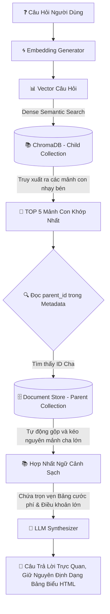

# 📚 Xanh SM Enterprise RAG - Kỹ Thuật Phân Mảnh Tri Thức (CHUNKING)

Tài liệu này ghi lại chi tiết giải pháp **Heading-Aware Parent-Child Chunking** — kỹ thuật cốt lõi giúp hệ thống RAG của Xanh SM đạt độ chính xác cao về mặt ngữ nghĩa mà vẫn giữ nguyên vẹn 100% các bảng biểu cước phí phức tạp.

---

## 🚫 1. Vấn Đề Của Các Kỹ Thuật Chunking Thô (Naive Chunking)

Khi xây dựng hệ thống RAG doanh nghiệp, đặc biệt cho các quy chế dịch vụ taxi/xe máy điện có nhiều bảng biểu cước phí lồng nhau, các phương pháp cắt đoạn thô sơ gặp các hạn chế chí tử:

```
Văn Bản Thô: "Điều 1: Phí hủy chuyến xe máy là 15.000đ khi tài xế đã di chuyển được 2 phút."
                       Cắt cơ học (Character Splitter - Cắt ở ký tự thứ 30)
                                      ⬇️
Mảnh 1: "Điều 1: Phí hủy chuyến xe máy"   |   Mảnh 2: " là 15.000đ khi tài xế đã..."
      (Mất thông tin số tiền phạt!)       |        (Mất thông tin đối tượng phạt!)
```

* **Character Chunking (Cắt thô):** Cắt theo số lượng ký tự cố định. Gây đứt gãy câu, làm nát dữ liệu bảng giá cước.
* **Recursive Character Chunking:** Tách đệ quy dựa trên dấu xuống dòng (`\n`) và khoảng trắng. Khá hơn cắt thô nhưng vẫn làm đứt mạch liên kết giữa các điều khoản lồng nhau.
* **Semantic Chunking:** Cắt dựa trên khoảng cách ngữ nghĩa giữa các câu. Phù hợp cho văn xuôi, nhưng đối với các bảng cước phí, khoảng cách ngữ nghĩa giữa các dòng số liệu không đủ rõ ràng để phân tách tự nhiên.

---

## 🌿 2. Giải Pháp Đột Phá: Heading-Aware Parent-Child Chunking

Hệ thống RAG Xanh SM áp dụng kiến trúc phân mảnh **Hai Tầng (Parent-Child)** kết hợp phân tích cấu trúc đề mục Markdown (**Heading-Aware**).

### 📐 Kiến Trúc Quan Hệ Cha - Con (Parent-Child Schema)

```
========================================================================================
[PARENT CHUNK] (Mảnh Cha: Cả chương/điều khoản lớn - Chứa đầy đủ ngữ cảnh & bảng biểu cước phí)
----------------------------------------------------------------------------------------
|  # CHƯƠNG II: CHÍNH SÁCH PHẠT HỦY CUỐC XE & ĐỀN BÙ                                   |
|  Điều 1: Phí hủy cuốc áp dụng cho hành khách...                                       |
|  | Loại xe     | Thời gian hủy | Phí phạt  |                                          |
|  | ----------- | ------------- | --------- |                                          |
|  | Xanh Bike   | > 2 phút      | 15.000 đ  |                                          |
|  | Xanh Car    | > 2 phút      | 20.000 đ  |                                          |
========================================================================================
       | (Trích xuất)                 | (Trích xuất)                 | (Trích xuất)
       ⬇️                              ⬇️                              ⬇️
 [CHILD CHUNK 1]                [CHILD CHUNK 2]                [CHILD CHUNK 3]
 (Mảnh Con 1: Mảnh nhỏ)         (Mảnh Con 2: Mảnh nhỏ)         (Mảnh Con 3: Mảnh nhỏ)
 "Hành khách hủy Xanh Bike      "Hành khách hủy Xanh Car       "Phí phạt hủy chuyến xe
  sau 2 phút phạt 15.000đ"       sau 2 phút phạt 20.000đ"       Xanh SM taxi điện"
 (Kích thước: 100-200 từ)       (Kích thước: 100-200 từ)       (Kích thước: 100-200 từ)
```

1. **Child Chunks (Mảnh con - Kích thước nhỏ 150-250 từ):**
   * Được nhúng (Embed) thành Vector và nạp vào **ChromaDB**.
   * Nhỏ gọn, tập trung cao độ vào một ý nghĩa cụ thể ➔ Đạt độ nhạy bén (Recall) cực cao khi tìm kiếm ngữ nghĩa, không bị loãng vector.
   * Lưu metadata liên kết: `parent_id` trỏ về mảnh cha.
2. **Parent Chunks (Mảnh cha - Kích thước lớn 1000-2000 từ):**
   * Chứa toàn bộ cấu trúc chương mục, điều khoản lớn, danh mục bảng biểu cước phí hoàn chỉnh.
   * Không nạp vector trực tiếp để tránh loãng nghĩa, chỉ lưu trữ trong CSDL tài liệu (Document Store).

---

## 🔁 3. Luồng Truy Xuất Tri Thức (Retrieval Workflow)

Khi người dùng hỏi: *"Nếu đặt xe Xanh Car mà hủy sau 2 phút thì bị trừ bao nhiêu tiền?"*



### 🧠 Lợi ích vượt trội của luồng này:
* **Tìm kiếm thông minh (Child level):** Tìm kiếm tương đồng vector trên mảnh nhỏ rất dễ tìm thấy từ đồng nghĩa và ý định của người dùng.
* **Trả lời thông tuệ (Parent level):** Khi sinh câu trả lời, LLM không đọc mảnh con chắp vá. Nó được đọc toàn bộ mảnh cha lớn, đảm bảo câu trả lời có đầu có đuôi, giữ vững cấu trúc bảng cước phí, không bao giờ bị cắt cụt hay ảo giác số liệu.

---

## 🛠️ 4. Heading-Aware Splitter (Bộ Chia Tách Markdown Tiêu Đề)

Để tự động tạo ra Mảnh Cha có cấu trúc logic tốt nhất, hệ thống Xanh SM sử dụng **Heading-Aware Splitter** quét qua tài liệu Markdown:

```python
from langchain_text_splitters import MarkdownHeaderTextSplitter

# 1. Định nghĩa các tiêu đề phân cấp cần tách
headers_to_split_on = [
    ("#", "Header_1"),      # Tiêu đề Chương (Ví dụ: # CHƯƠNG I: QUY ĐỊNH CHUNG)
    ("##", "Header_2"),     # Tiêu đề Điều (Ví dụ: ## Điều 1: Định nghĩa)
    ("###", "Header_3")     # Tiêu đề Mục (Ví dụ: ### 1.1 Khách hàng cá nhân)
]

splitter = MarkdownHeaderTextSplitter(
    headers_to_split_on=headers_to_split_on, 
    strip_headers=False
)

# 2. Tiến hành tách văn bản thô thành các Mảnh Cha (Parent chunks)
parent_documents = splitter.split_text(raw_markdown_content)
```

### 📋 Heuristics Chuyển Đổi Layout PDF Sang Markdown
Đối với tài liệu PDF (hợp đồng pháp lý phức tạp), hệ thống áp dụng các luật heuristics thông minh để nhận dạng đề mục:
1. Phát hiện các dòng ngắn (dưới 80 ký tự) kết thúc không có dấu chấm.
2. Nhận dạng chữ in hoa toàn bộ (e.g. `ĐIỀU KHOẢN CHUNG`).
3. Quét các regex tiêu chuẩn đầu dòng như `Điều \d+`, `CHƯƠNG [I|V|X|L]+`, `Mục \d+`.
Các dòng này được tự động bọc thêm thẻ đề mục Markdown (`#`, `##`, `###`) trước khi chạy bộ chia tách, giúp bảo toàn cấu trúc văn bản PDF gốc một cách tuyệt đối trước khi chạy thuật toán Parent-Child!
