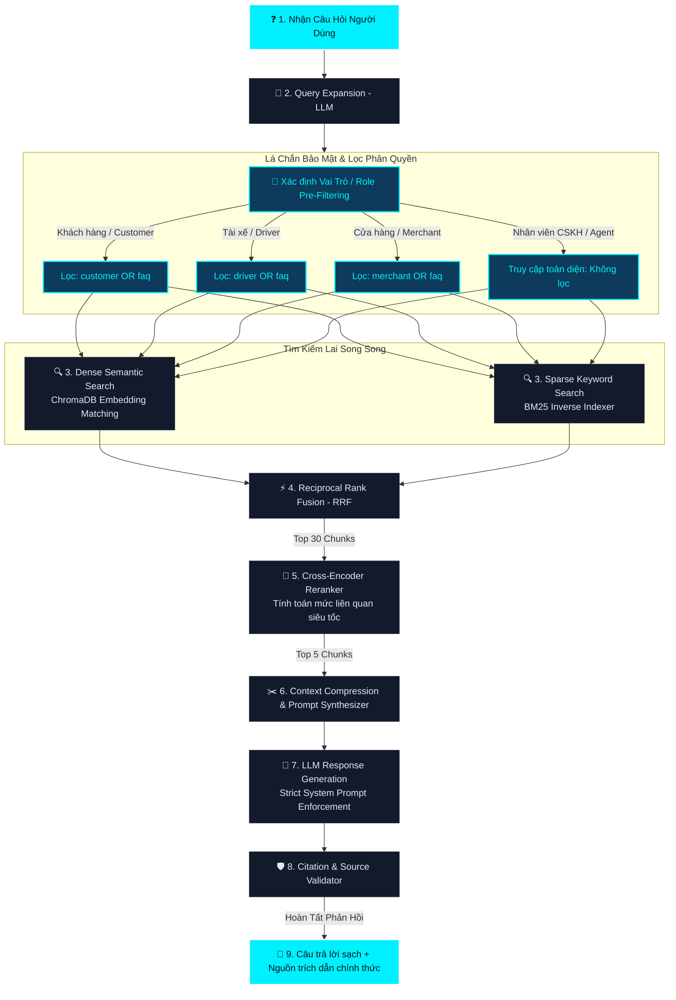

# 👨‍🏫 Xanh SM Enterprise RAG - Hệ Tư Duy & Sơ Đồ Kiến Trúc (MINDSET)

Chào mừng các em học sinh và các kỹ sư hệ thống đến với **Lớp Học RAG Doanh Nghiệp** của **Thầy Giáo AI Xanh SM**! 

Tài liệu này trình bày toàn bộ hệ tư duy thiết kế, sơ đồ kiến trúc luồng dữ liệu chuẩn hóa sản xuất (Production-Grade) cùng nhật ký giải quyết lỗ hổng cấu trúc dữ liệu thực tế của dự án **Xanh SM RAG System**.

---

## 🌿 1. Sơ Đồ Kiến Trúc Luồng Hoạt Động (RAG Workflow)

Dưới đây là sơ đồ chi tiết biểu diễn luồng đi của một câu hỏi từ lúc người dùng nhập vào cho đến khi nhận được câu trả lời kèm trích dẫn đã xác thực nguồn gốc:



---

## 👨‍🏫 2. Bài Giảng Chuyên Sâu Từ Thầy Giáo AI

> [!NOTE]
> *“Hỏi gì đáp nấy (Naive RAG) là cách nhanh nhất để đưa một hệ thống RAG doanh nghiệp vào ngõ cụt. Thông tin nhiễu, lỗi định dạng đứt đoạn, và ảo giác (hallucination) sẽ giết chết lòng tin của khách hàng. Thầy đã hệ thống lại 8 chương bài giảng chuyên sâu theo trình tự 4 giai đoạn chuẩn của một đường ống (pipeline) RAG cấp doanh nghiệp thực thụ.”*

---

### 🧱 GIAI ĐOẠN I: CHUẨN BỊ DỮ LIỆU & PHÂN MẢNH (INGESTION PHASE)

#### 🧹 Chương 1: Tiền Xử Lý Dữ Liệu & Tách Theo Tiêu Đề (Heading-Aware Chunking)
Để VectorDB lưu trữ hiệu quả, dữ liệu HTML thô được bóc tách bằng BeautifulSoup, loại bỏ sạch rác (headers, footers, scripts) rồi chuyển về **Markdown** nhằm giữ cấu trúc phân cấp.

Thay vì cắt văn bản ngẫu nhiên theo số ký tự làm mất câu và ngữ cảnh, Thầy thiết kế bộ tách `HeadingAwareSplitter` cắt văn bản theo các thẻ tiêu đề Markdown (`#`, `##`, `###`) để giữ các điều khoản pháp lý nguyên vẹn, sau đó mới chia nhỏ với kích thước `chunk_size=700` ký tự và `overlap=150` để đảm bảo gối đầu liền mạch. Mỗi mảnh (chunk) được gán mã MD5 duy nhất dạng ASCII để tránh lỗi ký tự đặc biệt của hệ điều hành.

#### 📦 Chương 2: Tiến Trình Tiến Hóa Của Kỹ Thuật Chunking (Phân Mảnh Văn Bản)
Phân mảnh quyết định chất lượng của vector đầu vào. Thầy xin khái quát con đường tiến hóa của kỹ thuật này từ sơ khai đến hiện đại:
* **Character Chunking** *(Cổ điển)*: Cắt cơ học đúng số ký tự $N$ (ví dụ: cứ 500 ký tự cắt 1 mảnh). Nhanh nhưng làm đứt câu, hỏng từ và nát bảng biểu. (❌ Không dùng)
* **Recursive Character Chunking**: Tách đệ quy dựa trên danh sách ký tự ưu tiên `["\n\n", "\n", " ", ""]` để bảo toàn đoạn văn và câu. Rất tốt cho tài liệu phẳng thông thường. (⚠️ Baseline cơ bản)
* **Heading-Aware / Structural Chunking**: Sử dụng cấu trúc cú pháp tiêu đề Markdown để cắt. Bảo toàn 100% tính toàn vẹn của một điều khoản, bảng biểu. (✅ Khuyên dùng cho chính sách/quy chế)
* **Semantic Chunking**: Tính toán embedding cho từng câu liên tiếp, thực hiện cắt chunk khi độ tương đồng ngữ nghĩa giữa hai câu đột ngột sụt giảm. Mảnh cắt tự nhiên nhưng tốn tài nguyên nhúng vector từng câu. (⚠️ Phù hợp cho văn xuôi)
* **Agentic / LLM-based Chunking**: Dùng một LLM đọc và tự quyết định vị trí cắt đoạn tối ưu. Chất lượng hoàn hảo nhưng chi phí API khổng lồ, tốc độ chậm chạp. (❌ Không thực tế)
* **Hierarchical + Parent-Child Retrieval** *(Vàng)*: Phân tích layout PDF bằng mô hình thị giác cục bộ (PyMuPDF / Marker). Tạo ra các **Chunk Con (Child Chunks - 100-200 từ)** nhúng vector để tìm kiếm cực nhạy, liên kết với **Chunk Cha (Parent Chunks - 1000-2000 từ)** để tự động gộp context khi gửi LLM. Đạt lợi ích kép: Tìm siêu nhạy + Context siêu đầy đủ, chi phí ban đầu bằng $0. (👑 Tiêu chuẩn vàng doanh nghiệp hiện đại)

---

### 🧠 GIAI ĐOẠN II: Ý ĐỊNH & TRUY VẤN NÂNG CAO (QUERYING & RETRIEVAL PHASE)

#### 🧠 Chương 3: Mở Rộng Ý Định Thông Minh (AI Query Expansion)
Hành khách thường gõ thiếu chữ, dùng tiếng lóng hoặc sai chính tả. Nếu chỉ dùng câu gốc để tìm kiếm, ta sẽ bỏ sót tài liệu. Ở bước này, Thầy gọi LLM sinh ra **3 câu hỏi đồng nghĩa Tiếng Việt** chất lượng để truy quét toàn diện không gian vector, đảm bảo vét sạch mọi góc khuất của chính sách.

#### 🔍 Chương 4: Các Công Nghệ Truy Vấn Nâng Cao (Similarity vs. Threshold vs. MMR)
Khi truy quét VectorDB, ta có 3 phương pháp chính với các sự đánh đổi kỹ thuật cực kỳ rõ rệt:
1. **Tìm kiếm Tương đồng tuyến tính (Cosine Similarity Search)**: Quét lấy Top K mảnh gần nhất. Tốc độ cực nhanh nhưng gặp "Thảm họa Trùng lặp" (Redundancy) khi nhiều mảnh cùng nói về một ý làm loãng Context window của LLM.
2. **Tương đồng có ngưỡng điểm số (Similarity with Score Threshold)**: Chỉ lấy những mảnh có điểm tương đồng lớn hơn một ngưỡng cứng (ví dụ: `score >= 0.75`). Giúp chặn rác rất tốt nhưng ngưỡng cứng rất nhạy cảm và dễ vỡ (Threshold Fragility) - đặt quá cao thì mất kết quả, đặt quá thấp thì mất tác dụng lọc.
3. **Độ liên quan tối đa (Maximal Marginal Relevance - MMR)**: MMR cân bằng giữa **Độ tương đồng ngữ nghĩa** và **Tính đa dạng (chống trùng lặp)** của context bằng công thức tối ưu hóa đa mục tiêu:
   $$MMR = \arg\max_{D_i \in R \setminus S} \left[ \lambda \cdot Sim_1(D_i, Q) - (1 - \lambda) \cdot \max_{D_j \in S} Sim_2(D_i, D_j) \right]$$
   Trong đó: $\lambda \approx 0.5$ giúp loại bỏ triệt để các nội dung trùng lặp để nhường chỗ cho các mảnh thông tin bổ trợ khác. Đánh đổi lại, MMR làm giảm nhẹ độ chính xác tuyệt đối của mảnh đứng đầu tiếp theo và làm chậm tốc độ truy xuất do phải tính toán khoảng cách chéo ($O(K^2)$).

---

### 🚀 GIAI ĐOẠN III: TÌM KIẾM LAI & TÁI XẾP HẠNG (RETRIEVAL & RERANKING PHASE)

#### 🔍 Chương 5: Tìm Kiếm Lai Hai Luồng (Dense & Sparse Hybrid Search)
Thầy cho chạy song song 2 tay săn thông tin kết hợp hoàn hảo:
1. **Dense Search (Tìm kiếm ngữ nghĩa)**: Quét ChromaDB bằng vector nhúng để bắt được các ý nghĩa đồng nghĩa (ví dụ: "xe điện" -> "EV").
2. **Sparse Search (BM25)**: Đối sánh từ khóa chính xác trên chỉ mục nghịch đảo để bắt trúng biểu phí, số điện thoại, con số cụ thể, mã lỗi chuyên môn.
Kết quả được hòa trộn bằng thuật toán **RRF (Reciprocal Rank Fusion)** xếp hạng Top 30 trích đoạn tối ưu nhất:
$$RRF\_Score(d \in D) = \frac{1}{60 + r_{dense}(d)} + \frac{1}{60 + r_{sparse}(d)}$$

#### ⚡ Chương 6: Tái Xếp Hạng Siêu Tốc (Cross-Encoder Reranking & Bi/Cross-Encoder Deep-Dive)
Đưa 30 trích đoạn vào LLM sẽ rất đắt và loãng. Thầy sử dụng mô hình Cross-Encoder cục bộ để tính toán sự tương tác ngữ nghĩa trực tiếp giữa câu hỏi và từng đoạn trích siêu tốc, lọc lấy **Top 5 văn bản có điểm số cao nhất**.
Các em cần phân biệt rõ kiến trúc của hai bộ mã hóa:
* **Bi-Encoder** (Mô hình Nhúng Vector - ChromaDB): Nhúng độc lập Query và Document thành 2 vector rồi tính độ tương đồng. Cực nhanh, tính toán offline được, nhưng không có tương tác Attention chéo giữa từng chữ.
* **Cross-Encoder** (Mô hình Reranker): Ghép trực tiếp `Query + Document` đưa vào Transformer để tương tác **Full Attention** chéo toàn phần. Siêu chính xác nhưng siêu nặng, bắt buộc dùng ở Stage 2 để rerank tập ứng viên nhỏ.

```
[Kiến trúc Bi-Encoder]
Query (Q)    ➔ [ Encoder ] ➔ Vector V_Q ──┐
                                          ├──➔ [ Cosine Sim ] ➔ Điểm số (Nhanh)
Document (D) ➔ [ Encoder ] ➔ Vector V_D ──┘

[Kiến trúc Cross-Encoder]
Query (Q)    ──┐
               ├──➔ [ Q + D ] ➔ [ Transformer (Full Attention) ] ➔ Điểm số (Chính xác)
Document (D) ──┘
```

#### 🕸️ Chương 7: GraphRAG & Đồ Thị Tri Thức (Khi nào thực sự cần thiết?)
Trong Giai đoạn 2, một số kỹ sư thường nghĩ tới việc tích hợp **Graph DB (như Neo4j)** để xây dựng **GraphRAG** (trích xuất Entities, Relations và xây dựng Đồ thị Tri thức). Tuy nhiên, Thầy muốn các em làm rõ đánh đổi thực tế:
* **Khi nào thực sự cần?**: Khi kho tài liệu chứa mạng lưới quan hệ chéo cực kỳ phức tạp và người dùng thường đặt các câu hỏi toàn cục (Global QA) cần liên kết thông tin nhiều bước (Multi-hop) như: *"Vẽ sơ đồ liên hệ của tất cả các ban ngành ảnh hưởng tới quy trình xử lý cước phạt?"*.
* **Tại sao không cần thiết cho Xanh SM?**: 
  1. Dữ liệu cước phí, hotline của chúng ta chủ yếu dạng phẳng và phân cấp điều khoản rõ ràng. Câu hỏi người dùng là **cục bộ (Local QA)**, cơ chế Hybrid Search + Parent-Child đã giải quyết trọn vẹn.
  2. **Chi phí khổng lồ**: Việc trích xuất đồ thị bằng LLM đắt gấp **50x - 100x** chi phí nhúng thông thường.
  3. **Độ trễ cao (Latency)**: GraphRAG tốn từ 5s - 30s để phản hồi, hoàn toàn không thích hợp cho Chatbot CSKH thời gian thực yêu cầu độ trễ < 1s.
* **Giải pháp "Graph" Lai Siêu Nhẹ (Pragmatic Graph)**: Thay vì server Neo4j cồng kềnh, ta có thể xây dựng một bảng quan hệ liên kết chéo các file Markdown (ví dụ: `terms.md` link tới `refund.md`) bằng thư viện **`networkx`** trực tiếp trong RAM. Khi tìm thấy file này, hệ thống tự động kéo thêm file liên kết vào context, đạt hiệu quả liên kết tối đa với chi phí bằng $0 và độ trễ 0ms!

---

### 🛡️ GIAI ĐOẠN IV: TỔNG HỢP & BẢO MẬT (SYNTHESIS & CITATION PHASE)

#### 🤖 Chương 8: Tổng Hợp Phản Hồi Trích Nguồn (LLM Synthesizer & Citation Validation)
Top 5 trích đoạn sạch nhất được đưa vào hệ thống Prompt kiểm duyệt trích nguồn cực kỳ nghiêm ngặt. LLM (gpt-4o-mini) tổng hợp câu trả lời tự nhiên, thân thiện đúng tác phong CSKH Xanh SM.

Sau đó, bộ xác thực trích nguồn của Thầy sẽ bóc tách URL, đối sánh nguồn và hiển thị gọn gàng bên dưới câu trả lời, loại bỏ hoàn toàn các link rác hoặc link hỏng để đảm bảo lòng tin tuyệt đối của người dùng!

---25 sẽ trả về 0.
* **Hòa trộn thứ hạng (RRF - Reciprocal Rank Fusion)**: Hệ thống của chúng ta không cộng điểm số trực tiếp (vì phân phối điểm vector và BM25 hoàn toàn khác nhau). Thay vào đó, ta sử dụng RRF để xếp hạng lại dựa trên thứ tự xuất hiện của tài liệu trong cả hai danh sách tìm kiếm:
  $$RRF\_Score(d \in D) = \frac{1}{60 + r_{dense}(d)} + \frac{1}{60 + r_{sparse}(d)}$$
  Điều này giúp chọn ra những tài liệu đứng hạng cao ở cả hai luồng hoặc cực kỳ nổi bật ở một trong hai luồng.

#### 2. So sánh Kiến trúc Reranker: Bi-Encoder vs. Cross-Encoder
Đây là phần tri thức cực kỳ quan trọng về mặt kiến trúc Transformer mà các kỹ sư AI bắt buộc phải thấu hiểu:

* **Bi-Encoder (Mô hình Nhúng Vector - Ví dụ: ChromaDB + text-embedding-3)**:
  - *Kiến trúc*: Câu hỏi $Q$ và Tài liệu $D$ được đưa vào mô hình Encoder độc lập nhau để tạo ra hai vector đại diện $V_Q$ và $V_D$. Sau đó tính khoảng cách bằng tích vô hướng hoặc Cosine Similarity.
  - *Cơ chế tương tác*: **Không có**. Hai văn bản không hề biết đến sự tồn tại của nhau trong quá trình encode.
  - *Ưu điểm*: Tốc độ siêu tốc. Toàn bộ các mảnh tài liệu có thể được tính toán vector sẵn (Offline indexing) và lưu vào cơ sở dữ liệu. Khi người dùng hỏi, hệ thống chỉ cần tính 1 vector cho câu hỏi và thực hiện đối sánh cực nhanh trong vài mili-giây.
  - *Nhược điểm*: Vì không có sự tương tác trực tiếp ở cấp độ từ vựng (Cross-Attention) giữa câu hỏi và tài liệu, mô hình dễ bỏ sót các sắc thái ngữ nghĩa phức tạp và độ chính xác ở mức trung bình khá.

```
[Kiến trúc Bi-Encoder]
Query (Q)    ➔ [ Encoder ] ➔ Vector V_Q ──┐
                                          ├──➔ [ Cosine Sim ] ➔ Điểm số
Document (D) ➔ [ Encoder ] ➔ Vector V_D ──┘
```

* **Cross-Encoder (Mô hình Reranker - Ví dụ: `bge-reranker-large` / `cohere-rerank`)**:
  - *Kiến trúc*: Ghép trực tiếp câu hỏi và tài liệu thành một chuỗi văn bản duy nhất dạng `[CLS] Query [SEP] Document [SEP]` rồi đưa toàn bộ chuỗi này vào một mô hình Transformer duy nhất.
  - *Cơ chế tương tác*: **Tối đa (Full Attention)**. Từng từ trong câu hỏi được phép thực hiện cơ chế Self-Attention trực tiếp với từng từ trong tài liệu.
  - *Ưu điểm*: Độ chính xác cực kỳ cao, bắt trọn từng sắc thái ngữ nghĩa tinh tế nhất, hiểu rõ mối quan hệ logic giữa câu hỏi và văn bản trả về.
  - *Nhược điểm*: Tính toán cực kỳ nặng nề và chậm chạp. Không thể tính trước (offline) vì phải ghép cặp trực tiếp từng cặp $(Q, D)$ tại thời điểm chạy (Runtime).
  - *Tính thực tế*: Hệ thống RAG doanh nghiệp áp dụng cơ chế **Phễu Lọc 2 Lớp (Two-Stage Pipeline)**: Sử dụng Bi-Encoder (Hybrid Search) để quét nhanh hàng triệu mảnh để lấy ra Top 30 ứng viên, sau đó mới dùng Cross-Encoder (Reranker) để chấm điểm sâu và chọn ra Top 5 mảnh chất lượng nhất để gửi LLM.

```
[Kiến trúc Cross-Encoder]
Query (Q)    ──┐
               ├──➔ [ CLS + Q + SEP + D + SEP ] ➔ [ Transformer ] ➔ Điểm số (Full Attention)
Document (D) ──┘
```

---

## 🛡️ 3. Nhật Ký Giải Quyết Lỗ Hổng Phân Phối Dữ Liệu & Bảo Mật

### ⚠️ Điểm yếu nghiêm trọng đã phát hiện (The Issue)
Trong quá trình vận hành, khi khách hàng hỏi câu hỏi: **"hướng dẫn đặt đồ ăn xanh sm"** (hoặc các dịch vụ như thuê xe, đặt xe sân bay...), hệ thống trả về thông báo trống rỗng: *"Rất tiếc, tài liệu chính sách hiện tại không có thông tin về vấn đề này."*

Mặc dù trong kho dữ liệu thô **CÓ** đầy đủ tài liệu về dịch vụ đồ ăn Xanh Food (`vn_vi_greensm_ngon.md`) và Hướng dẫn trợ giúp đặt xe (`vn_vi_helps.md`), nhưng khách hàng vẫn bị báo trắng thông tin.

#### Nguyên nhân kỹ thuật:
1. **Lỗi phân loại của Crawler (Categorization Bug)**:
   Do chân trang (footer) của mọi trang trên `xanhsm.com` đều chứa các liên kết đăng ký tài xế, hàm phân loại cũ quét từ khóa thô `"tài xế" in content_lower` đã **nhầm lẫn xếp 26 tài liệu trợ giúp chung vào thư mục `data/driver`**.
2. **Lỗi cô lập dữ liệu (Rigid Metadata Siloing)**:
   Hệ thống RAG cũ áp dụng bộ lọc vai trò tuyệt đối `{"role": target_role}`. Khi Khách hàng (customer) hỏi, bộ lọc ChromaDB và BM25 chặn đứng tất cả tài liệu có nhãn `driver` hoặc trợ giúp chung `faq`, dẫn đến việc RAG trả về 0 kết quả!

```
[Mô tả lỗi cũ]
Người dùng (Khách hàng) ➔ Gửi câu hỏi "Đặt đồ ăn" 
                        ➔ RAG áp dụng lọc {"role": "customer"} 
                        ➔ Không tìm thấy tài liệu (do bị gắn nhãn driver và nằm ở data/driver/) 
                        ➔ Báo lỗi trống thông tin.
```

---

### 💡 Giải pháp cấu trúc dữ liệu chia sẻ chung (Shared Document Store Solution)

Thầy giáo AI đã thiết kế giải pháp tái cấu trúc và phân quyền chuẩn Production như sau:

#### 1. Sửa lỗi Crawler & Tái cấu trúc thư mục dữ liệu
* **Tối ưu hàm phân loại**: Cập nhật hàm `categorize_content` trong [crawl.py](file:///c:/Users/DUNG/Desktop/RAG_XANH_SM/app/crawler/crawl.py) để nhận diện đúng trang tài xế bằng các từ khóa chuyên sâu ở phần thân bài (`chính sách tài xế`, `tác phong tài xế`), loại bỏ hoàn toàn nhiễu từ footer.
* **Di dời tài liệu về kho dùng chung**: Chuyển toàn bộ 26 tệp tin hướng dẫn dịch vụ tổng quan từ `data/driver` về thư mục **`data/faq`** (Kho lưu trữ dùng chung). Thư mục `driver/` bây giờ chỉ giữ lại các tài liệu nhạy cảm thực sự của tài xế.

#### 2. Thiết kế bộ lọc liên kết (Unified Shared Filter)
Nâng cấp bộ lọc tìm kiếm trong cả [chroma_client.py](file:///c:/Users/DUNG/Desktop/RAG_XANH_SM/app/vectordb/chroma_client.py) và [bm25_retriever.py](file:///c:/Users/DUNG/Desktop/RAG_XANH_SM/app/retrieval/bm25_retriever.py). 

Khi một người dùng thuộc một vai trò cụ thể tìm kiếm, hệ thống cho phép họ truy cập tài liệu đặc thù của họ **VÀ kho tài liệu trợ giúp dùng chung (`faq`)**:

$$\text{Quyền truy cập của vai trò} = \text{target\_role} \cup \text{"faq"}$$

```python
# Cú pháp truy vấn ChromaDB nâng cao tự động áp dụng:
search_filter = {"role": {"$in": [target_role, "faq"]}}
```

```
[Cơ chế mới hoạt động hoàn hảo]
Người dùng (Khách hàng) ➔ Gửi câu hỏi "Hướng dẫn đặt đồ ăn xanh sm"
                        ➔ RAG lọc thông tin thuộc danh mục: "customer" hoặc "faq"
                        ➔ Truy cập thành công file "vn_vi_greensm_ngon.md" (đã được chuyển về danh mục faq)
                        ➔ Trích xuất chính xác biểu phí và quy trình đặt đồ ăn Xanh Food!
```

Cơ chế này vừa bảo mật tuyệt đối thông tin nội bộ của từng vai trò (khách hàng không bao giờ đọc được chiết khấu hay mức phạt của tài xế), vừa tối ưu hóa khả năng chia sẻ thông tin hữu ích cho toàn bộ người dùng!

Cơ chế này vừa bảo mật tuyệt đối thông tin nội bộ của từng vai trò (khách hàng không bao giờ đọc được chiết khấu hay mức phạt của tài xế), vừa tối ưu hóa khả năng chia sẻ thông tin hữu ích cho toàn bộ người dùng!

---

## 🚨 4. Bộ Tứ Điểm Yếu Kinh Điển & Lộ Trình Vá Lỗi Chiến Lược (Giai Đoạn 2)

> [!WARNING]
> *“Học trò của Thầy thân mến! Một kỹ sư giỏi không chỉ xây dựng hệ thống chạy được, mà phải là người nhìn thấy trước những vết nứt của bức tường trước khi nó sụp đổ. Dưới đây là 4 điểm yếu kinh điển của RAG doanh nghiệp hiện đại và hệ tư duy khắc phục của chúng ta.”*

### ❌ Điểm Yếu 1: Thiếu Bộ Nhớ Hội Thoại (Anaphora & Chat History Loss)
* **Hiện tượng**: Khi khách hàng chat nhiều câu nối tiếp ngữ cảnh:
  - Câu 1: *"Xanh SM có bao nhiêu nhân viên?"*
  - Câu 2: *"Doanh thu của **họ** là bao nhiêu?"*
  - RAG sẽ tìm kiếm vector thô chữ *"họ"* và trả về 0 kết quả chính xác vì không biết *"họ"* là ai.
* **Giải pháp khắc phục**: Tích hợp luồng **Conversational Query Rewriter**. Lưu 3-5 lượt chat gần nhất vào bộ nhớ đệm (Redis/SQLite), sau đó dùng một LLM siêu nhẹ biên dịch lại câu hỏi kế thừa thành câu hỏi độc lập (Self-Contained Query) trước khi gửi vào VectorDB.
  - *Ví dụ:* `[Doanh thu của họ là bao nhiêu?]` ➔ `[Doanh thu của Xanh SM là bao nhiêu?]`.

### ❌ Điểm Yếu 2: Lãng Phí Chi Phí API & Tăng Độ Trễ Khi Hỏi Lại (Redundant LLM Calls)
* **Hiện tượng**: Hàng ngàn khách hàng khác nhau thường xuyên hỏi cùng một câu hỏi hoặc các câu hỏi tương đương nghĩa (ví dụ: *"Hotline là gì?"* vs *"Số tổng đài Xanh SM"*). Việc gọi OpenAI API liên tục cho các câu hỏi trùng lặp gây **lãng phí chi phí nghiêm trọng** và tạo ra **độ trễ nghẽn mạng (~1s-2s)**.
* **Giải pháp khắc phục**: Triển khai bộ đệm **GPTCache** hoặc **Redis Semantic Cache** với 2 lớp:
  - *Deterministic Cache (MD5 string hash)*: Khớp chính xác 100% câu hỏi cũ ➔ Trả ngay kết quả (Độ trễ < 5ms, Phí = $0).
  - *Semantic Cache (Embedding Similarity)*: Đối sánh khoảng cách vector câu hỏi mới và các câu hỏi lịch sử. Nếu Cosine Similarity > `0.96`, lấy luôn câu trả lời đã lưu ➔ Trả ngay (Độ trễ < 20ms, Phí = $0).

### ❌ Điểm Yếu 3: Thiếu Đầu Vào Đa Phương Tiện (Multimodal EV Diagnostics Blindness)
* **Hiện tượng**: Khi nâng cấp hệ thống thành bộ chẩn đoán kỹ thuật toàn năng cho xe điện GSM (EV), người lái xe/khách hàng sẽ chụp hình ảnh đèn cảnh báo taplo (như lỗi rùa vàng, báo lỗi động cơ, đèn phanh...) gửi lên. Hệ thống text-only hiện tại sẽ hoàn toàn bị "mù".
* **Giải pháp khắc phục**: Nâng cấp lên **Multimodal RAG & Vision LLM Agent**:
  - Dùng mô hình **CLIP/ColPali** nhúng đồng thời cả hình ảnh cảnh báo và sách hướng dẫn kỹ thuật vào chung không gian vector.
  - Tích hợp **GPT-4o Vision** tiếp nhận ảnh chụp taplo thực tế ➔ Tự động bóc cảnh báo ➔ Truy xuất tài liệu xử lý tương ứng ➔ Đưa ra chỉ dẫn an toàn khẩn cấp.

### ❌ Điểm Yếu 4: Nghịch Lý Phân Mảnh Văn Bản Trên PDF Phức Tạp (The Chunking Paradox)
* **Hiện tượng**: Các phương pháp cắt mảnh cơ học (`RecursiveCharacterTextSplitter` hay `Semantic Chunking` dựa trên vector) hoạt động máy móc, dễ cắt ngang bảng biểu giá cước, danh sách hoặc tài liệu PDF nhiều cột làm mất cấu trúc. Ngược lại, nếu dùng AI (LLM-based chunking) để cắt mảnh thông minh thì chi phí xử lý thô ban đầu sẽ **cực kỳ đắt đỏ**, doanh nghiệp chắc chắn từ chối chi trả.
* **Giải pháp khắc phục**: Cơ chế **Hierarchical Layout-Aware Parsing & Parent-Child Retrieval (Truy xuất Cha-Con tự động gộp)**:
  - *Bố cục thị giác (Layout-Aware Parser)*: Sử dụng các mô hình thị giác máy tính cục bộ gọn nhẹ, chạy local miễn phí (như **LayoutLMv3**, **Marker**, hoặc **PyMuPDF/fitz**) để phân tích bố cục PDF nhiều cột, cấu trúc bảng biểu, Header-DOM chuẩn xác thay vì gọi LLM đắt đỏ.
  - *Nhận xét về thư viện nổi tiếng `Unstructured`*: Thư viện `unstructured` rất mạnh về lý thuyết phân tách layout ("Chunk by Title"), nhưng cài đặt cục bộ cực kỳ nặng nề (phình Docker lên 3-5GB, đòi hỏi PyTorch, Tesseract, poppler) gây treo đĩa cứng/RAM trên máy chủ Cloud cấu hình vừa phải. Do đó, việc tự thiết kế bộ lọc **PyMuPDF + Heuristics cục bộ** hoặc dùng **Marker** là lựa chọn tối ưu, thực dụng và siêu tốc nhất để deploy.
  - *Truy xuất Cha-Con (Parent-Child Auto-Merging)*: Vector search chạy trên các mảnh con cực nhỏ (100-200 từ) để bắt trúng ý nghĩa chính xác nhất. Khi tìm thấy mảnh con, RAG tự động gộp và gửi toàn bộ ngữ cảnh cha (1000-2000 từ) chứa nó cho LLM. Điều này giải quyết triệt để vấn đề mất ngữ cảnh PDF mà hoàn toàn không tốn chi phí gọi LLM lúc phân mảnh ban đầu!

---

👨‍🏫 *Lớp học của Thầy giáo AI hôm nay đến đây là kết thúc. Hãy áp dụng hệ tư duy kiên cố này để xây dựng những hệ thống AI an toàn, tối ưu chi phí và thông minh vượt trội nhé các em!*
