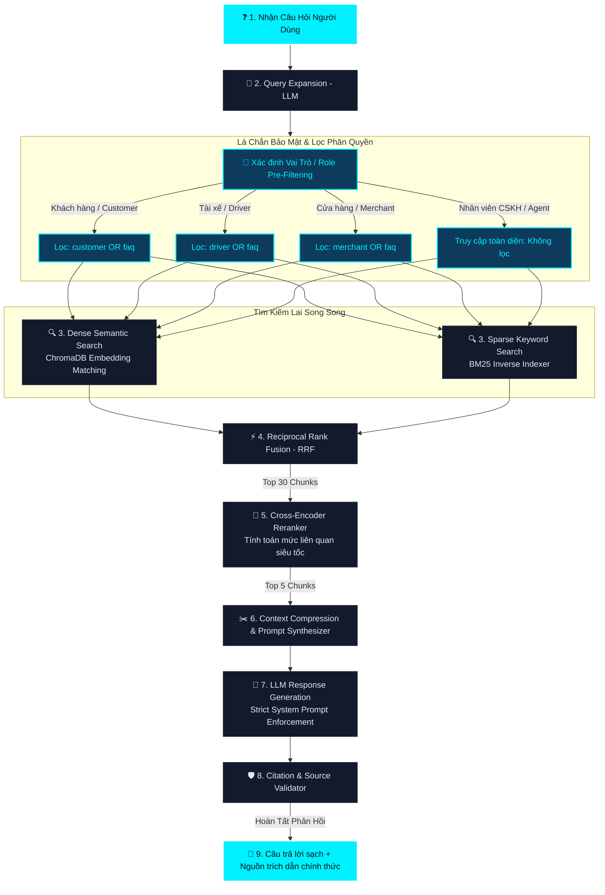

# 👨‍🏫 Xanh SM Enterprise RAG - Hệ Tư Duy & Sơ Đồ Kiến Trúc (MINDSET)

Chào mừng các em học sinh và các kỹ sư hệ thống đến với **Lớp Học RAG Doanh Nghiệp** của **Thầy Giáo AI Xanh SM**! 

Tài liệu này trình bày toàn bộ hệ tư duy thiết kế, sơ đồ kiến trúc luồng dữ liệu chuẩn hóa sản xuất (Production-Grade) cùng nhật ký giải quyết lỗ hổng cấu trúc dữ liệu thực tế của dự án **Xanh SM RAG System**.

---

## 🌿 1. Sơ Đồ Kiến Trúc Luồng Hoạt Động (RAG Workflow)

Dưới đây là sơ đồ chi tiết biểu diễn luồng đi của một câu hỏi từ lúc người dùng nhập vào cho đến khi nhận được câu trả lời kèm trích dẫn đã xác thực nguồn gốc:



---

## 👨‍🏫 2. Bài Giảng Chuyên Sâu Từ Thầy Giáo AI

> [!NOTE]
> *“Hỏi gì đáp nấy (Naive RAG) là cách nhanh nhất để đưa một hệ thống RAG doanh nghiệp vào ngõ cụt. Thông tin nhiễu, lỗi định dạng đứt đoạn, và ảo giác (hallucination) sẽ giết chết lòng tin của khách hàng. Hãy cùng Thầy phân tích 5 chương tri thức nền tảng của hệ thống Xanh SM.”*

### 🧹 Chương 1: Tiền Xử Lý Dữ Liệu & Phân Mảnh (Heading-Aware Chunking)
Để VectorDB lưu trữ hiệu quả, dữ liệu HTML thô được bóc tách bằng BeautifulSoup, loại bỏ sạch rác (headers, footers, scripts) rồi chuyển về **Markdown**.

Thay vì cắt văn bản ngẫu nhiên theo số ký tự làm mất câu và ngữ cảnh, Thầy thiết kế bộ tách `HeadingAwareSplitter` cắt văn bản theo các thẻ tiêu đề Markdown (`#`, `##`, `###`) để giữ các điều khoản pháp lý nguyên vẹn, sau đó mới chia nhỏ với kích thước `chunk_size=700` ký tự và `overlap=150` để đảm bảo gối đầu liền mạch. Mỗi mảnh (chunk) được gán mã MD5 duy nhất dạng ASCII để tránh lỗi hệ điều hành.

### 🧠 Chương 2: Mở Rộng Ý Định Thông Minh (AI Query Expansion)
Hành khách thường gõ thiếu chữ hoặc sai chính tả. Nếu chỉ dùng câu gốc để tìm kiếm, ta sẽ bỏ sót tài liệu. Ở bước này, Thầy gọi LLM sinh ra **3 câu hỏi đồng nghĩa Tiếng Việt** chất lượng để truy quét toàn diện không gian vector.

### 🔍 Chương 3: Tìm Kiếm Lai Hai Luồng (Dense & Sparse Hybrid Search)
Thầy cho chạy song song 2 tay săn thông tin:
1. **Dense Search (Tìm kiếm ngữ nghĩa)**: Quét ChromaDB bằng vector nhúng để bắt được các ý nghĩa đồng nghĩa.
2. **Sparse Search (BM25)**: Đối sánh từ khóa chính xác trên chỉ mục nghịch đảo để bắt trúng biểu phí, số điện thoại, con số cụ thể.

Kết quả được hòa trộn bằng thuật toán **RRF (Reciprocal Rank Fusion)** xếp hạng Top 30 trích đoạn tối ưu nhất.

### ⚡ Chương 4: Tái Xếp Hạng Siêu Tốc (Cross-Encoder Reranking)
Đưa 30 trích đoạn vào LLM sẽ rất đắt và loãng. Thầy sử dụng mô hình Cross-Encoder cục bộ để tính toán sự tương tác ngữ nghĩa trực tiếp giữa câu hỏi và từng đoạn trích siêu tốc, lọc lấy **Top 5 văn bản có điểm số cao nhất**.

### 🤖 Chương 5: Tổng Hợp Phản Hồi Trích Nguồn (LLM & Citation Validation)
Top 5 trích đoạn sạch nhất được đưa vào hệ thống Prompt kiểm duyệt trích nguồn cực kỳ nghiêm ngặt. LLM (gpt-4o-mini) tổng hợp câu trả lời tự nhiên, sau đó bộ xác thực trích nguồn bóc tách URL, hiển thị nguồn tham khảo sạch, loại bỏ hoàn toàn các link rác lỗi.

---

## 🛡️ 3. Nhật Ký Giải Quyết Lỗ Hổng Phân Phối Dữ Liệu & Bảo Mật

### ⚠️ Điểm yếu nghiêm trọng đã phát hiện (The Issue)
Trong quá trình vận hành, khi khách hàng hỏi câu hỏi: **"hướng dẫn đặt đồ ăn xanh sm"** (hoặc các dịch vụ như thuê xe, đặt xe sân bay...), hệ thống trả về thông báo trống rỗng: *"Rất tiếc, tài liệu chính sách hiện tại không có thông tin về vấn đề này."*

Mặc dù trong kho dữ liệu thô **CÓ** đầy đủ tài liệu về dịch vụ đồ ăn Xanh Food (`vn_vi_greensm_ngon.md`) và Hướng dẫn trợ giúp đặt xe (`vn_vi_helps.md`), nhưng khách hàng vẫn bị báo trắng thông tin.

#### Nguyên nhân kỹ thuật:
1. **Lỗi phân loại của Crawler (Categorization Bug)**:
   Do chân trang (footer) của mọi trang trên `xanhsm.com` đều chứa các liên kết đăng ký tài xế, hàm phân loại cũ quét từ khóa thô `"tài xế" in content_lower` đã **nhầm lẫn xếp 26 tài liệu trợ giúp chung vào thư mục `data/driver`**.
2. **Lỗi cô lập dữ liệu (Rigid Metadata Siloing)**:
   Hệ thống RAG cũ áp dụng bộ lọc vai trò tuyệt đối `{"role": target_role}`. Khi Khách hàng (customer) hỏi, bộ lọc ChromaDB và BM25 chặn đứng tất cả tài liệu có nhãn `driver` hoặc trợ giúp chung `faq`, dẫn đến việc RAG trả về 0 kết quả!

```
[Mô tả lỗi cũ]
Người dùng (Khách hàng) ➔ Gửi câu hỏi "Đặt đồ ăn" 
                        ➔ RAG áp dụng lọc {"role": "customer"} 
                        ➔ Không tìm thấy tài liệu (do bị gắn nhãn driver và nằm ở data/driver/) 
                        ➔ Báo lỗi trống thông tin.
```

---

### 💡 Giải pháp cấu trúc dữ liệu chia sẻ chung (Shared Document Store Solution)

Thầy giáo AI đã thiết kế giải pháp tái cấu trúc và phân quyền chuẩn Production như sau:

#### 1. Sửa lỗi Crawler & Tái cấu trúc thư mục dữ liệu
* **Tối ưu hàm phân loại**: Cập nhật hàm `categorize_content` trong [crawl.py](file:///c:/Users/DUNG/Desktop/RAG_XANH_SM/app/crawler/crawl.py) để nhận diện đúng trang tài xế bằng các từ khóa chuyên sâu ở phần thân bài (`chính sách tài xế`, `tác phong tài xế`), loại bỏ hoàn toàn nhiễu từ footer.
* **Di dời tài liệu về kho dùng chung**: Chuyển toàn bộ 26 tệp tin hướng dẫn dịch vụ tổng quan từ `data/driver` về thư mục **`data/faq`** (Kho lưu trữ dùng chung). Thư mục `driver/` bây giờ chỉ giữ lại các tài liệu nhạy cảm thực sự của tài xế.

#### 2. Thiết kế bộ lọc liên kết (Unified Shared Filter)
Nâng cấp bộ lọc tìm kiếm trong cả [chroma_client.py](file:///c:/Users/DUNG/Desktop/RAG_XANH_SM/app/vectordb/chroma_client.py) và [bm25_retriever.py](file:///c:/Users/DUNG/Desktop/RAG_XANH_SM/app/retrieval/bm25_retriever.py). 

Khi một người dùng thuộc một vai trò cụ thể tìm kiếm, hệ thống cho phép họ truy cập tài liệu đặc thù của họ **VÀ kho tài liệu trợ giúp dùng chung (`faq`)**:

$$\text{Quyền truy cập của vai trò} = \text{target\_role} \cup \text{"faq"}$$

```python
# Cú pháp truy vấn ChromaDB nâng cao tự động áp dụng:
search_filter = {"role": {"$in": [target_role, "faq"]}}
```

```
[Cơ chế mới hoạt động hoàn hảo]
Người dùng (Khách hàng) ➔ Gửi câu hỏi "Hướng dẫn đặt đồ ăn xanh sm"
                        ➔ RAG lọc thông tin thuộc danh mục: "customer" hoặc "faq"
                        ➔ Truy cập thành công file "vn_vi_greensm_ngon.md" (đã được chuyển về danh mục faq)
                        ➔ Trích xuất chính xác biểu phí và quy trình đặt đồ ăn Xanh Food!
```

Cơ chế này vừa bảo mật tuyệt đối thông tin nội bộ của từng vai trò (khách hàng không bao giờ đọc được chiết khấu hay mức phạt của tài xế), vừa tối ưu hóa khả năng chia sẻ thông tin hữu ích cho toàn bộ người dùng!

---

👨‍🏫 *Lớp học của Thầy giáo AI hôm nay đến đây là kết thúc. Hãy áp dụng hệ tư duy này để xây dựng những hệ thống AI an toàn, kiên cố và thông minh vượt trội nhé các em!*
