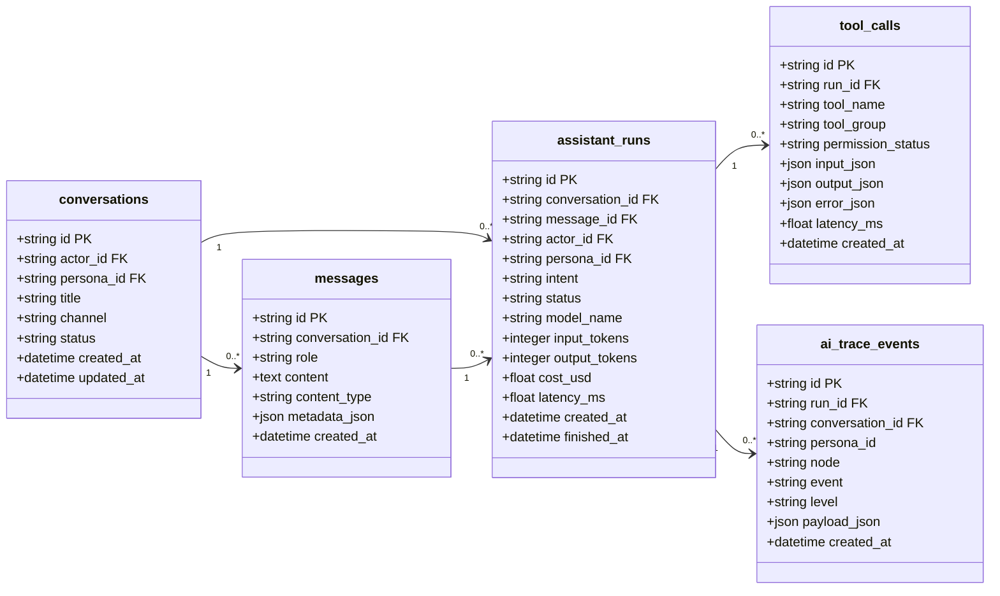
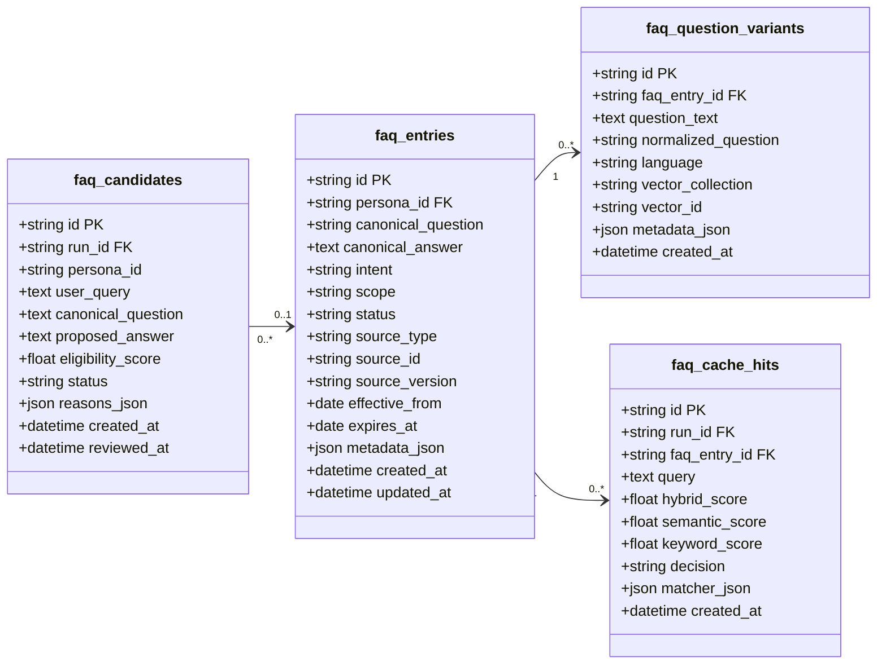
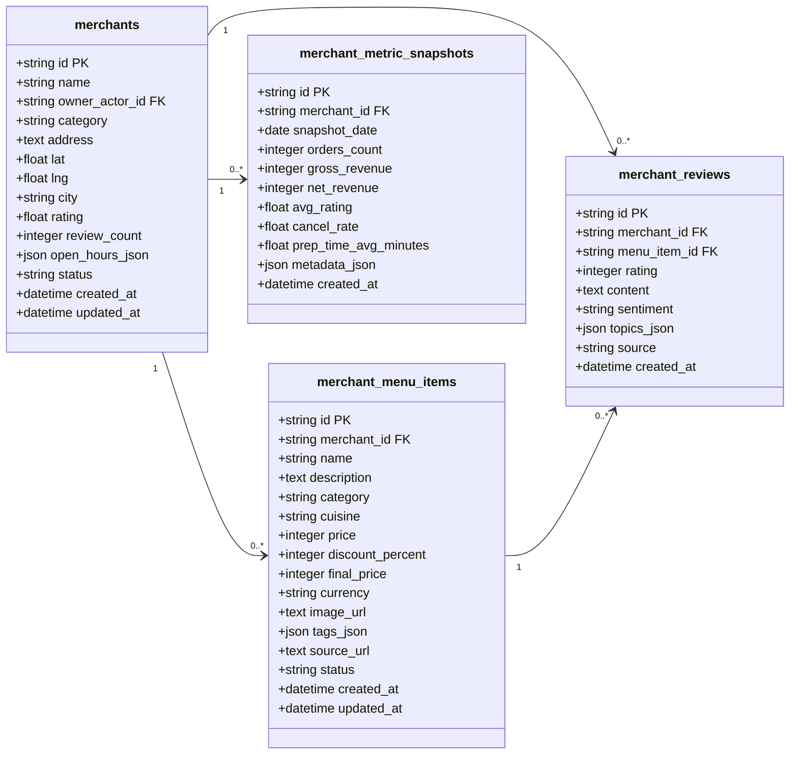

# Thiết Kế Database Mới Cho Modular AI Assistant Platform

## 1. Mục tiêu thiết kế

Database mới phục vụ hệ thống AI Assistant đa persona cho Xanh SM/Vin:

- `customer`: khách hàng.
- `driver`: tài xế.
- `merchant`: đối tác cửa hàng.
- `operator`: nhân viên vận hành.
- `executive`: ban điều hành/BI.

Thiết kế mới giải quyết các vấn đề hiện tại:

- Giảm nhiều bảng log riêng lẻ bằng `assistant_runs`, `tool_calls`, `ai_trace_events`.
- Tách rõ actor, persona, quyền truy cập, hội thoại, memory.
- Tách merchant và menu item khỏi `food_catalog` phẳng.
- Chuẩn bị bảng snapshot cho Merchant Copilot, Driver Copilot, Operator Copilot, Executive Copilot.
- Hỗ trợ reset schema sạch cho giai đoạn nâng cấp; dữ liệu hiện tại có thể clear, không bắt buộc backfill sang schema mới.

## 2. ER Diagram Tổng Quan

```mermaid
erDiagram
    actors ||--o{ actor_identities : has
    actors ||--o{ persona_access_grants : granted
    personas ||--o{ persona_access_grants : controls

    actors ||--o{ conversations : owns
    personas ||--o{ conversations : scopes
    conversations ||--o{ messages : contains
    conversations ||--o{ assistant_runs : executes
    messages ||--o{ assistant_runs : triggers
    assistant_runs ||--o{ tool_calls : uses
    assistant_runs ||--o{ ai_trace_events : traces
    assistant_runs ||--o{ retrieval_events : retrieves
    assistant_runs ||--o{ user_feedback : receives

    actors ||--o{ memories : owns
    personas ||--o{ memories : scopes
    conversations ||--o{ memories : produces
    messages ||--o{ memories : extracted_from
    actors ||--o{ profile_snapshots : has
    conversations ||--o| conversation_summaries : summarized_by

    knowledge_sources ||--o{ documents : produces
    documents ||--o{ document_chunks : split_into
    personas ||--o{ faq_entries : scopes
    knowledge_sources ||--o{ faq_entries : supports
    faq_entries ||--o{ faq_question_variants : has
    assistant_runs ||--o{ faq_candidates : proposes
    faq_entries ||--o{ faq_cache_hits : receives
    assistant_runs ||--o{ faq_cache_hits : logs

    actors ||--o{ merchants : owns
    merchants ||--o{ merchant_menu_items : sells
    merchants ||--o{ merchant_metric_snapshots : measured_by
    merchants ||--o{ merchant_reviews : receives
    merchant_menu_items ||--o{ merchant_reviews : reviewed
    merchant_menu_items ||--o{ food_interactions : interacted_with
    actors ||--o{ food_interactions : performs

    actors ||--o{ drivers : maps_to
    drivers ||--o{ driver_status_snapshots : reports
    drivers ||--o{ trips : serves
    actors ||--o{ trips : requests
    trips ||--o{ payments : paid_by

    operational_metric_snapshots ||--o{ executive_insight_reports : feeds
    assistant_runs ||--o{ executive_insight_reports : creates
    actors ||--o{ notifications : creates
    notifications ||--o{ notification_reads : read_by
    actors ||--o{ notification_reads : reads
```



## 3. Identity Và Access

### `actors`

Người hoặc thực thể dùng hệ thống. Bảng này thay vai trò trung tâm của `users` và `guest_sessions`.

| Field | Type | Meaning |
|---|---|---|
| `id` | string PK | ID dạng `actor_<uuid>`. |
| `actor_type` | string | `customer`, `driver`, `merchant_user`, `operator`, `executive`, `admin`, `guest`. |
| `display_name` | string nullable | Tên hiển thị. |
| `email` | string nullable unique | Email nếu đăng nhập. |
| `phone` | string nullable | Số điện thoại nếu có. |
| `status` | string | `active`, `disabled`, `deleted`. |
| `created_at` | datetime | Thời điểm tạo. |
| `updated_at` | datetime | Thời điểm cập nhật. |

### `actor_identities`

Liên kết actor với Google, guest token, phone hoặc tài khoản nội bộ Vin.

| Field | Type | Meaning |
|---|---|---|
| `id` | string PK | ID identity. |
| `actor_id` | string FK -> actors.id | Chủ sở hữu. |
| `provider` | string | `google`, `guest`, `internal`, `phone`. |
| `provider_subject` | string | ID từ provider. |
| `metadata_json` | json/text nullable | Metadata phụ. |
| `created_at` | datetime | Thời điểm tạo. |

### `personas`

Danh mục persona hệ thống.

| Field | Type | Meaning |
|---|---|---|
| `id` | string PK | `customer`, `driver`, `merchant`, `operator`, `executive`. |
| `name` | string | Tên hiển thị. |
| `description` | text | Mô tả persona. |
| `default_prompt_key` | string | Khóa prompt mặc định. |
| `enabled` | boolean | Bật/tắt persona. |
| `created_at` | datetime | Thời điểm tạo. |

### `persona_access_grants`

Quyền actor dùng persona và phạm vi dữ liệu.

| Field | Type | Meaning |
|---|---|---|
| `id` | string PK | Grant ID. |
| `actor_id` | string FK -> actors.id | Actor được cấp quyền. |
| `persona_id` | string FK -> personas.id | Persona được dùng. |
| `role` | string | `viewer`, `operator`, `admin`. |
| `scope_json` | json/text nullable | Phạm vi dữ liệu được xem. |
| `created_at` | datetime | Thời điểm cấp quyền. |
| `expires_at` | datetime nullable | Thời điểm hết hạn. |

## 4. Conversation Và Agent Runtime



### `conversations`

| Field | Type | Meaning |
|---|---|---|
| `id` | string PK | ID dạng `conv_<uuid>`. |
| `actor_id` | string FK nullable | Chủ hội thoại. |
| `persona_id` | string FK | Persona đang dùng. |
| `title` | string nullable | Tiêu đề hội thoại. |
| `channel` | string | `web`, `mobile`, `voice`, `admin`. |
| `status` | string | `active`, `archived`. |
| `created_at` | datetime | Thời điểm tạo. |
| `updated_at` | datetime | Thời điểm cập nhật. |

### `messages`

| Field | Type | Meaning |
|---|---|---|
| `id` | string PK | ID dạng `msg_<uuid>`. |
| `conversation_id` | string FK | Hội thoại chứa message. |
| `role` | string | `user`, `assistant`, `tool`, `system`. |
| `content` | text | Nội dung hiển thị hoặc payload text. |
| `content_type` | string | `text`, `json`, `image`, `audio`, `event`. |
| `metadata_json` | json/text nullable | Card, sources, UI payload. |
| `created_at` | datetime | Thời điểm tạo. |

### `assistant_runs`

Một lượt AI xử lý một user message.

| Field | Type | Meaning |
|---|---|---|
| `id` | string PK | ID dạng `run_<uuid>`. |
| `conversation_id` | string FK | Hội thoại. |
| `message_id` | string FK nullable | User message kích hoạt run. |
| `actor_id` | string FK nullable | Actor tạo request. |
| `persona_id` | string FK | Persona tại thời điểm chạy. |
| `intent` | string nullable | Intent cuối. |
| `status` | string | `running`, `completed`, `failed`, `blocked`. |
| `model_name` | string nullable | Model chính. |
| `input_tokens` | integer | Token input. |
| `output_tokens` | integer | Token output. |
| `cost_usd` | float | Chi phí ước tính. |
| `latency_ms` | float | Tổng latency. |
| `created_at` | datetime | Thời điểm bắt đầu. |
| `finished_at` | datetime nullable | Thời điểm kết thúc. |

### `tool_calls`

Audit mọi tool agent gọi.

| Field | Type | Meaning |
|---|---|---|
| `id` | string PK | ID dạng `toolcall_<uuid>`. |
| `run_id` | string FK | Assistant run. |
| `tool_name` | string | Tên tool. |
| `tool_group` | string | Nhóm tool. |
| `permission_status` | string | `allowed`, `denied`, `needs_confirmation`. |
| `input_json` | json/text | Input đã chuẩn hóa. |
| `output_json` | json/text nullable | Output. |
| `error_json` | json/text nullable | Lỗi nếu có. |
| `latency_ms` | float | Thời gian chạy. |
| `created_at` | datetime | Thời điểm tạo. |

### `ai_trace_events`

Thay thế dần `basic_request_logs`, `rag_request_logs`, `food_request_logs`, `system_logs`.

| Field | Type | Meaning |
|---|---|---|
| `id` | string PK | Trace event ID. |
| `run_id` | string FK nullable | Assistant run. |
| `conversation_id` | string FK nullable | Hội thoại. |
| `persona_id` | string nullable | Persona. |
| `node` | string | Node trong graph. |
| `event` | string | Tên event. |
| `level` | string | `INFO`, `WARN`, `ERROR`. |
| `payload_json` | json/text | Payload trace. |
| `created_at` | datetime | Thời điểm tạo. |

## 5. Memory

### `memories`

Gộp `user_memories`, một phần `user_profiles`, một phần `user_food_profiles`.

| Field | Type | Meaning |
|---|---|---|
| `id` | string PK | ID dạng `mem_<uuid>`. |
| `actor_id` | string FK nullable | Chủ memory. |
| `persona_id` | string FK nullable | Persona scope. |
| `conversation_id` | string FK nullable | Hội thoại nguồn. |
| `message_id` | string FK nullable | Message nguồn. |
| `memory_type` | string | `fact`, `preference`, `location`, `constraint`, `behavior`, `business_context`. |
| `scope` | string | `general`, `food`, `ride`, `driver`, `merchant`, `ops`, `executive`. |
| `content` | text | Nội dung natural language. |
| `metadata_json` | json/text nullable | Dữ liệu có cấu trúc. |
| `confidence` | float | Độ tin cậy. |
| `status` | string | `active`, `superseded`, `deleted`. |
| `created_at` | datetime | Thời điểm tạo. |
| `updated_at` | datetime | Thời điểm cập nhật. |

### `profile_snapshots`

Cache profile đã tổng hợp từ memory.

| Field | Type | Meaning |
|---|---|---|
| `id` | string PK | Profile snapshot ID. |
| `actor_id` | string FK | Actor. |
| `persona_id` | string FK nullable | Persona. |
| `profile_json` | json/text | Profile tổng hợp. |
| `source_memory_ids_json` | json/text nullable | Memory IDs nguồn. |
| `created_at` | datetime | Thời điểm tạo. |
| `updated_at` | datetime | Thời điểm cập nhật. |

### `conversation_summaries`

| Field | Type | Meaning |
|---|---|---|
| `id` | string PK | Summary ID. |
| `conversation_id` | string FK unique | Hội thoại. |
| `summary_json` | json/text | Summary có cấu trúc. |
| `last_message_id` | string FK nullable | Message cuối đã summarize. |
| `created_at` | datetime | Thời điểm tạo. |
| `updated_at` | datetime | Thời điểm cập nhật. |

## 6. Knowledge/RAG

### `knowledge_sources`

Thay `crawl_sources`.

| Field | Type | Meaning |
|---|---|---|
| `id` | string PK | Source ID. |
| `name` | string | Tên nguồn. |
| `source_type` | string | `web`, `pdf`, `file`, `manual`, `api`. |
| `uri` | text | URL/path. |
| `category` | string | `customer`, `driver`, `merchant`, `operator`, `executive`, `public`. |
| `access_scope` | string | Scope quyền đọc. |
| `crawl_strategy` | string | Chiến lược crawl. |
| `enabled` | boolean | Bật/tắt. |
| `last_status` | string nullable | Trạng thái crawl gần nhất. |
| `last_error` | text nullable | Lỗi gần nhất. |
| `created_at` | datetime | Thời điểm tạo. |
| `updated_at` | datetime | Thời điểm cập nhật. |

### `documents`

| Field | Type | Meaning |
|---|---|---|
| `id` | string PK | Document ID. |
| `source_id` | string FK | Nguồn. |
| `title` | string | Tiêu đề. |
| `document_type` | string | `policy`, `pricing`, `faq`, `news`, `guide`, `report`. |
| `language` | string | `vi`, `en`. |
| `content_hash` | string | Hash chống trùng. |
| `metadata_json` | json/text nullable | Metadata. |
| `created_at` | datetime | Thời điểm tạo. |
| `updated_at` | datetime | Thời điểm cập nhật. |

### `document_chunks`

| Field | Type | Meaning |
|---|---|---|
| `id` | string PK | Chunk ID. |
| `document_id` | string FK | Document. |
| `chunk_index` | integer | Thứ tự chunk. |
| `section_title` | string nullable | Section. |
| `content` | text | Nội dung. |
| `token_count` | integer nullable | Số token. |
| `metadata_json` | json/text nullable | Metadata. |
| `vector_collection` | string nullable | Qdrant collection. |
| `vector_id` | string nullable | ID trong vector DB. |
| `created_at` | datetime | Thời điểm tạo. |

### `retrieval_events`

| Field | Type | Meaning |
|---|---|---|
| `id` | string PK | Retrieval event ID. |
| `run_id` | string FK | Assistant run. |
| `query` | text | Query. |
| `retriever_name` | string | Dense/BM25/hybrid. |
| `top_k` | integer | Số kết quả. |
| `results_json` | json/text | Chunk IDs và scores. |
| `latency_ms` | float | Latency. |
| `created_at` | datetime | Thời điểm tạo. |

## 7. Semantic FAQ Cache

Semantic cache mới không lưu trực tiếp mọi prompt của user. Hệ thống chỉ cache trên tập FAQ đã được chuẩn hóa, kiểm duyệt và gắn scope/persona rõ ràng.



### `faq_entries`

FAQ chuẩn đã được duyệt để semantic cache được phép dùng.

| Field | Type | Meaning |
|---|---|---|
| `id` | string PK | FAQ ID. |
| `persona_id` | string FK -> personas.id | Persona được phép dùng FAQ này. |
| `canonical_question` | text | Câu hỏi chuẩn, độc lập ngữ cảnh. |
| `canonical_answer` | text | Câu trả lời chuẩn, đã kiểm duyệt. |
| `intent` | string | Intent tương ứng, ví dụ `rag`, `pricing`, `policy`, `food_help`. |
| `scope` | string | `public`, `customer`, `driver`, `merchant`, `operator`, `executive`. |
| `status` | string | `draft`, `approved`, `published`, `deprecated`, `archived`. |
| `source_type` | string nullable | `rag_document`, `manual`, `tool_result`, `admin`. |
| `source_id` | string nullable | ID nguồn hỗ trợ câu trả lời. |
| `source_version` | string nullable | Version/chính sách nguồn. |
| `effective_from` | date nullable | Ngày bắt đầu hiệu lực. |
| `expires_at` | date nullable | Ngày hết hiệu lực. |
| `metadata_json` | json/text nullable | Threshold, tags, owner, notes. |
| `created_at` | datetime | Thời điểm tạo. |
| `updated_at` | datetime | Thời điểm cập nhật. |

### `faq_question_variants`

Các cách hỏi tương đương của một FAQ canonical. Vector search sẽ index các variant này.

| Field | Type | Meaning |
|---|---|---|
| `id` | string PK | Variant ID. |
| `faq_entry_id` | string FK -> faq_entries.id | FAQ cha. |
| `question_text` | text | Câu hỏi biến thể. |
| `normalized_question` | text | Câu hỏi đã normalize. |
| `language` | string | `vi`, `en`. |
| `vector_collection` | string nullable | Qdrant collection chứa embedding. |
| `vector_id` | string nullable | Vector ID. |
| `metadata_json` | json/text nullable | Metadata phụ. |
| `created_at` | datetime | Thời điểm tạo. |

### `faq_candidates`

Câu hỏi tiềm năng được analyzer đề xuất sau khi một assistant run hoàn tất. Candidate chưa được dùng làm cache cho tới khi được duyệt hoặc pass rule/evaluation.

| Field | Type | Meaning |
|---|---|---|
| `id` | string PK | Candidate ID. |
| `run_id` | string FK -> assistant_runs.id | Run sinh ra candidate. |
| `persona_id` | string nullable | Persona liên quan. |
| `user_query` | text | Query gốc của user. |
| `canonical_question` | text | Câu hỏi chuẩn được đề xuất. |
| `proposed_answer` | text nullable | Câu trả lời đề xuất. |
| `eligibility_score` | float | Điểm đủ điều kiện đưa vào FAQ. |
| `status` | string | `candidate`, `approved`, `rejected`, `published`. |
| `reasons_json` | json/text nullable | Lý do đạt/không đạt. |
| `created_at` | datetime | Thời điểm tạo. |
| `reviewed_at` | datetime nullable | Thời điểm review. |

### `faq_cache_hits`

Log mọi quyết định cache hit/miss của hybrid FAQ matcher.

| Field | Type | Meaning |
|---|---|---|
| `id` | string PK | Cache hit ID. |
| `run_id` | string FK -> assistant_runs.id | Run đang xử lý. |
| `faq_entry_id` | string FK nullable | FAQ matched nếu có. |
| `query` | text | Query sau normalize/rewrite. |
| `hybrid_score` | float | Điểm tổng hợp. |
| `semantic_score` | float | Điểm embedding similarity. |
| `keyword_score` | float | Điểm BM25/keyword overlap. |
| `decision` | string | `hit`, `miss`, `blocked_scope`, `expired`, `low_score`. |
| `matcher_json` | json/text nullable | Chi tiết matcher, thresholds, top candidates. |
| `created_at` | datetime | Thời điểm tạo. |

Quy tắc dữ liệu:

- Không lưu prompt user trực tiếp vào semantic cache.
- Không cache câu hỏi realtime như tài xế online, trạng thái chuyến, doanh thu hôm nay.
- Chỉ `faq_entries.status = published` mới được dùng để trả cache.
- Cache hit phải kiểm tra persona, scope, intent và thời hạn hiệu lực.

## 8. Food Và Merchant



### `merchants`

Tách merchant khỏi bảng `food_catalog` phẳng.

| Field | Type | Meaning |
|---|---|---|
| `id` | string PK | Merchant ID. |
| `name` | string | Tên quán/cửa hàng. |
| `owner_actor_id` | string FK nullable | Chủ merchant. |
| `category` | string nullable | Loại cửa hàng. |
| `address` | text nullable | Địa chỉ. |
| `lat` | float nullable | Vĩ độ. |
| `lng` | float nullable | Kinh độ. |
| `city` | string nullable | Thành phố. |
| `rating` | float nullable | Rating. |
| `review_count` | integer nullable | Số review. |
| `open_hours_json` | json/text nullable | Giờ mở cửa. |
| `status` | string | `active`, `inactive`, `pending`. |
| `created_at` | datetime | Thời điểm tạo. |
| `updated_at` | datetime | Thời điểm cập nhật. |

### `merchant_menu_items`

Thay phần item trong `food_catalog`.

| Field | Type | Meaning |
|---|---|---|
| `id` | string PK | Item ID. |
| `merchant_id` | string FK | Merchant. |
| `name` | string | Tên món. |
| `description` | text nullable | Mô tả. |
| `category` | string nullable | Danh mục. |
| `cuisine` | string nullable | Ẩm thực. |
| `price` | integer nullable | Giá. |
| `discount_percent` | integer nullable | Giảm giá. |
| `final_price` | integer nullable | Giá cuối. |
| `currency` | string | `VND`. |
| `image_url` | text nullable | Ảnh. |
| `tags_json` | json/text nullable | Taste/diet/ingredient tags. |
| `source_url` | text nullable | Link nguồn. |
| `status` | string | `active`, `hidden`, `deleted`. |
| `created_at` | datetime | Thời điểm tạo. |
| `updated_at` | datetime | Thời điểm cập nhật. |

### `food_interactions`

| Field | Type | Meaning |
|---|---|---|
| `id` | string PK | Event ID. |
| `actor_id` | string FK nullable | Người tương tác. |
| `conversation_id` | string FK nullable | Hội thoại. |
| `message_id` | string FK nullable | Message chứa card. |
| `merchant_id` | string FK nullable | Merchant. |
| `menu_item_id` | string FK nullable | Món. |
| `event_type` | string | `impression`, `click`, `like`, `dislike`, `order_click`. |
| `rank_position` | integer nullable | Vị trí card. |
| `context_json` | json/text nullable | Query/card context. |
| `created_at` | datetime | Thời điểm tạo. |

### `merchant_metric_snapshots`

Dữ liệu phân tích cho Merchant Copilot.

| Field | Type | Meaning |
|---|---|---|
| `id` | string PK | Snapshot ID. |
| `merchant_id` | string FK | Merchant. |
| `snapshot_date` | date | Ngày snapshot. |
| `orders_count` | integer | Số đơn. |
| `gross_revenue` | integer | Doanh thu gross. |
| `net_revenue` | integer nullable | Doanh thu ròng. |
| `avg_rating` | float nullable | Rating trung bình. |
| `cancel_rate` | float nullable | Tỷ lệ hủy. |
| `prep_time_avg_minutes` | float nullable | Thời gian chuẩn bị trung bình. |
| `metadata_json` | json/text nullable | Weather/event/notes. |
| `created_at` | datetime | Thời điểm tạo. |

### `merchant_reviews`

| Field | Type | Meaning |
|---|---|---|
| `id` | string PK | Review ID. |
| `merchant_id` | string FK | Merchant. |
| `menu_item_id` | string FK nullable | Món. |
| `rating` | integer nullable | Số sao. |
| `content` | text | Nội dung review. |
| `sentiment` | string nullable | `positive`, `neutral`, `negative`. |
| `topics_json` | json/text nullable | Chủ đề khen/chê. |
| `source` | string nullable | Nguồn. |
| `created_at` | datetime | Thời điểm tạo. |

## 9. Ride, Driver, Map

### `drivers`

| Field | Type | Meaning |
|---|---|---|
| `id` | string PK | Driver ID. |
| `actor_id` | string FK nullable | Actor tài xế. |
| `name` | string | Tên tài xế. |
| `phone` | string nullable | Số điện thoại. |
| `vehicle_id` | string nullable | Xe. |
| `status` | string | `active`, `inactive`, `suspended`. |
| `created_at` | datetime | Thời điểm tạo. |
| `updated_at` | datetime | Thời điểm cập nhật. |

### `driver_status_snapshots`

| Field | Type | Meaning |
|---|---|---|
| `id` | string PK | Snapshot ID. |
| `driver_id` | string FK | Driver. |
| `status` | string | `online`, `offline`, `busy`, `charging`. |
| `lat` | float nullable | Vĩ độ. |
| `lng` | float nullable | Kinh độ. |
| `battery_percent` | integer nullable | Pin xe điện. |
| `current_trip_id` | string FK nullable | Cuốc hiện tại. |
| `metadata_json` | json/text nullable | Extra. |
| `created_at` | datetime | Thời điểm tạo. |

### `trips`

| Field | Type | Meaning |
|---|---|---|
| `id` | string PK | Trip ID. |
| `customer_actor_id` | string FK nullable | Khách hàng. |
| `driver_id` | string FK nullable | Tài xế. |
| `status` | string | `requested`, `assigned`, `arriving`, `in_progress`, `completed`, `cancelled`. |
| `pickup_address` | text nullable | Điểm đón. |
| `pickup_lat` | float nullable | Vĩ độ điểm đón. |
| `pickup_lng` | float nullable | Kinh độ điểm đón. |
| `dropoff_address` | text nullable | Điểm đến. |
| `dropoff_lat` | float nullable | Vĩ độ điểm đến. |
| `dropoff_lng` | float nullable | Kinh độ điểm đến. |
| `estimated_fare` | integer nullable | Cước ước tính. |
| `final_fare` | integer nullable | Cước cuối. |
| `created_at` | datetime | Thời điểm tạo. |
| `updated_at` | datetime | Thời điểm cập nhật. |

### `charging_stations`

| Field | Type | Meaning |
|---|---|---|
| `id` | string PK | Station ID. |
| `name` | string | Tên trạm. |
| `address` | text nullable | Địa chỉ. |
| `lat` | float | Vĩ độ. |
| `lng` | float | Kinh độ. |
| `available_ports` | integer nullable | Số cổng trống. |
| `total_ports` | integer nullable | Tổng số cổng. |
| `price_json` | json/text nullable | Giá. |
| `status` | string | `open`, `busy`, `closed`, `unknown`. |
| `updated_at` | datetime | Thời điểm cập nhật. |

## 10. Operator Và Executive BI

### `operational_metric_snapshots`

| Field | Type | Meaning |
|---|---|---|
| `id` | string PK | Snapshot ID. |
| `metric_date` | date | Ngày. |
| `region` | string | Khu vực. |
| `metric_name` | string | `online_drivers`, `orders`, `revenue`, `cancel_rate`. |
| `metric_value` | float | Giá trị. |
| `dimension_json` | json/text nullable | City/service/channel. |
| `created_at` | datetime | Thời điểm tạo. |

### `fraud_signals`

| Field | Type | Meaning |
|---|---|---|
| `id` | string PK | Fraud signal ID. |
| `actor_id` | string FK nullable | Actor liên quan. |
| `driver_id` | string FK nullable | Driver liên quan. |
| `trip_id` | string FK nullable | Trip liên quan. |
| `signal_type` | string | Loại bất thường. |
| `severity` | string | `low`, `medium`, `high`. |
| `score` | float | Điểm nghi ngờ. |
| `evidence_json` | json/text nullable | Bằng chứng. |
| `status` | string | `new`, `reviewing`, `resolved`, `dismissed`. |
| `created_at` | datetime | Thời điểm tạo. |

### `executive_insight_reports`

| Field | Type | Meaning |
|---|---|---|
| `id` | string PK | Report ID. |
| `title` | string | Tiêu đề. |
| `region` | string nullable | Khu vực. |
| `period_start` | date | Ngày bắt đầu. |
| `period_end` | date | Ngày kết thúc. |
| `insight_type` | string | `revenue`, `growth`, `forecast`, `churn`, `expansion`. |
| `summary` | text | Tóm tắt. |
| `data_json` | json/text | Số liệu. |
| `created_by_run_id` | string FK nullable | AI run tạo report. |
| `created_at` | datetime | Thời điểm tạo. |

## 11. Payments, Notifications, Feedback

### `payments`

| Field | Type | Meaning |
|---|---|---|
| `id` | string PK | Payment ID. |
| `actor_id` | string FK nullable | Người trả. |
| `trip_id` | string FK nullable | Trip. |
| `amount` | integer | Số tiền. |
| `currency` | string | `VND`. |
| `method` | string | `wallet`, `card`, `cash`, `bank`. |
| `status` | string | `pending`, `paid`, `failed`, `refunded`. |
| `provider_ref` | string nullable | Mã provider. |
| `created_at` | datetime | Thời điểm tạo. |
| `updated_at` | datetime | Thời điểm cập nhật. |

### `notifications`

| Field | Type | Meaning |
|---|---|---|
| `id` | string PK | Notification ID. |
| `title` | string | Tiêu đề. |
| `body` | text | Nội dung. |
| `audience_type` | string | `all`, `persona`, `actor`, `segment`. |
| `audience_json` | json/text nullable | Target. |
| `status` | string | `draft`, `published`, `archived`. |
| `created_by_actor_id` | string FK nullable | Người tạo. |
| `published_at` | datetime nullable | Thời điểm publish. |
| `expires_at` | datetime nullable | Thời điểm hết hạn. |
| `created_at` | datetime | Thời điểm tạo. |

### `notification_reads`

| Field | Type | Meaning |
|---|---|---|
| `id` | string PK | Read ID. |
| `notification_id` | string FK | Notification. |
| `actor_id` | string FK | Actor. |
| `read_at` | datetime | Thời điểm đọc. |

### `user_feedback`

Thay dần `user_reviews`.

| Field | Type | Meaning |
|---|---|---|
| `id` | string PK | Feedback ID. |
| `run_id` | string FK nullable | Assistant run. |
| `message_id` | string FK nullable | Message. |
| `actor_id` | string FK nullable | Actor. |
| `rating` | string | `up`, `down`, `neutral`. |
| `reason_tags_json` | json/text nullable | Tags lý do. |
| `comment` | text nullable | Góp ý. |
| `status` | string | `new`, `reviewed`, `resolved`. |
| `created_at` | datetime | Thời điểm tạo. |

## 12. Legacy Mapping Tham Khảo

Vì giai đoạn này được phép clear data hiện tại, bảng mapping dưới đây chỉ dùng để hiểu quan hệ giữa schema cũ và schema mới. Đây không còn là yêu cầu backfill bắt buộc.

| Schema cũ | Schema mới | Ghi chú |
|---|---|---|
| `users` | `actors`, `actor_identities` | User thật thành actor type `customer` hoặc `admin`. |
| `guest_sessions` | `actors`, `actor_identities` | Guest thành actor type `guest`. |
| `user_assistant_settings` | `persona_access_grants` | Bảng cũ là legacy persona setting. |
| `conversations` | `conversations` | Bổ sung `actor_id`, `persona_id`, `channel`, `status`. |
| `messages` | `messages` | Bổ sung `content_type`, `metadata_json`. |
| `user_memories` | `memories` | Giữ source conversation/message. |
| `user_profiles` | `profile_snapshots` | Cache tổng hợp. |
| `user_food_profiles` | `memories`, `profile_snapshots` | Location/preference đưa vào memory scope `food`. |
| `crawl_sources` | `knowledge_sources` | Chuẩn hóa source. |
| `document_chunks` | `documents`, `document_chunks` | Thêm document parent. |
| `semantic_cache` | `faq_entries`, `faq_question_variants`, `faq_cache_hits` | Không chuyển toàn bộ cache cũ; chỉ seed FAQ chuẩn nếu cần. |
| `food_catalog` | `merchants`, `merchant_menu_items` | Tách merchant và item. |
| `food_interactions` | `food_interactions` | Bổ sung actor/menu item FK. |
| `basic_request_logs` | `assistant_runs`, `ai_trace_events` | Gộp telemetry. |
| `rag_request_logs` | `assistant_runs`, `retrieval_events`, `ai_trace_events` | Retrieval detail ra bảng riêng. |
| `food_request_logs` | `assistant_runs`, `tool_calls`, `ai_trace_events` | Food trace thành tool/trace. |
| `system_logs` | `ai_trace_events` | Trace thống nhất. |
| `error_logs` | `ai_trace_events` | Event level `ERROR`. |
| `user_reviews` | `user_feedback` | Feedback tổng quát hơn. |
| `admin_notifications` | `notifications` | Audience linh hoạt hơn. |
| `notification_reads` | `notification_reads` | Đổi user_id sang actor_id. |
| `evaluation_runs` | giữ hoặc chuyển vào `ml/evaluation` schema | Có thể giữ nguyên phase đầu. |

## 13. Clean Reset Strategy

Quyết định mới: không cần chuyển dữ liệu cũ sang schema mới. Có thể clear database hiện tại để triển khai schema sạch, miễn là backup file/database trước khi reset nếu còn cần tham chiếu.

Chiến lược triển khai:

1. Backup database hiện tại nếu cần giữ lại để tra cứu.
2. Tạo migration reset schema mới theo quy tắc tên file `YYYYMMDD_NNNN_short_description.py`.
3. Drop hoặc truncate các bảng legacy trong môi trường dev/demo.
4. Tạo toàn bộ bảng mới trong schema này.
5. Seed dữ liệu nền tối thiểu:
   - `personas`: `customer`, `driver`, `merchant`, `operator`, `executive`.
   - Admin/dev actor.
   - FAQ mẫu đã duyệt.
   - Merchant/menu demo nếu cần test food.
   - Driver/trip/operation metric snapshot demo nếu cần test copilot.
6. Không backfill `messages`, `logs`, `semantic_cache`, `food_catalog` cũ trừ khi có yêu cầu riêng.
7. Nếu production sau này cần migrate thật, tạo plan migration riêng; không trộn vào clean reset phase.

Migration reset gợi ý:

```text
20260628_0001_create_identity_persona_tables.py
20260628_0002_create_conversation_agent_runtime_tables.py
20260628_0003_create_memory_knowledge_tables.py
20260628_0004_create_semantic_faq_cache_tables.py
20260628_0005_create_food_merchant_tables.py
20260628_0006_create_ride_driver_ops_bi_tables.py
20260628_0007_create_payment_notification_feedback_tables.py
20260628_0101_seed_base_personas_and_admin.py
20260628_0102_seed_demo_snapshots.py
```

## 14. Index Và Constraint Khuyến nghị

Identity:

- Unique `actor_identities(provider, provider_subject)`.
- Index `actors(actor_type, status)`.
- Unique nullable email nếu DB hỗ trợ partial unique.

Conversation:

- Index `conversations(actor_id, persona_id, updated_at)`.
- Index `messages(conversation_id, created_at)`.
- Index `assistant_runs(conversation_id, created_at)`.
- Index `assistant_runs(persona_id, status, created_at)`.

Tool/trace:

- Index `tool_calls(run_id, tool_name)`.
- Index `tool_calls(tool_group, created_at)`.
- Index `ai_trace_events(run_id, created_at)`.
- Index `ai_trace_events(level, node, created_at)`.

Memory:

- Index `memories(actor_id, scope, status)`.
- Index `memories(persona_id, memory_type)`.

Knowledge:

- Unique `documents(content_hash)`.
- Index `document_chunks(document_id, chunk_index)`.
- Index `document_chunks(vector_collection, vector_id)`.

Semantic FAQ cache:

- Index `faq_entries(persona_id, scope, status)`.
- Index `faq_entries(intent, status)`.
- Index `faq_entries(effective_from, expires_at)`.
- Index `faq_question_variants(faq_entry_id)`.
- Index `faq_question_variants(vector_collection, vector_id)`.
- Index `faq_candidates(status, eligibility_score)`.
- Index `faq_cache_hits(run_id, decision)`.
- Index `faq_cache_hits(faq_entry_id, created_at)`.

Food/merchant:

- Index `merchants(city, status)`.
- Index `merchant_menu_items(merchant_id, status)`.
- Index `merchant_metric_snapshots(merchant_id, snapshot_date)`.

Driver/ops:

- Index `driver_status_snapshots(driver_id, created_at)`.
- Index `trips(driver_id, status, created_at)`.
- Index `operational_metric_snapshots(metric_date, region, metric_name)`.

## 15. Nguyên tắc dữ liệu

- Dữ liệu thật và dữ liệu demo phải có dấu hiệu phân biệt trong `metadata_json`.
- AI không được trả số liệu vận hành nếu không có snapshot hoặc nguồn dữ liệu tương ứng.
- Tool dùng dữ liệu nhạy cảm phải ghi `tool_calls`.
- Executive/Operator query phải kiểm tra scope trong `persona_access_grants`.
- Không dùng prompt để che dữ liệu. Query repository phải filter theo permission.
- Semantic cache chỉ đọc từ `faq_entries` đã published, không lấy trực tiếp prompt user làm cache.
- FAQ hết hạn hoặc deprecated không được dùng để trả lời.
