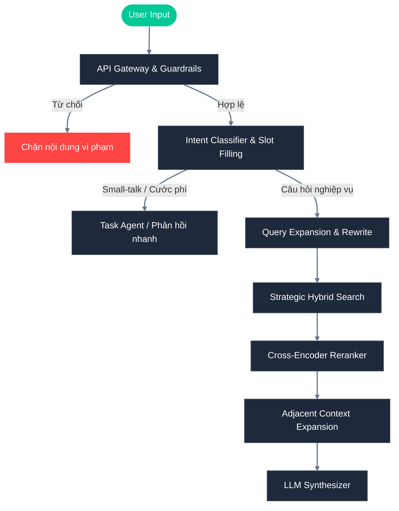

# Kiến trúc Hệ thống Xanh SM AI - RAG Pipeline

Hệ thống RAG (Retrieval-Augmented Generation) của Xanh SM được thiết kế với chuẩn Enterprise, tích hợp nhiều cơ chế xử lý phức tạp nhằm đảm bảo độ chính xác, an toàn và tối ưu chi phí.

## Sơ đồ Kiến trúc Tổng quan (Mermaid Flowchart)

## Các Chiến Thuật Đóng Vai Trò Cốt Lõi (Key Strategies)

### 1. Ingestion Pipeline & Heading-Aware Splitter
Trong quá trình nạp dữ liệu (Ingestion), tài liệu được bóc tách nội dung dựa trên cấu trúc tự nhiên của nó (Headers).
- **Chunk Size: 400 ký tự** | **Overlap: 50 ký tự**
- **Tại sao?** Việc duy trì `chunk_size` nhỏ giúp các Vector Embeddings (Dense & Sparse) đạt được độ chính xác (Precision) cực cao khi so khớp với câu hỏi của người dùng. Mỗi chunk sẽ là một ý hoàn chỉnh thay vì bị pha loãng.

### 2. Multi-Query Expansion & Rewrite
Thay vì lấy câu hỏi thô của User để truy vấn DB, hệ thống sẽ sử dụng LLM để viết lại (Rewrite) dựa trên lịch sử (Memory), đồng thời sinh ra thêm nhiều góc độ câu hỏi khác nhau (Multi-Query). Điều này giúp khắc phục hiện tượng người dùng hỏi quá ngắn gọn hoặc dùng từ đồng nghĩa.

### 3. Strategic Hybrid Search (Dense + Sparse)
Qdrant Vector DB được thiết lập với khả năng **Hybrid Search**.
- **Dense Vector (Embedding)**: Bắt ý nghĩa ngữ nghĩa (Semantics).
- **Sparse Vector (BM25/Splade)**: Bắt chính xác từ khóa (Keywords).
Qdrant sẽ sử dụng thuật toán **RRF (Reciprocal Rank Fusion)** ở mức Database Engine để hợp nhất kết quả giữa hai phương pháp này, giúp loại bỏ hoàn toàn việc phải tự định nghĩa tỉ lệ `0.5 - 0.5` cứng nhắc.

### 4. Cross-Encoder Reranker
Sau khi có danh sách các kết quả tiềm năng từ Hybrid Search (Top 25-35 tài liệu thô), hệ thống áp dụng mô hình `BGE-Reranker` để sắp xếp lại (Re-rank) mức độ liên quan. Mô hình Cross-Encoder "nhìn" đồng thời cả Câu hỏi và Câu trả lời tiềm năng thay vì so sánh 2 vector độc lập, lọc ra **Top 10 tài liệu tinh** khắt khe nhất. Điều này giúp tránh nhiễu và tăng độ chính xác vượt trội trước khi mở rộng ngữ cảnh.

### 5. Adjacent Context Expansion (Trượt Cửa Sổ Ngữ Cảnh)
> Đây là một chiến thuật đặc biệt thay thế cho Parent-Child Retrieval, được thực hiện **ngay sau khi Reranker** tìm ra Top 10 tài liệu liên quan nhất.
Khi tìm được một Chunk số `N` từ Database, hệ thống có thể bị thiếu đi ngữ cảnh nếu nội dung bị cắt ngang.
- **Vấn đề của Parent-Child**: Truy xuất ngược về Parent Document có thể kéo theo một file dài hàng ngàn ký tự, làm phình to Prompt (Prompt Bloat) và gây nhiễu cho LLM.
- **Giải pháp Adjacent Context**: Hệ thống truy vấn thẳng vào Qdrant để lấy chính xác Chunk `N-1` và Chunk `N+1` (dựa trên metadata `chunk_index` và `url`) của 10 tài liệu đã qua sàng lọc. Tổng ngữ cảnh đưa vào Prompt sẽ chỉ xoay quanh `400 x 3 = 1200` ký tự, cực kỳ tinh gọn và bám sát trọng tâm, đồng thời tiết kiệm tài nguyên mạng khi chỉ gọi Qdrant scroll cho 10 chunk chiến thắng.

### 6. LLM Synthesizer & Citation Validator
Bước cuối cùng, LLM sẽ nhận ngữ cảnh (đã được tinh lọc và mở rộng lân cận) để tổng hợp ra câu trả lời cuối cùng. Hệ thống cũng sẽ so sánh ngược kết quả sinh ra với tài liệu gốc để đảm bảo độ trung thực (Faithfulness) và đính kèm nguồn (Citation) cụ thể.
