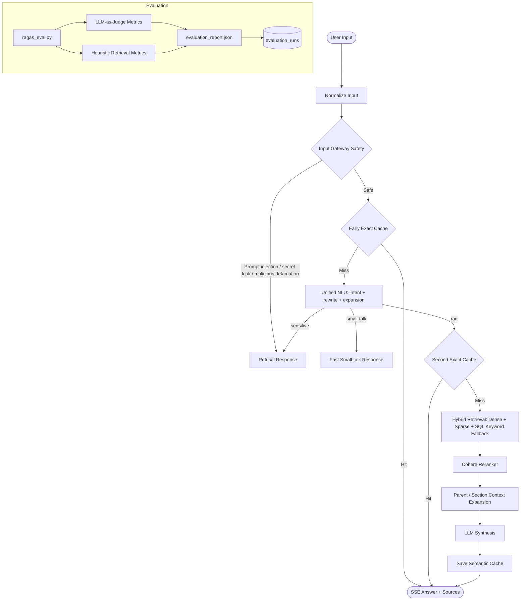

# Kien truc RAG Pipeline hien tai

Tai lieu nay mo ta pipeline dang chay cua Xanh SM RAG sau khi safety duoc dua ve tang dau vao va benchmark co lich su so sanh theo tung lan eval.

## So do tong quan

## 1. Input Gateway Safety

Gateway chay truoc cache, NLU, retriever va LLM. Tang nay chan som cac cau hoi co dau hieu prompt injection, yeu cau lo system prompt/API key/cau hinh noi bo, hoac yeu cau boi nho khong co can cu.

Viec chan o dau vao giup answer path khong phai quet lai cau tra loi hop le. Day la thay doi quan trong de tranh false-positive voi cac cau tra loi co thong so ky thuat nhu EC Van.

## 2. Early Exact Cache

Sau khi cau hoi vuot qua gateway, he thong tim exact match trong `SemanticCache` bang cau hoi tho da normalize. Neu hit, cau tra loi duoc tra ve ngay qua SSE voi latency rat thap va khong ton token LLM.

## 3. Unified NLU Gateway

`UNIFIED_NLU_PROMPT` gom cac viec tien RAG vao mot lan goi LLM:

- `intent`: phan loai `rag`, `small-talk`, hoac `sensitive`.
- `rewritten_query`: viet lai cau hoi doc lap, ngan, ro keyword.
- `expanded_queries`: sinh toi da mot bien the dong nghia de ho tro retrieval.
- `suggested_answer`: tra nhanh cho small-talk khi phu hop.

`max_tokens` NLU dang duoc giam nhe xuong `220`. Anh huong du kien thap vi output NLU la JSON ngan; doi lai giam tran sinh token, chi phi va latency xau nhat. Ruu ro chinh la JSON bi cat neu prompt sinh qua dai, nhung pipeline da co fallback rule-based khi parse loi.

## 4. Second Exact Cache

Neu NLU tra ve intent `rag`, pipeline kiem tra cache lan hai bang `rewritten_query`. Lop cache nay bat duoc cac cau hoi dien dat khac nhau nhung cung y nghia.

## 5. Hybrid Retrieval

Retriever ket hop:

- Dense vector voi OpenAI embedding.
- Sparse/BM25 trong Qdrant.
- SQL keyword fallback tren `document_chunks` de bat cac cum literal, ma xe, gia, chinh sach hoac so lieu ma vector search co the bo sot.
- Metadata/domain hints de uu tien dung nhom tai lieu.

Ket qua tho duoc hop nhat va khu trung truoc khi dua sang reranker.

## 6. Cohere Reranker

Pipeline dung Cohere rerank de sap xep lai cac chunk ung vien theo muc do lien quan truc tiep voi cau hoi da rewrite. Sau rerank, he thong giu top chunk tot nhat de tranh dua qua nhieu context nhieu vao LLM.

## 7. Parent / Section Context Expansion

Voi chunk co diem rerank du cao, pipeline mo rong theo `parent_chunk_id` hoac section lien quan de lay tron bang bieu/dieu khoan/chinh sach. Voi chunk diem thap hon, pipeline giu chunk goc de tranh lam loang context.

Trong buoc nay he thong cung dedupe header va noi dung trung lap de giam prompt size.

## 8. LLM Synthesis & SSE

LLM nhan context da rerank/mo rong, cau hoi da rewrite va lich su hoi thoai gan nhat. Cau tra loi duoc stream ve client qua SSE kem sources/citations.

Safety chinh nam o Input Gateway/NLU. Output guardrail khong con la node chan chinh tren duong sinh cau tra loi de tranh chan nham noi dung hop le.

## 9. Semantic Cache Saving

Sau khi sinh cau tra loi thanh cong, pipeline luu cache cho ca cau hoi goc va cau hoi da rewrite. Nhung lan hoi sau co the hit o Early Cache hoac Second Cache.

## 10. Evaluation & History

`evaluation/ragas_eval.py` doc `evaluation/golden_dataset.json`, chay qua RAG pipeline va xuat `evaluation_report.json`.

Benchmark ket hop:

- Retrieval metrics heuristic: Recall@5, Recall@10, MRR, NDCG@5.
- LLM-as-Judge: faithfulness, correctness, relevancy, va context recall khi co OpenAI API key.
- Latency trung binh va latency tung case.

Moi lan eval ghi them snapshot vao bang `evaluation_runs`, gom metrics tong, details JSON, model, dataset, total cases va thoi diem chay. Admin UI doc `/api/admin/eval/runs` de hien recent runs, trend va delta so voi lan truoc.

## Cac nguon latency chinh

Latency cao thuong den tu bon diem:

- NLU LLM call: da giam output budget xuong `220`, nhung van la mot network/API call.
- Embedding + hybrid retrieval: phu thuoc Qdrant, SQL fallback va kich thuoc tap ung vien.
- Cohere rerank: la API call rieng, thuong ton them hang tram ms den vai giay neu network cham.
- LLM synthesis: phu thuoc do dai context sau expansion va do dai cau tra loi; day thuong la phan lon nhat neu context/document dai.

Cache hit la cach giam latency manh nhat vi bo qua NLU, retrieval, rerank va generation.
