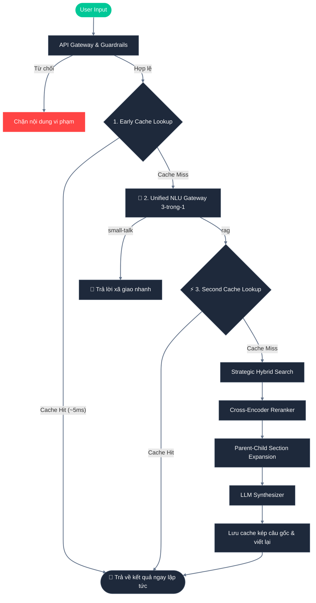

# Kiến trúc Hệ thống Xanh SM AI - RAG Pipeline

Hệ thống RAG (Retrieval-Augmented Generation) của Xanh SM được thiết kế với chuẩn Enterprise, tích hợp nhiều cơ chế xử lý phức tạp nhằm đảm bảo độ chính xác, an toàn và tối ưu chi phí.

## Sơ đồ Kiến trúc Tổng quan (Mermaid Flowchart)

## Các Chiến Thuật Đóng Vai Trò Cốt Lõi (Key Strategies)

### 1. Ingestion Pipeline & Table-Aware Splitter
Trong quá trình nạp dữ liệu (Ingestion), tài liệu được bóc tách nội dung kết hợp giữa cấu trúc tiêu đề tự nhiên của tài liệu và cấu trúc bảng biểu đặc thù.
- **Chunk Size: 400 ký tự** | **Overlap: 50 ký tự** (Áp dụng cho các đoạn văn bản thông thường)
- **Table-Aware Splitter**:
  - **Vấn đề**: Các tài liệu chứa bảng biểu (như bảng giá cước, thông số kỹ thuật) thường có kích thước vượt quá cấu hình `chunk_size` tiêu chuẩn. Nếu sử dụng thuật toán phân đoạn theo ký tự thông thường, bảng sẽ bị cắt làm đôi hoặc phân mảnh theo dòng, làm mất tiêu đề cột (Column Headers) và phá vỡ mối quan hệ ngữ nghĩa giữa các ô dữ liệu.
  - **Giải pháp**: 
    1. Tách biệt cấu trúc bảng: Hệ thống tự động nhận diện các khối bảng Markdown thông qua các ký tự phân tách đặc thù (`|` và đường căn lề `-`).
    2. Cô lập bảng thành Chunk riêng (Table Isolation): Khi phát hiện khối bảng có chiều dài dưới **1500 ký tự**, hệ thống sẽ tự động cô lập toàn bộ bảng này thành một chunk độc lập hoàn chỉnh, không gộp chung với văn bản xung quanh hay chia nhỏ theo ký tự.
    3. Xử lý bảng kích thước lớn: Đối với các bảng vượt quá 1500 ký tự, hệ thống áp dụng cơ chế phân đoạn theo hàng (row-by-row splitting) nhưng luôn sao chép tiêu đề cột (headers) gắn vào đầu mỗi chunk con. Điều này đảm bảo mỗi phần nhỏ của bảng vẫn giữ đầy đủ thông tin định danh cột để mô hình Embedding và LLM hiểu chính xác ngữ nghĩa.

### 2. Early Cache Lookup (Kiểm tra Cache sớm)
- **Vấn đề**: Để giảm thiểu tối đa chi phí gọi API OpenAI và tăng tốc phản hồi cho các câu hỏi lặp lại.
- **Giải pháp**: Trước khi chạy bất kỳ logic LLM hay NLU nào, hệ thống thực hiện một truy vấn tìm kiếm khớp chính xác (Exact Match) trên bộ nhớ đệm `SemanticCache` (SQL) dựa trên câu hỏi thô đã chuẩn hóa của người dùng.
- **Kết quả**: Nếu tìm thấy (Cache Hit), câu trả lời được trả về ngay lập tức với độ trễ siêu nhỏ **~5-10ms** và **0 token tiêu tốn**, bỏ qua hoàn toàn các bước LLM phía sau.

### 3. Unified NLU Gateway 3-trong-1 (Hợp nhất Gateway)
Thay vì thực hiện 3 cuộc gọi LLM tuần tự độc lập (viết lại câu hỏi, phân loại ý định, và sinh câu hỏi đồng nghĩa) tốn tới ~5 giây, hệ thống sử dụng một prompt hợp nhất `UNIFIED_NLU_PROMPT` để giải quyết cả 3 tác vụ trong **1 lần gọi LLM duy nhất**:
1. **Rewrite**: Viết lại câu hỏi thô thành câu hỏi độc lập có đủ bối cảnh từ lịch sử trò chuyện.
2. **Classify**: Phân loại ý định của người dùng thành `small-talk` (lời chào, xã giao), `sensitive` (tấn công hệ thống, jailbreak, yêu cầu tiết lộ prompt/file mật) hoặc `rag` (các câu hỏi tra cứu thông tin chính sách).
3. **Expand**: Sinh ra tối đa 1 câu hỏi đồng nghĩa tương đương hỗ trợ tìm kiếm Hybrid Search.
- **Kết quả**: Giảm độ trễ tiền RAG từ ~5.0 giây xuống còn **~1.5 - 2.0 giây** mà vẫn đảm bảo độ chính xác và an toàn.

### 4. Strategic Hybrid Search (Dense + Sparse)
Qdrant Vector DB được thiết lập với khả năng **Hybrid Search**.
- **Dense Vector (Embedding)**: Bắt ý nghĩa ngữ nghĩa (Semantics).
- **Sparse Vector (BM25/Splade)**: Bắt chính xác từ khóa (Keywords).
Qdrant sẽ sử dụng thuật toán **RRF (Reciprocal Rank Fusion)** ở mức Database Engine để hợp nhất kết quả giữa hai phương pháp này, giúp loại bỏ hoàn toàn việc phải tự định nghĩa tỉ lệ `0.5 - 0.5` cứng nhắc.

### 5. Cross-Encoder Reranker
Sau khi có danh sách các kết quả tiềm năng từ Hybrid Search (Top 25 tài liệu thô), hệ thống áp dụng mô hình `cross-encoder/ms-marco-MiniLM-L-6-v2` để sắp xếp lại (Re-rank) mức độ liên quan. Mô hình Cross-Encoder "nhìn" đồng thời cả Câu hỏi và Câu trả lời tiềm năng thay vì so sánh 2 vector độc lập, lọc ra **Top 10 tài liệu tinh** khắt khe nhất. Điều này giúp tránh nhiễu và tăng độ chính xác vượt trội trước khi mở rộng ngữ cảnh.

### 6. Adaptive Parent-Child Section Expansion (Mở rộng Mục Cha Tùy Biến Động)
> Đây là chiến thuật kết hợp tính gọn nhẹ của tìm kiếm vector (với các chunk con 400 ký tự) và tính toàn vẹn của tài liệu gốc thông qua việc truy xuất động mục lớn (Parent Section).
- **Semantic Header Prepending**: Khi nạp dữ liệu (Ingestion), các chunk con thứ cấp (từ index > 0) tự động được gắn thêm tiêu đề mục lớn `### Tiêu đề mục\n\n` để duy trì độ tương đồng ngữ nghĩa khi tìm kiếm vector.
- **Cơ chế Parent-Child Tùy Biến Động (Adaptive Expansion)**:
  - Nếu chunk đạt điểm tương đồng xếp hạng lại (`rerank_score`) **>= 0.7** (độ liên quan rất cao): Hệ thống tự động cuộn Qdrant truy xuất toàn bộ các chunk con cùng cha (`parent_chunk_id`), tối đa **10 chunks**, giúp tái cấu trúc trọn vẹn mục lớn cho LLM.
  - Nếu chunk có điểm **< 0.7** (độ liên quan vừa phải/thấp): Giữ nguyên chunk gốc độc lập để tránh làm loãng ngữ cảnh và tiết kiệm token.
- **Dọn dẹp & Loại trùng lặp (De-duplication & Merging)**: 
  - Khi gộp các chunk của mục lớn, hệ thống sắp xếp theo thứ tự `chunk_index` tăng dần và tự động lọc bỏ các header trùng lặp ở đầu các chunk con thứ cấp để tiết kiệm token tối đa.
  - Sử dụng danh sách `covered_chunk_ids` để đảm bảo nếu một chunk thô đã nằm trong một mục lớn được mở rộng, nó sẽ không xuất hiện lại trong prompt, loại bỏ hoàn toàn hiện tượng trùng lặp nội dung.

### 7. LLM Synthesizer & Citation Validator
Bước cuối cùng, LLM sẽ nhận ngữ cảnh (đã được tinh lọc và mở rộng lân cận) để tổng hợp ra câu trả lời cuối cùng. Hệ thống cũng sẽ so sánh ngược kết quả sinh ra với tài liệu gốc để đảm bảo độ trung thực (Faithfulness) và đính kèm nguồn (Citation) cụ thể. Sau khi sinh phản hồi thành công, hệ thống tiến hành **Double Caching** - lưu cache cho cả câu hỏi thô gốc lẫn câu hỏi đã viết lại để tăng khả năng trúng cache cho các lần hỏi sau.

### 8. SSE Streaming Latency Correction
Trong mô hình streaming Server-Sent Events (SSE), việc timing tổng độ trễ bằng hiệu thời gian thô có nhược điểm lớn là tính gộp cả thời gian chờ gửi tin (network delays và tốc độ render typewriter của client). Hệ thống của chúng tôi áp dụng cơ chế đo lường cải tiến:
- **First Token Locking (Chốt Số Đo ở Ký Tự Đầu Tiên)**: Hệ thống ghi nhận và chốt số đo `generation_latency_ms` và `total_latency_ms` ngay khi nhận được **ký tự đầu tiên chứa nội dung** từ OpenAI (Time To First Token - TTFT). Điều này giúp loại bỏ hoàn toàn thời gian LLM nhả chữ/typewriter kéo dài sau đó, phản ánh chính xác tốc độ xử lý thực tế của hệ thống.
- **Bypass / Instant Response Timing**: Với các phản hồi nhanh (như small-talk hoặc cache-hit), độ trễ được chốt ngay trước khi luồng tokens được gửi đi, giữ số đo cực kỳ nhỏ và chuẩn xác.

### 9. Telemetry & Quality Evaluation (Ghi nhận Số liệu Thử nghiệm)
Nhằm phục vụ đánh giá chất lượng RAG tự động qua Ragas benchmark:
- **Số lượng Chunk trước mở rộng (num_chunks_before_expansion)**: Số lượng tài liệu liên quan tối đa được giữ lại sau bước Reranking của Cohere (tối đa là 10) và ngay trước khi thực hiện mở rộng `expand_context`.
- **Độ dài ngữ cảnh (compressed_context_len)**: Tổng số lượng ký tự của ngữ cảnh gộp cuối cùng đưa vào prompt để gửi tới LLM.
- **Heuristic và LLM Judge**: Hệ thống kết hợp việc đếm từ khóa mong đợi (`expected_keywords`) và sử dụng LLM Judge chấm điểm `correctness`, `faithfulness`, `relevancy` và `context_recall`.

