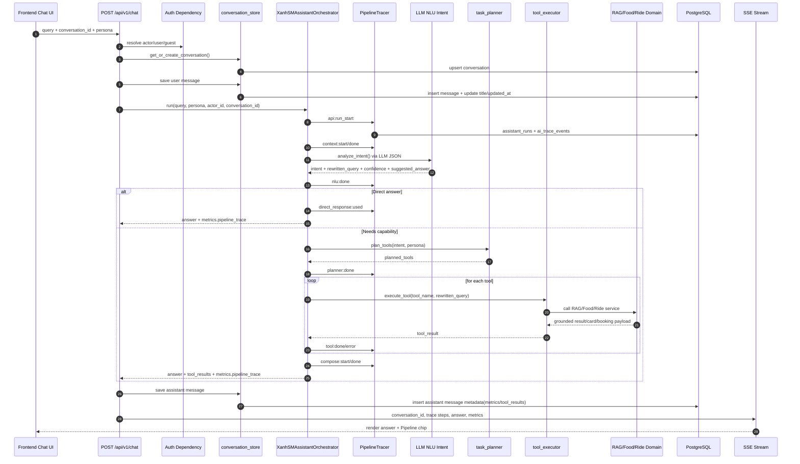
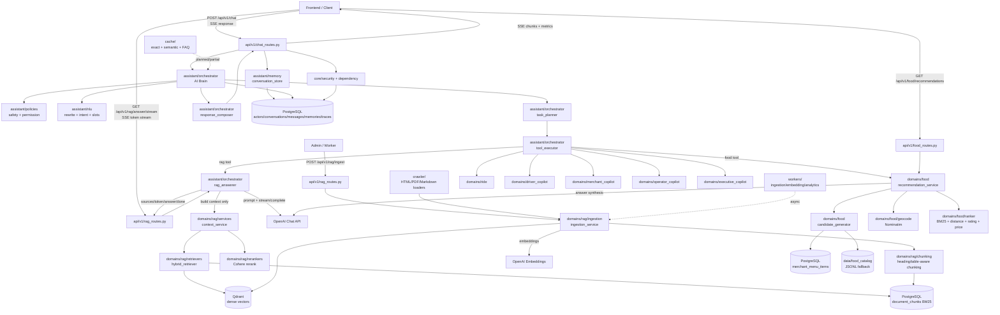

# Kế Hoạch Tái Cấu Trúc Modular AI Assistant Platform

## 0. Sơ đồ luồng hệ thống

### 0.1 Chat runtime flow hiện tại





## 1. Mục tiêu

Dự án sẽ được nâng từ một AI Assistant phục vụ chat/RAG/food recommendation thành một **Modular AI Assistant Platform** cho hệ sinh thái Xanh SM/Vin. Hệ thống có một **AI Brain** dùng chung, nhưng được cấu hình khác nhau theo persona:

- `customer`: Customer AI Assistant.
- `driver`: Driver Copilot.
- `merchant`: Merchant Copilot.
- `operator`: Operator Copilot.
- `executive`: Business Intelligence Copilot.

Mục tiêu kỹ thuật:

- Code rõ module, ít file quá dài, dễ mở rộng persona/tool mới.
- Tách API, orchestration, domain service, tool, database, integration.
- Dùng permission bằng code để ngăn persona gọi nhầm tool hoặc đọc nhầm dữ liệu.
- Chuẩn hóa database mới, giảm các bảng log rời rạc.
- Giữ tương thích dần ở tầng code, nhưng database dev/demo có thể reset sạch; không bắt buộc chuyển dữ liệu cũ sang schema mới.

## 2. Công nghệ agent

Dùng **LangGraph** làm lõi orchestration chính.

LangChain vẫn dùng cho:

- Retriever.
- Tool wrapper.
- Prompt template.
- Chain primitive.

Không dùng LangChain Agent thuần làm lõi vì hệ thống multi-persona cần state graph, permission, retry, audit, human confirmation và trace rõ ràng hơn.

Thư viện tiếp tục dùng:

- Backend: `fastapi`, `pydantic`, `sqlalchemy`, `alembic`, `langgraph`, `langchain`, `langchain-openai`, `langchain-qdrant`, `qdrant-client`, `cohere`, `openai`.
- Map: `leaflet`, `react-leaflet`.
- Frontend chart/dashboard: `recharts`, `lucide-react`, `react-markdown`.
- ML phase sau: `xgboost`, `numpy`, có thể bổ sung `pandas`, `scikit-learn` khi làm forecast thật.

## 3. Cấu trúc thư mục backend mục tiêu

```text
backend/
  app/
    main.py

    config/
      settings.py
      environment.py

    core/
      security/
        auth.py
        jwt.py
        password.py
        permissions.py
      logging/
        logger.py
        request_log.py
      middleware/
        cors.py
        request_context.py
      exceptions/
        handlers.py
        errors.py
      dependency.py

    api/
      v1/
        chat_routes.py
        voice_routes.py
        rag_routes.py
        recommendation_routes.py
        driver_routes.py
        merchant_routes.py
        operator_routes.py
        executive_routes.py
        booking_routes.py
        admin_routes.py

    assistant/
      orchestrator/
        assistant_orchestrator.py
        graph_runtime.py
        intent_router.py
        task_planner.py
        tool_executor.py
        response_composer.py
      personas/
        customer_persona.py
        driver_persona.py
        merchant_persona.py
        operator_persona.py
        executive_persona.py
        registry.py
      memory/
        working_memory.py
        long_term_memory.py
        user_profile_memory.py
        conversation_store.py
      nlu/
        query_rewriter.py
        intent_classifier.py
        slot_extractor.py
        context_resolver.py
      policies/
        safety_guard.py
        permission_guard.py
        hallucination_guard.py
        action_confirmation.py
      prompts/
        system_prompts.py
        nlu_prompts.py
        rag_prompts.py
        food_prompts.py
        driver_prompts.py
        merchant_prompts.py
        operator_prompts.py
        executive_prompts.py
        travel_prompts.py

    domains/
      rag/
        services/
        retrievers/
        rerankers/
        chunking/
        ingestion/
        schemas.py
        repository.py
      food/
        recommendation_service.py
        candidate_generator.py
        ranker.py
        food_profile.py
        menu_ocr.py
        schemas.py
      ride/
        booking_service.py
        fare_service.py
        dispatch_service.py
        driver_matching.py
        route_service.py
        schemas.py
      driver_copilot/
        driver_assistant_service.py
        demand_prediction.py
        congestion_prediction.py
        hot_zone_service.py
        trip_status_service.py
        charging_station_service.py
        schemas.py
      merchant_copilot/
        revenue_analysis.py
        menu_analysis.py
        review_analysis.py
        promotion_advisor.py
        business_consultant.py
        schemas.py
      operator_copilot/
        fleet_monitor.py
        revenue_diagnostics.py
        fraud_detection.py
        incident_monitor.py
        schemas.py
      executive_copilot/
        bi_analysis.py
        forecast_simulation.py
        churn_prediction.py
        expansion_advisor.py
        schemas.py
      travel/
        trip_planner.py
        itinerary_service.py
        hotel_recommendation.py
        attraction_service.py
        schemas.py
      commerce/
        vin_ecosystem_recommender.py
        voucher_service.py
        upsell_service.py
        schemas.py
      user/
        user_profile_service.py
        preference_service.py
        location_service.py
        schemas.py

    tools/
      base_tool.py
      registry.py
      rag_tools.py
      food_tools.py
      ride_tools.py
      driver_tools.py
      merchant_tools.py
      operator_tools.py
      executive_tools.py
      travel_tools.py
      hotel_tools.py
      map_tools.py
      payment_tools.py
      notification_tools.py

    voice/
      realtime_session.py
      vad.py
      stt_service.py
      tts_service.py
      streaming_gateway.py
      turn_taking.py

    realtime/
      websocket_manager.py
      event_bus.py
      driver_location_stream.py
      trip_status_stream.py
      notification_stream.py

    ml/
      embeddings/
      ranking/
      prediction/
        demand_forecast_model.py
        traffic_model.py
        eta_model.py
      evaluation/
        rag_eval.py
        agent_eval.py
        recommendation_eval.py
        golden_dataset.py

    integrations/
      openai_client.py
      groq_client.py
      qwen_client.py
      cohere_client.py
      leaflet_geocode_client.py
      vin_service_client.py
      payment_client.py
      notification_client.py

    db/
      session.py
      base.py
      models/
        identity.py
        assistant.py
        conversation.py
        memory.py
        knowledge.py
        food.py
        ride.py
        merchant.py
        operations.py
        analytics.py
        observability.py
      repositories/
      migrations/
      seed/

    vectorstore/
      qdrant_client.py
      collections.py
      vector_repository.py

    cache/
      semantic_cache.py
      exact_cache.py
      session_cache.py

    schemas/
      common.py
      chat.py
      voice.py
      tool.py
      response.py

    workers/
      ingestion_worker.py
      embedding_worker.py
      prediction_worker.py
      notification_worker.py
      analytics_worker.py

  tests/
  scripts/
  docs/
  docker/
  requirements.txt
  README.md
```

Ghi chú cho repo hiện tại: source backend chính đã chuyển sang `backend/app`; thư mục root `app/` chỉ còn vai trò shim tương thích. Dockerfile vẫn nên đặt ở repo root trong giai đoạn monorepo để build context lấy được `requirements.txt`, `alembic`, shim `app/`, `backend/app` và cấu hình deploy.

## 4. Trách nhiệm từng lớp

### `api/v1`

Chỉ nhận request, validate schema, gọi service/runtime, trả response/SSE. Không đặt business logic dài trong route.

### `assistant`

Lớp AI Brain dùng chung:

- `orchestrator`: LangGraph runtime, route intent, plan task, execute tool, compose response.
- `personas`: cấu hình prompt, tone, allowed tools, data scope cho từng persona.
- `memory`: working memory, long-term memory, profile snapshot.
- `nlu`: rewrite query, classify intent, extract slots, resolve context.
- `policies`: safety, permission, hallucination guard, action confirmation.
- `prompts`: chia prompt theo nhiệm vụ, không nhồi prompt dài vào runtime.

### `domains`

Chứa business logic theo nghiệp vụ:

- `rag`: knowledge retrieval, rerank, ingestion.
- `food`: recommendation, ranking, menu OCR.
- `ride`: booking, fare, dispatch, route.
- `driver_copilot`: demand, congestion, charging, trip status.
- `merchant_copilot`: doanh thu, menu, review, promotion, consultant.
- `operator_copilot`: fleet, revenue, fraud, incident.
- `executive_copilot`: BI, forecast, churn, expansion.

### `tools`

Tool là lớp adapter để agent gọi domain service. Tool không chứa logic nghiệp vụ lớn. Mỗi tool có input/output schema rõ ràng.

### `integrations`

Chỉ chứa client gọi dịch vụ ngoài: OpenAI, Cohere, Qdrant, map/geocode, Vin service, payment.

### `db`

Tách model theo nhóm domain. Repository là nơi query database, không query SQLAlchemy rải rác trong route hoặc tool.

## 5. Persona registry và permission

Persona chính:

```text
customer
driver
merchant
operator
executive
```

Tool groups:

```text
rag_tools
food_tools
ride_tools
driver_tools
merchant_tools
operator_tools
executive_tools
travel_tools
map_tools
payment_tools
notification_tools
```

Permission mặc định:

| Persona | Tool được dùng |
|---|---|
| customer | rag, food, ride, travel, commerce, payment_stub |
| driver | rag_driver, ride_status, map, charging, demand_heatmap |
| merchant | merchant_analytics, menu_analysis, review_analysis, promotion_advisor, menu_ocr |
| operator | fleet_monitor, revenue_diagnostics, fraud_detection, incident_monitor |
| executive | bi_analysis, forecast_simulation, churn_prediction, expansion_advisor |

Quy tắc:

- Persona không được gọi tool ngoài whitelist.
- Tool nhạy cảm như booking, payment, promotion publish phải qua `action_confirmation.py`.
- Prompt không phải lớp bảo mật. Bảo mật nằm ở `permission_guard.py` và repository query scope.
- Mọi tool call cần ghi audit vào `tool_calls`.

## 6. Chuẩn code clean

Quy định:

- Tên file phải nói rõ mục đích.
- Hàm có type hint đầy đủ.
- Tránh file trên 250-300 dòng. Nếu dài hơn, tách theo responsibility.
- Không đặt business logic dài trong API route.
- Không trộn refactor với đổi behavior nếu không cần.
- Không hardcode JSON string dài; dùng Pydantic schema và helper serialize.
- Prompt dài đặt trong file prompt theo domain.
- Tool input/output dùng Pydantic model.

Ví dụ style:

```python
def get_retriever(collection_name: str = "data_test") -> EnsembleRetriever:
    ...


def build_customer_context(actor_id: str, conversation_id: str) -> CustomerContext:
    ...


def can_use_tool(persona_id: str, tool_name: str) -> bool:
    ...
```

## 7. API thay đổi dự kiến

Giữ `/api/chat` tương thích, thêm field `persona`.

```python
class ChatRequest(BaseModel):
    query: str
    display_query: str | None = None
    conversation_id: str | None = None
    image_base64: str | None = None
    deep_search: bool = False
    persona: str = "customer"
```

Thêm endpoint:

```text
GET /api/v1/personas
POST /api/v1/chat
POST /api/v1/voice/session
GET /api/v1/driver/status
GET /api/v1/merchant/analytics
GET /api/v1/operator/metrics
GET /api/v1/executive/insights
```

SSE event giữ format cũ, bổ sung metadata:

```json
{
  "step": "tool_call",
  "persona": "merchant",
  "tool_name": "merchant_sales_analytics",
  "trace_id": "run_xxx"
}
```

## 8. Database

Thiết kế database mới nằm trong [NEW_DB_SCHEMA.md](NEW_DB_SCHEMA.md).

Định hướng:

- Gộp `users` và `guest_sessions` thành mô hình `actors` + `actor_identities`.
- Thêm `personas` và `persona_access_grants`.
- Thêm `assistant_runs`, `tool_calls`, `ai_trace_events` để thay dần nhiều bảng log cũ.
- Gộp memory/profile rời rạc thành `memories` và `profile_snapshots`.
- Tách `food_catalog` thành `merchants` và `merchant_menu_items`.
- Thêm bảng cho driver, trip, charging station, operation metrics, fraud signals, executive insight.

## 9. Semantic Cache & FAQ Governance

Semantic cache mới không lưu mọi prompt của user và cũng không chỉ compare string. Cache phải là một lớp FAQ có kiểm duyệt, dùng hybrid matching để tránh làm loạn hệ thống.

### Vấn đề hiện tại

- Nếu lưu mọi câu hỏi user vào semantic cache, hệ thống dễ nhiễu bởi prompt cá nhân, câu hỏi sai, câu hỏi chứa ngữ cảnh tạm thời hoặc câu hỏi ngoài phạm vi.
- Compare string thuần chỉ bắt trùng câu chữ, không bắt được câu hỏi tương đương về nghĩa.
- Semantic similarity thuần cũng nguy hiểm nếu không có lớp kiểm duyệt, vì có thể match nhầm giữa các câu gần nghĩa nhưng khác điều kiện chính sách/giá/dịch vụ.

### Thiết kế mới

Tách semantic cache thành 2 lớp:

```text
User query
  -> normalize/rewrite
  -> FAQ eligibility analyzer
  -> hybrid FAQ matcher
  -> answer from curated FAQ cache OR run full pipeline
```

Các module đề xuất:

```text
app/cache/
  semantic_cache.py
  exact_cache.py
  faq_cache.py
  faq_candidate_analyzer.py
  hybrid_cache_matcher.py
```

### Hybrid compare

Matcher dùng nhiều tín hiệu cùng lúc:

- Exact normalized match: câu đã chuẩn hóa trùng hoàn toàn.
- Semantic vector similarity: embedding query so với FAQ canonical question.
- BM25/keyword overlap: giữ các từ khóa quan trọng như tên dịch vụ, địa điểm, gói giá, điều kiện.
- Intent compatibility: intent của query phải cùng nhóm với FAQ.
- Scope/persona compatibility: customer/driver/merchant/operator/executive không dùng lẫn FAQ nếu khác quyền.
- Freshness/version: FAQ có `effective_from`, `expires_at`, `source_document_id`, `policy_version`.

Chỉ trả cache hit khi điểm tổng hợp vượt ngưỡng an toàn, ví dụ:

```text
hybrid_score >= 0.86
semantic_score >= 0.82
keyword_score >= 0.45
intent matched
persona scope matched
FAQ status = approved
```

Ngưỡng cụ thể sẽ được tuning bằng evaluation set.

### FAQ eligibility analyzer

Không phải câu hỏi nào cũng được lưu vào FAQ. Một câu hỏi chỉ trở thành FAQ candidate nếu:

- Câu hỏi có tính lặp lại, độc lập ngữ cảnh.
- Không chứa thông tin cá nhân, vị trí riêng tư, token, số điện thoại, nội dung nhạy cảm.
- Không phụ thuộc vào thời điểm quá hẹp như "hôm nay", "đơn này", "tài xế này" nếu không có source realtime.
- Có câu trả lời được hỗ trợ bởi RAG source hoặc domain tool đáng tin cậy.
- Có thể viết lại thành canonical question rõ ràng.

Pipeline đề xuất:

```text
completed assistant run
  -> analyze FAQ eligibility
  -> create faq_candidate if qualified
  -> admin/eval approval
  -> publish to faq_entries
  -> embed canonical question
  -> available for hybrid semantic cache
```

Các trạng thái FAQ:

```text
candidate -> approved -> published -> deprecated -> archived
```

### Bảng dữ liệu đề xuất

Chi tiết nằm trong `NEW_DB_SCHEMA.md`, nhưng logic cần có các bảng:

- `faq_entries`: câu hỏi chuẩn, câu trả lời chuẩn, persona scope, source, status.
- `faq_question_variants`: các cách hỏi tương đương đã được duyệt.
- `faq_cache_hits`: log cache hit/miss, score, matcher version.
- `faq_candidates`: câu hỏi tiềm năng sinh từ user query sau khi analyzer đánh giá.

### Quy tắc không được làm

- Không tự động publish prompt user vào semantic cache.
- Không cache câu trả lời có dữ liệu realtime như số tài xế online, trạng thái chuyến, doanh thu hôm nay.
- Không dùng chung FAQ giữa persona có quyền khác nhau.
- Không trả cache nếu source policy đã hết hạn hoặc bị deprecated.

## 10. User Context & Memory

Hệ thống cần làm rõ 3 loại ngữ cảnh: ngữ cảnh hội thoại hiện tại, ngữ cảnh dài hạn của user, và hành vi/thói quen suy ra từ tương tác.

### Hiện tại đang làm

Hiện pipeline đã có các lớp sau:

- Working memory: lấy các message gần nhất trong cùng conversation để hiểu câu hỏi nối tiếp.
- Long-term memory: `user_memories` lưu fact/preference/location/constraint khi NLU phát hiện thông tin đáng nhớ.
- Profile cache: `user_profiles` tổng hợp memory thành context ngắn để đưa vào prompt.
- Food profile: `user_food_profiles` lưu location, món thích/không thích, budget, tags để cá nhân hóa food recommendation.

Điểm cần nâng cấp:

- Memory còn phân tán giữa general profile và food profile.
- Chưa có persona scope rõ cho driver/merchant/operator/executive.
- Chưa đủ cơ chế phân biệt explicit memory do user nói trực tiếp và inferred behavior suy ra từ click/like/order.
- Chưa có policy rõ cho việc quên, sửa, hoặc supersede memory cũ.

### Thiết kế mới

Chuẩn hóa memory quanh 4 lớp:

```text
1. Conversation context
2. Actor profile context
3. Persona-scoped memory
4. Behavioral memory
```

#### 1. Conversation context

Dùng cho các câu nối tiếp trong cùng hội thoại:

- "cái đầu tiên"
- "gần hơn nữa"
- "so sánh cái đó"
- "đặt món vừa rồi"

Nguồn:

- N message gần nhất.
- `conversation_summaries` khi hội thoại dài.
- Last selected entities: món/quán/xe/chuyến/merchant/report.

#### 2. Actor profile context

Dữ liệu ổn định của chính user/actor:

- Tên/cách xưng hô.
- Địa chỉ quen thuộc nếu user cho phép.
- Sở thích ăn uống.
- Ràng buộc như ăn chay, dị ứng, không cay.
- Thói quen ngân sách.

Nguồn mới:

- `memories`
- `profile_snapshots`

#### 3. Persona-scoped memory

Mỗi persona có memory scope riêng:

| Persona | Memory scope |
|---|---|
| customer | `general`, `food`, `ride`, `travel` |
| driver | `driver`, `ride`, `charging` |
| merchant | `merchant`, `menu`, `promotion`, `review` |
| operator | `ops`, `fleet`, `incident`, `fraud` |
| executive | `executive`, `bi`, `forecast`, `strategy` |

Không đưa memory nhạy cảm của persona này vào prompt persona khác nếu không có permission rõ.

#### 4. Behavioral memory

Suy ra từ hành vi lặp lại, không phải một câu nói trực tiếp:

- Hay chọn món dưới 50.000đ.
- Thường đặt quanh nhà vào buổi tối.
- Hay bấm vào quán có rating cao.
- Merchant thường hỏi doanh thu theo tuần.
- Operator thường theo dõi sân bay hoặc khu vực cụ thể.

Behavioral memory phải có:

- `source = behavioral_signal`
- `confidence`
- `evidence_json`
- `last_observed_at`
- `decay_policy`

Không dùng behavioral memory để khẳng định tuyệt đối. Chỉ dùng để gợi ý mềm.

### Memory lifecycle

```text
extract candidate
  -> validate safety/privacy
  -> deduplicate
  -> assign scope/persona
  -> save memory
  -> refresh profile snapshot
  -> retrieve relevant memory in next turns
```

Trạng thái memory:

```text
active
superseded
deleted
expired
```

Quy tắc:

- User nói "quên thông tin này" thì phải soft-delete hoặc mark `deleted`.
- User sửa thông tin mới thì memory cũ chuyển `superseded`.
- Memory suy luận hành vi có thể hết hạn theo thời gian.
- Sensitive data không được lưu nếu không cần thiết cho sản phẩm.

### Context builder mới

Tạo module:

```text
app/assistant/memory/
  working_memory.py
  long_term_memory.py
  user_profile_memory.py
  behavioral_memory.py
  context_builder.py
```

`context_builder.py` chịu trách nhiệm tạo prompt context theo thứ tự:

```text
system persona prompt
  + permission/data scope
  + conversation summary
  + recent turns
  + relevant actor memories
  + persona-scoped profile snapshot
  + current tool/result context
```

## 11. Alembic Migration Convention

Hiện tên file trong `alembic/versions` hơi khó đọc vì lẫn timestamp tự đặt và revision hash. Từ các migration mới, dùng quy tắc đặt tên thống nhất để nhìn là biết migration mới/cũ và thuộc nhóm nào.

### Quy tắc tên file

Format:

```text
YYYYMMDD_NNNN_short_description.py
```

Ví dụ:

```text
20260628_0001_create_actor_persona_tables.py
20260628_0002_create_assistant_run_trace_tables.py
20260628_0003_create_memory_profile_tables.py
20260628_0004_split_food_catalog_to_merchants.py
20260628_0005_create_driver_operator_bi_tables.py
```

Ý nghĩa:

- `YYYYMMDD`: ngày tạo migration.
- `NNNN`: số thứ tự trong ngày, tăng dần.
- `short_description`: snake_case, mô tả đúng nội dung.

### Quy tắc message Alembic

Khi tạo migration, message cũng phải rõ:

```text
alembic revision -m "20260628_0001_create_actor_persona_tables"
```

Nếu Alembic tự sinh revision ID dạng hash, vẫn giữ `revision`/`down_revision` đúng chuẩn Alembic, nhưng file name và message phải theo format trên.

### Quy tắc nội dung migration

- Một migration chỉ làm một nhóm thay đổi liên quan.
- Trong phase clean reset hiện tại, không tạo migration backfill dữ liệu cũ.
- Nếu production sau này bắt buộc migrate dữ liệu thật, backfill phải tách file riêng:

```text
20260628_0101_backfill_actors_from_users.py
20260628_0102_backfill_merchants_from_food_catalog.py
```

- Với dev/demo hiện tại, có thể drop bảng/cột cũ sau khi backup nếu cần.
- Migration destructive phải có ghi chú rõ đây là clean reset và chỉ áp dụng khi đã chấp nhận clear data.

### Quy tắc kiểm tra migration

Mỗi migration phải chạy được:

```text
alembic upgrade head
alembic downgrade -1
alembic upgrade head
```

Với clean reset, smoke test chính là kiểm tra schema mới tạo đủ bảng, seed đủ persona/FAQ demo và app khởi động được. Nếu sau này có backfill production riêng, khi đó mới cần kiểm tra số dòng nguồn/đích.

## 12. Lộ trình triển khai

### Phase 1: Chuẩn hóa tài liệu và schema

- Tạo `PLAN.md`.
- Tạo `NEW_DB_SCHEMA.md`.
- Chốt cấu trúc module mục tiêu.
- Xác định bảng legacy và bảng mới.
- Chốt quy tắc đặt tên Alembic migration mới.

### Phase 2: Tạo khung AI Brain

- Tạo `assistant/personas`.
- Tạo persona registry.
- Tạo permission guard.
- Tạo tool registry.
- Wrap RAG và Food hiện tại thành tool đầu tiên.
- Tạo context builder mới cho working memory, long-term memory, profile snapshot.

### Phase 3: LangGraph runtime

- Tạo `graph_runtime.py`.
- Flow: safety -> persona resolve -> NLU -> permission -> tool planning -> tool execution -> response compose -> trace.
- Giữ `/api/chat` hoạt động như cũ với persona mặc định `customer`.
- Tích hợp memory context theo persona scope.

### Phase 4: Database clean reset

- Tạo model mới theo `NEW_DB_SCHEMA.md`.
- Backup database hiện tại nếu còn cần tham chiếu.
- Clear/drop dữ liệu legacy trong môi trường dev/demo.
- Viết Alembic migration tạo schema mới sạch.
- Seed dữ liệu nền tối thiểu: personas, admin/dev actor, FAQ mẫu, snapshot demo.
- Không backfill dữ liệu cũ trừ khi có yêu cầu riêng.
- Đặt tên migration theo format `YYYYMMDD_NNNN_short_description.py`.

### Phase 4.5: Semantic FAQ cache

- Tạo `faq_entries`, `faq_question_variants`, `faq_candidates`, `faq_cache_hits`.
- Tạo `faq_candidate_analyzer.py`.
- Tạo `hybrid_cache_matcher.py`.
- Chỉ publish FAQ sau khi được duyệt hoặc pass evaluation rule.
- Thay cache hit hiện tại bằng hybrid FAQ matching có persona/scope/freshness check.

### Phase 5: Persona demo tools

- Driver: trip status, ETA/map, charging station, demand heatmap demo.
- Merchant: revenue analysis, menu optimization, review sentiment, promotion suggestion.
- Operator: online drivers, revenue diagnostics, fraud signal.
- Executive: revenue insight, voucher simulation, churn risk, expansion advisor.

### Phase 6: Frontend persona experience

- Thêm persona switcher trong chat.
- Tạo màn hình/panel cho driver, merchant, operator, executive.
- Dùng Leaflet cho map.
- Dùng Recharts cho KPI/dashboard.

## 13. Test plan

Backend:

- `python -m compileall app`
- `alembic upgrade head`
- `alembic downgrade -1`
- `alembic upgrade head`
- Test persona registry có đủ 5 persona.
- Test permission guard chặn tool ngoài whitelist.
- Test `/api/chat` không truyền persona vẫn chạy customer.
- Test tool audit có record trong `tool_calls`.
- Test trace có record trong `ai_trace_events`.
- Test clean reset tạo đủ bảng mới và seed dữ liệu nền.
- Test migration file name theo format `YYYYMMDD_NNNN_short_description.py`.
- Test semantic cache không lưu prompt user trực tiếp vào FAQ.
- Test FAQ cache chỉ hit khi intent/persona/scope/freshness hợp lệ.
- Test câu hỏi realtime không được cache.
- Test context builder lấy đúng recent turns, summary, profile, persona-scoped memory.
- Test lệnh quên/sửa memory chuyển trạng thái `deleted` hoặc `superseded`.

Frontend:

- `npm run build`
- Persona switcher đổi persona đúng.
- Leaflet render map ở customer food location, driver hotspot, operator fleet map.
- Chat SSE vẫn render text/card/metrics.
- Mobile không overlap chat, map, dashboard panel.

Acceptance scenarios:

- Customer: "Tôi đói quá, gợi ý món gần tôi" -> food flow vẫn chạy.
- Driver: "Khách của tôi đang ở đâu?" -> dùng trip/map tool hoặc yêu cầu quyền/vị trí nếu thiếu.
- Merchant: "Doanh thu tuần này giảm vì sao?" -> phân tích từ merchant snapshot.
- Operator: "Có bao nhiêu tài xế online?" -> trả operational metric.
- Executive: "Nếu tăng voucher 15% ở Đà Nẵng thì đơn tăng bao nhiêu?" -> trả simulation có giả định rõ.

## 14. Assumptions

- Giai đoạn đầu dùng dữ liệu demo/snapshot cho driver, merchant, operator, executive nếu chưa có API thật.
- Tool booking/payment/fraud/forecast ban đầu là stub an toàn, không thực hiện action thật.
- Leaflet/react-leaflet là map mặc định.
- LangGraph là agent runtime chính.
- Bảng cũ chỉ được drop sau khi đã backup và code mới chạy ổn định.
- Với môi trường dev/demo hiện tại, được phép clear data cũ để triển khai schema mới sạch.
- Semantic cache chỉ dùng nguồn FAQ đã duyệt, không lưu tự động mọi prompt của user.
- Memory hành vi là tín hiệu gợi ý có confidence, không phải sự thật tuyệt đối về user.
