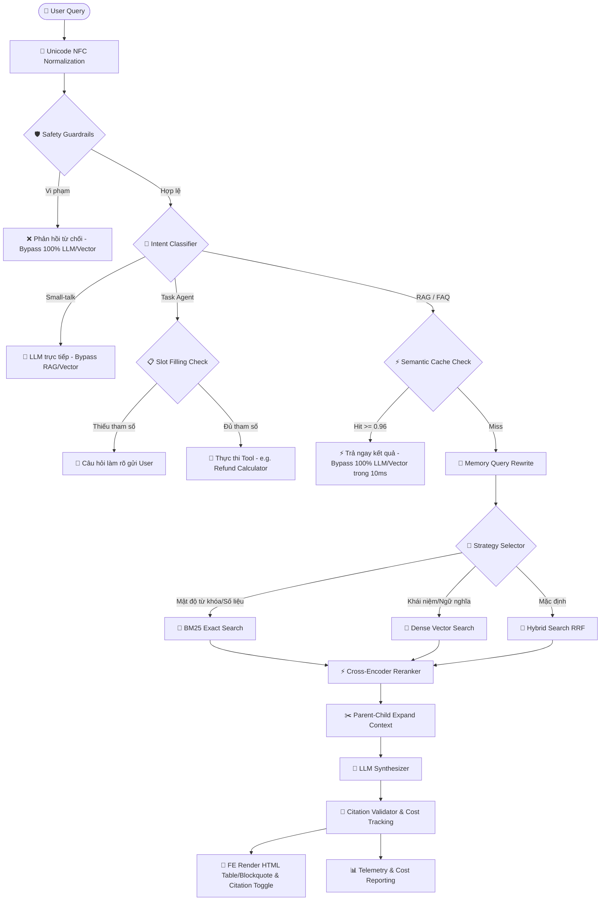

# 🚗 Xanh SM Enterprise Production RAG System (Phase 3)

Hệ thống **Retrieval-Augmented Generation (RAG)** cấp doanh nghiệp (Production-Grade) được thiết kế và tối ưu hóa đặc biệt dành riêng cho **Xanh SM** nhằm phục vụ bốn nhóm đối tượng cốt lõi:
* 👤 **Khách hàng (Customer)** - Giải đáp về đặt xe, phí hủy chuyến, chính sách hoàn tiền, đặt đồ ăn (Xanh Food), giao hàng.
* 🚗 **Đối tác tài xế (Driver)** - Giải đáp chiết khấu doanh thu, tác phong làm việc, chế tài phạt.
* 🏪 **Đối tác cửa hàng (Merchant)** - Giải đáp hoa hồng Xanh Food/Express, quy trình đối soát tuần.
* 🎧 **Nhân viên CSKH (Agent)** - Truy cập toàn diện để giải quyết các khiếu nại phức tạp.

Hệ thống này triển khai kiến trúc **NLU-Gateway RAG (Phase 3)** nâng cao, thực tiễn và tối ưu hóa chi phí vận hành:
`Question ➔ Safety & Lang Gateway ➔ Intent Classifier ➔ Slot Filling (Task/RAG) ➔ Caching Layer Check (Bypass) ➔ Memory Query Rewrite ➔ Strategy Selector ➔ Strategic Search (Dense / BM25 / Hybrid) ➔ Cross-Encoder Reranker ➔ Parent-Child Context ➔ LLM Synthesizer ➔ Citation Validator (Integrated Faithfulness) ➔ Cost Observability`.

Để hiểu sâu sắc về hệ tư duy thiết kế, sơ đồ và các bài giảng kỹ thuật của dự án, vui lòng đọc [MINDSET.md](file:///c:/Users/DUNG/Desktop/RAG_XANH_SM/MINDSET.md).

> [!IMPORTANT]
> **🚀 LIVE PRODUCTION DEMO:** Trải nghiệm trực tiếp chatbot RAG CSKH Xanh SM tại địa chỉ: **[ragxanhsmv1-production.up.railway.app](https://ragxanhsmv1-production.up.railway.app/)**

---

## 🏗️ 1. Kiến Trúc Thư Mục Dự Án

Mã nguồn được tổ chức theo cấu trúc module hóa chuẩn sản xuất:

```text
RAG_XANH_SM/
│
├── app/
│   ├── crawler/
│   │   ├── crawl.py          # BFS Web Crawler thu thập link nội bộ & Phân loại thông minh
│   │   └── parser.py         # Chuyển đổi sạch HTML sang Markdown (giữ bảng biểu)
│   │
│   ├── ingestion/
│   │   ├── splitter.py       # Phân đoạn heading-aware & Parent-Child metadata, hỗ trợ PDF
│   │   ├── embedding.py      # Bộ sinh embeddings thông minh (Tự phục hồi fallback khi key lỗi)
│   │   └── ingest.py         # Pipeline nạp dữ liệu & dọn dẹp sạch sẽ CSDL vector cũ
│   │
│   ├── vectordb/
│   │   └── chroma_client.py  # Quản lý dense vector index (Hỗ trợ Singleton Fallback DB & Shared Filter)
│   │
│   ├── retrieval/
│   │   ├── bm25_retriever.py # Mô hình từ khóa chính xác BM25 (Hỗ trợ lọc Role linh hoạt)
│   │   ├── hybrid_search.py  # Hybrid Search kết hợp RRF & Logic Tự Động Đồng Bộ/Nạp Startup
│   │   ├── multi_query.py    # Query Expansion mở rộng truy vấn đồng nghĩa tiếng Việt
│   │   └── reranker.py       # Cross-Encoder Reranker xếp hạng lại Top 5 tài liệu
│   │
│   ├── rag/
│   │   ├── prompt.py         # Prompt hệ thống tối ưu hóa tác phong và trích nguồn
│   │   ├── cache.py          # Bộ đệm Caching thông minh kép (SQLite/PostgreSQL Dual-Driver)
│   │   ├── gateway.py        # Conversation Gateway (NFC, Safety, Lang Detect)
│   │   ├── classifier.py     # Intent Classifier & Slot Filling Engine (tích hợp RefundCalculatorTool)
│   │   └── chain.py          # Chuỗi RAG điều phối toàn diện của hệ thống
│   │
│   ├── api/
│   │   ├── routes.py         # FastAPI REST Server endpoints & reload singleton tự động
│   │   └── streamlit_ui.py   # Streamlit UI cũ (lưu trữ phục vụ tham chiếu)
│   │
│   └── config.py             # Quản lý biến môi trường và cấu hình hệ thống
│
├── data/                     # Thư mục chứa tài liệu chính sách được cấu trúc hóa
│   ├── customer/             # Chính sách đặc thù khách hàng (terms.md, refund.md)
│   ├── driver/               # Quy chế tác phong tài xế & chiết khấu thưởng (commission.md)
│   ├── merchant/             # Quy định đối tác cửa hàng (merchant_policy.md)
│   └── faq/                  # Hướng dẫn đặt xe, đặt đồ ăn, giúp đỡ chung (booking.md, vn_vi_helps.md...)
│
├── FE/                       # Thư mục mã nguồn Front-End cao cấp
│   ├── index.html            # Cấu trúc Dashboard Dark-Neon điều khiển Cockpit
│   ├── style.css             # HHSL glassmorphism & render Table/Blockquote
│   └── app.js                # Xử lý REST API, Lịch sử trò chuyện & citations toggle button
│
├── MINDSET.md                # Hệ tư duy thiết kế, sơ đồ Mermaid và bài giảng của Thầy Giáo AI
├── FE_SPEC.md                # Bản tả đặc tính kỹ thuật Front-End dành cho Stitch vẽ UI
├── requirements.txt          # Các thư viện phụ thuộc của hệ thống (Tích hợp psycopg2-binary, pypdf)
├── run_tests.py              # Suite chấm điểm và đánh giá tự động RAGAS
└── README.md                 # Hướng dẫn khởi chạy và vận hành hệ thống
```

---

## ⚡ 2. Luồng Xử Lý Phase 3 NLU-Gateway RAG

Hệ thống hoạt động qua 13 bước khép kín với các lớp bảo vệ và tối ưu hóa hiệu năng vượt trội:



---

## 🛠️ 3. Các Tính Năng Nổi Bật Chuẩn Production

### 💎 A. Tránh Rò Rỉ Dữ Liệu Chéo (Unified Shared Filter)
Hệ thống áp dụng phân quyền truy cập tài liệu bảo mật trực tiếp ở tầng Vector Database & BM25, ngăn chặn triệt để Prompt Injection:
* **Customer**: Được phép truy quét tài liệu trong thư mục `customer` + `faq`.
* **Driver**: Được phép truy quét tài liệu `driver` + `faq`.
* **Merchant**: Được phép truy quét tài liệu `merchant` + `faq`.
* **Agent (CSKH)**: Được phép truy quét toàn bộ kho tài liệu.

### 💎 B. Cơ Chế Parent-Child Chunking Bảo Toàn Cấu Trúc
Giải quyết triệt để "Nghịch lý Phân Mảnh" trong RAG: **"Tìm kiếm cần mảnh cực nhỏ để nhạy bén, nhưng LLM cần mảnh lớn để đủ ngữ cảnh."**
* **Nạp liệu (Ingestion):** Tách tài liệu theo các Heading tiêu đề lớn (`#`, `##`, `###`) làm **Mảnh Cha (Parent - 1000-2000 từ)**. Tiếp tục chia nhỏ Mảnh Cha thành các **Mảnh Con (Child - 100-200 từ)** và đính kèm `parent_content` và `parent_chunk_id` trong metadata.
* **Truy xuất (Retrieval):** Tìm kiếm tương đồng vector và BM25 chạy trên các **Mảnh Con** (nhạy nhất). Khi kéo kết quả ra, hệ thống tự động gom cụm, loại bỏ trùng lặp và gửi toàn bộ **Mảnh Cha** gốc cho LLM. Giúp LLM đọc trọn vẹn được các bảng biểu cước phí phức tạp và quy định liền mạch!

### 💎 C. Phân Phối Heuristics Ingest PDF Hợp Đồng
Hỗ trợ đọc và phân mảnh các tệp PDF phức tạp (ví dụ: Hợp đồng đối tác tài xế). Hệ thống sử dụng `pypdf` bóc tách văn bản thô, áp dụng heuristics layout tự động chuyển đổi các đề mục phẳng hoặc chữ hoa (e.g. *"Điều 1"*, *"CHƯƠNG I"*) thành cấu trúc phân cấp Markdown `#`, `##` trước khi đưa vào bộ chia đoạn Heading-Aware.

### 💎 D. Tự Động Reset Singleton & Reload Tri Thức
Khi quản trị viên hoặc CSKH bấm nút **Ingest / Re-chunking** trên giao diện Console:
1. Hệ thống tự động dọn sạch CSDL vector cũ bằng cách gọi `db.clear()`.
2. Tạo mới cache chỉ mục tĩnh `bm25_corpus.json` để đồng bộ.
3. Tự động gọi `reset_pipeline_singleton()` đưa các biến toàn cục `pipeline = None` và `hybrid_search = None` về trạng thái ban đầu.
4. Lượt chat tiếp theo sẽ tự động reload tri thức mới nạp ngay lập tức mà không cần khởi động lại máy chủ!

### 💎 E. Giao Diện Cockpit Dark-Neon & Giám Sát Chi Phí
* **Hiển thị Led sáng động**: Sơ đồ 13 node LED sáng lên tuần tự theo thời gian thực mô phỏng chính xác đường đi của dữ liệu.
* **Markdown Render chuẩn HTML**: Tự động chuyển đổi bảng biểu (`| col |`) và trích dẫn (`> ...`) Markdown thô thành thẻ HTML bóng bẩy với viền neon xanh lá Xanh SM.
* **Real-time Cost Reporting**: Citation Validator trả về chi tiết số lượng token sử dụng (Prompt/Completion) và quy đổi chi phí ra USD/VND theo thời gian thực cho từng lượt chat.
* **Citation Toggle Button**: Người dùng có thể ẩn/hiện danh sách nguồn trích dẫn pháp lý một cách linh hoạt.

---

## 🚀 4. Hướng Dẫn Khởi Chạy & Deploy Railway Cloud

### 📦 A. Chạy Cục Bộ (Local Development)

#### 1. Cài đặt các thư viện phụ thuộc:
```bash
# Tạo môi trường ảo python (khuyên dùng Python 3.10+)
python -m venv venv
venv\Scripts\activate  # Trên Windows
source venv/bin/activate  # Trên Linux/macOS

# Cài đặt thư viện
pip install -r requirements.txt
```

#### 2. Cấu hình biến môi trường (`.env`):
Tạo file `.env` ở thư mục gốc của dự án với nội dung như sau:
```env
OPENAI_API_KEY=sk-proj-xxxx...
EMBEDDING_PROVIDER=openai
EMBEDDING_MODEL=text-embedding-3-small
LLM_MODEL=gpt-4o-mini
DATA_DIR=./data
CHROMA_PERSIST_DIR=./chroma_db
RERANKER_PROVIDER=none

# Chế độ bypass lỗi DLL SQLite trên Windows Host:
CHROMA_PROVIDER=fallback
```
* **Lưu ý an toàn:** Biến `CHROMA_PROVIDER=fallback` sử dụng bộ tìm kiếm in-memory thuần Python siêu ổn định để tránh lỗi crash DLL C++ của thư viện `hnswlib` trên một số máy Windows. **Điều này không ảnh hưởng đến Deploy Railway** vì ta sẽ ghi đè biến này trên đám mây!

#### 3. Chạy Server Backend và Front-End:
```bash
# Khởi chạy server FastAPI (Port 8000)
uvicorn app.api.routes:app --host 0.0.0.0 --port 8000 --reload
```
Mở trình duyệt truy cập: **[http://localhost:8000](http://localhost:8000)** để trải nghiệm giao diện Cockpit Dark-Neon đỉnh cao!

#### 4. Chạy Suite Kiểm Thử Tự Động:
```bash
python run_tests.py
```

---

### ☁️ B. Hướng Dẫn Triển Khai Lên Đám Mây Railway (Railway Deploy)

Dự án đã được cấu hình sẵn tệp [railway.toml](file:///c:/Users/DUNG/Desktop/RAG_XANH_SM/railway.toml) và [Procfile](file:///c:/Users/DUNG/Desktop/RAG_XANH_SM/Procfile) để tự động nhận diện và chạy lệnh khởi chạy môi trường sản xuất trên Railway.

> [!IMPORTANT]
> **Biến môi trường trên Railway Dashboard sẽ ghi đè file `.env` cục bộ.**
> Do đó, file `.env` chứa `CHROMA_PROVIDER=fallback` để dev local an toàn trên Windows **hoàn toàn KHÔNG ảnh hưởng** tới tính năng persistent trên cloud. Bạn chỉ cần cấu hình đúng các biến môi trường trên Railway Dashboard như sau:

#### 1. Các Biến Môi Trường Cần Thiết Lập Trên Railway Dashboard (Tab Variables):
Bạn truy cập vào service của mình trên Railway Dashboard, chuyển sang tab **Variables** và nhấn **Add Variable** cho các biến sau:

| Tên biến | Giá trị đề xuất | Ý nghĩa |
| :--- | :--- | :--- |
| `OPENAI_API_KEY` | `sk-proj-xxxxxxxxxxxxxxxx...` | Mã khóa API OpenAI của bạn. |
| `CHROMA_PROVIDER` | `chromadb` | **BẮT BUỘC:** Chuyển sang sử dụng ChromaDB thật, ghi đè chế độ fallback cục bộ. |
| `EMBEDDING_PROVIDER` | `openai` | Sử dụng mô hình nhúng text-embedding-3-small hiệu năng cao. |
| `EMBEDDING_MODEL` | `text-embedding-3-small` | Tên mô hình nhúng. |
| `LLM_MODEL` | `gpt-4o-mini` | Mô hình ngôn ngữ chính cho synthesizer và NLU. |
| `CHROMA_PERSIST_DIR` | `/data/chroma_db` | **BẮT BUỘC:** Đường dẫn lưu trữ CSDL vector trên đĩa cứng gắn ngoài (Volume) của Railway. |
| `DATA_DIR` | `/data` | **BẮT BUỘC:** Đường dẫn chứa dữ liệu chính sách trên Volume để tránh mất mát khi deploy lại. |
| `PORT` | `8000` | Cổng dịch vụ Railway tự động cấp phát. |

#### 2. Thiết Lập Ổ Đĩa Vĩnh Viễn (Persistent Volume):
CSDL ChromaDB và tệp cache BM25 cần được lưu giữ vĩnh viễn để tránh bị xóa sạch mỗi lần bạn cập nhật mã nguồn (Redeploy).
1. Trên giao diện sơ đồ Railway, click vào service **RAG_XANH_SM**.
2. Nhấn nút **Settings** hoặc nút **+ Add** góc trên ➔ Chọn **Volume**.
3. Đặt kích thước Volume tùy ý (ví dụ: `1 GB` hoặc `2 GB` là quá đủ cho hàng triệu trang chính sách).
4. Thiết lập **Mount Path** của Volume là: `/data` (khớp chính xác với cấu hình `DATA_DIR` và `CHROMA_PERSIST_DIR` ở bảng trên).

#### 3. Cơ chế Khởi Chạy Tự Chữa Lành (Self-Healing) trên Cloud:
* Khi container khởi chạy lần đầu tiên trên Railway, hệ thống sẽ tự động phát hiện nếu thư mục `/data` trên Volume mới gắn bị trống.
* Hệ thống sẽ tự động sao chép (copy) toàn bộ tài liệu Markdown mẫu từ thư mục `data/` trong mã nguồn sang `/data` trên Volume.
* Tiếp theo, hệ thống tự động kích hoạt tiến trình phân đoạn (ingestion) để phân mảnh và nạp toàn bộ tri thức vào ChromaDB thực tại `/data/chroma_db` và ghi file chỉ mục `/data/chroma_db/bm25_corpus.json`.
* Từ đó về sau, tri thức của bạn được bảo vệ vĩnh viễn trên Volume và hoạt động với hiệu suất tối đa 100%!