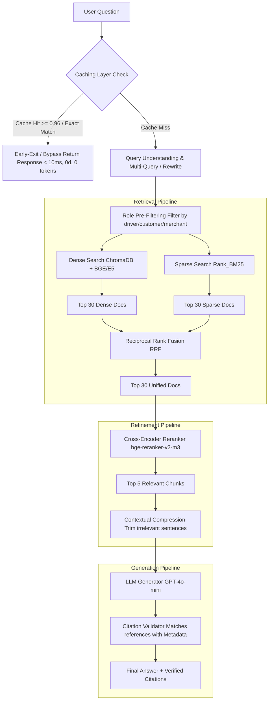

# 📖 Playbook: Production-Grade RAG System for Xanh SM

Welcome to the master reference guide and playbook for the **Xanh SM Production RAG System**. This document establishes the blueprint and technical guide for our advanced RAG pipeline targeting four critical user groups:

* 👤 **Customers (Khách hàng)** - Queries about booking, refund, promotion policies, user terms.
* 🚗 **Drivers (Tài xế)** - Queries about commission, penalties, driver policies, training guidelines.
* 🏪 **Merchant Partners (Cửa hàng đối tác)** - Queries about merchant terms, commissions, onboarding.
* 🎧 **CSKH Agents (Nhân viên CSKH)** - Comprehensive access to resolve advanced support tickets.

---

## 🏗️ 1. Complete System Architecture

Rather than a simplistic, naive RAG pipeline that leads to high citation errors and poor retrieval quality, this system adopts a enterprise-grade modular RAG design:



---

## 🗂️ 2. Data Structure & Taxonomy

To eliminate context pollution, legal documents and crawled pages are stored inside a structured classification directory. This ensures high-speed **Metadata Filtering** before search execution:

```text
data/
├── customer/
│   ├── terms.md         # Terms of Service for clients
│   ├── privacy.md       # Privacy Policy
│   └── refund.md        # Refund, Cancellation, & Compensation Policies
│
├── driver/
│   ├── driver_policy.md # Driver Rules, Codes of Conduct
│   └── commission.md    # Income structures, bonuses, and penalties
│
├── merchant/
│   └── merchant_policy.md # Merchant signup & operations policies
│
└── faq/
    ├── booking.md       # Booking questions
    └── payment.md       # Payment methods & troubleshooting
```

Every document holds a rich metadata schema:
```json
{
  "source": "driver_policy.md",
  "role": "driver",
  "section": "Điều 5: Tỷ lệ phân chia doanh thu",
  "version": "2026-01",
  "url": "https://greensm.com/driver-policy"
}
```

---

## ✂️ 3. Heading-Aware & Legal-Grade Chunking

Standard chunking methods (e.g. splitting strictly by token counts) break sentences and dissect legal articles in half, which degrades retrieve precision.

Our solution implements **Hierarchy-First Splitters**:
1. **MarkdownHeaderTextSplitter**: Splits the documents based on markdown headings (`#`, `##`, `###`).
2. **RecursiveCharacterTextSplitter**: Sub-splits larger segments while honoring sentence boundaries and block code syntax.

```python
from langchain_text_splitters import MarkdownHeaderTextSplitter, RecursiveCharacterTextSplitter

# 1. Splitting by hierarchy first
headers_to_split_on = [
    ("#", "Header 1"),
    ("##", "Header 2"),
    ("###", "Header 3"),
]
markdown_splitter = MarkdownHeaderTextSplitter(headers_to_split_on=headers_to_split_on)
header_splitted_docs = markdown_splitter.split_text(markdown_content)

# 2. Split large headers recursively
text_splitter = RecursiveCharacterTextSplitter(
    chunk_size=700, 
    chunk_overlap=150,
    separators=["\n\n", "\n", ". ", " ", ""]
)
final_chunks = text_splitter.split_documents(header_splitted_docs)
```

---

## 🔍 4. Hybrid Search & Reciprocal Rank Fusion (RRF)

Dense retrieval (semantic vector search) easily misses exact names, phone numbers, or rules, while Sparse retrieval (BM25 keyword search) fails on conceptual synonyms. We merge them via **RRF (Reciprocal Rank Fusion)**:

$$\text{RRF Score}(d) = \sum_{m \in M} \frac{1}{k + r_m(d)}$$

Where $r_m(d)$ is the rank of document $d$ in retriever $m$, and $k$ is a constant (typically $60$).

```python
def reciprocal_rank_fusion(dense_results, sparse_results, k=60):
    rrf_scores = {}
    
    # Process dense results
    for rank, doc in enumerate(dense_results):
        doc_id = doc.metadata["id"]
        rrf_scores[doc_id] = rrf_scores.get(doc_id, 0.0) + 1.0 / (k + rank + 1)
        
    # Process sparse results
    for rank, doc in enumerate(sparse_results):
        doc_id = doc.metadata["id"]
        rrf_scores[doc_id] = rrf_scores.get(doc_id, 0.0) + 1.0 / (k + rank + 1)
        
    # Sort documents based on final fusion score
    sorted_docs = sorted(rrf_scores.items(), key=lambda x: x[1], reverse=True)
    return sorted_docs
```

---

## ⚡ 5. Cross-Encoder Reranking

RRF retrieves the best candidates, but still relies on independent scores. A Cross-Encoder model (e.g. `bge-reranker-v2-m3`) computes full-attention interactions between the query and each chunk to output high-fidelity relevance.

```python
from sentence_transformers import CrossEncoder

class Reranker:
    def __init__(self, model_name="BAAI/bge-reranker-v2-m3"):
        self.model = CrossEncoder(model_name)

    def rerank(self, query, docs, top_n=5):
        pairs = [[query, doc.page_content] for doc in docs]
        scores = self.model.predict(pairs)
        
        for idx, score in enumerate(scores):
            docs[idx].metadata["rerank_score"] = float(score)
            
        sorted_docs = sorted(docs, key=lambda x: x.metadata["rerank_score"], reverse=True)
        return sorted_docs[:top_n]
```

---

## 🛡️ 6. Citation Extraction & LLM Prompting

For legal/policy systems, the LLM must **never** make up claims. Every answer fragment must cite a concrete source block and section.

### Premium Prompt Schema:
```text
Bạn là chuyên gia trợ lý AI cao cấp của Xanh SM. Hãy trả lời câu hỏi dựa trên tài liệu pháp lý và chính sách được cung cấp.

Yêu cầu nghiêm ngặt về Trích Dẫn:
- Bắt buộc trích dẫn chính xác tiêu đề, chương hoặc điều khoản dựa trên Metadata.
- Sử dụng cú pháp [Nguồn: tên_file.md - Mục/Điều].
- KHÔNG tự bịa đặt thông tin nếu nội dung không xuất hiện trong ngữ cảnh.

Bối cảnh hệ thống (Context):
---
{context}
---

Câu hỏi: {query}
Đối tượng hỏi: {role} (customer/driver/merchant/agent)
```

---

## 🧪 7. Production Evaluation via RAGAS

We use the RAGAS framework to evaluate output quality before committing code:

1. **Faithfulness**: Measures whether the LLM answer is strictly derived from the context (No Hallucinations).
2. **Answer Relevance**: Measures if the answer directly addresses the user query.
3. **Context Recall**: Verifies whether the retriever retrieved all necessary target pieces to answer the question.
