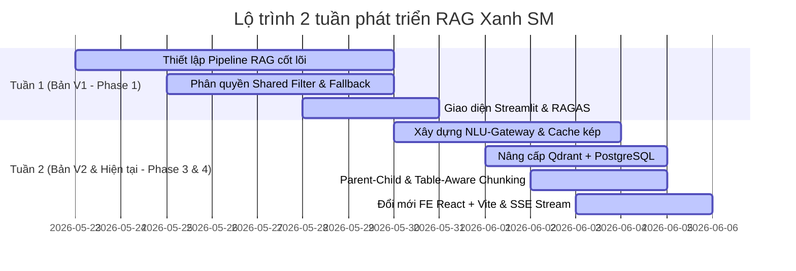

# BÁO CÁO TIẾN ĐỘ PHÁT TRIỂN DỰ ÁN (2 TUẦN)
## Hệ thống RAG Doanh Nghiệp Cấp Sản Phẩm (Production-Grade) - Xanh SM

Báo cáo tổng hợp quá trình xây dựng, phát triển và nâng cấp hệ thống Retrieval-Augmented Generation (RAG) phục vụ tra cứu chính sách, điều khoản và quy định của Xanh SM cho 4 nhóm đối tượng: Khách hàng (Customer), Tài xế (Driver), Cửa hàng (Merchant) và Nhân viên CSKH (Agent).

---

## TÓM TẮT TIẾN ĐỘ THEO TUẦN

### 1. TUẦN 1: Xây Dựng Nền Tảng Cốt Lõi (Phiên bản V1 - Phase 1)
Tập trung xây dựng bộ khung RAG cơ bản nhưng đáp ứng đầy đủ tiêu chuẩn vận hành thực tế (Production-ready Baseline), giải quyết các bài toán phân quyền dữ liệu và lỗi môi trường.

*   **Kiến trúc Pipeline gốc**: Question -> Query Expansion -> Role-Filtered Shared Search -> Hybrid Search (Dense + BM25) -> Reranker -> Context Compression -> LLM -> Answer + Citation.
*   **Vector Database ban đầu**: Sử dụng ChromaDB chạy cục bộ (local/SQLite).
*   **Bảo mật phân quyền (Unified Shared Filter)**: Ngăn rò rỉ chéo tài liệu giữa các nhóm người dùng. Khách hàng/Tài xế/Cửa hàng chỉ được truy cập tài liệu được phân quyền riêng + FAQ chung, trong khi nhân viên CSKH (Agent) có quyền xem toàn bộ. Bộ lọc áp dụng trực tiếp tại tầng truy vấn DB để chống Prompt Injection.
*   **Cơ chế tự chữa lành (Self-Healing Fallback)**: Tự động phát hiện và fallback sang cơ sở dữ liệu In-Memory khi gặp lỗi SQLite C++ DLL trên môi trường Windows. Tự động chuyển đổi sang Mock Embeddings & Offline Fallback Synthesis nếu API Key OpenAI gặp sự cố.
*   **Giao diện & Đánh giá**: Sử dụng Streamlit Dashboard đơn giản hiển thị ô chat và đồ thị luồng suy nghĩ (Thinking Tree), tích hợp bộ đánh giá chất lượng tự động RAGAS.
*   **Triển khai (Deployment)**: Hỗ trợ triển khai Docker local và host cloud trên Railway sử dụng Persistent Volume để lưu trữ DB SQLite và dữ liệu.

---

### 2. TUẦN 2: Nâng Cấp NLU Gateway, Tối Ưu Hiệu Năng & Hoàn Thiện Full-Stack (Phiên bản V2 & Hiện Tại - Phase 3 & 4)
Tuần thứ 2 đánh dấu bước nhảy vọt về mặt kiến trúc từ RAG truyền thống sang NLU-Gateway RAG, nâng cấp toàn diện hạ tầng cơ sở dữ liệu, tối ưu hóa chi phí vận hành và xây dựng giao diện người dùng hiện đại.

#### A. Kiến trúc NLU-Gateway & Lớp Bảo Vệ (Phase 3 & Phase 4)
*   **Input/Output Guardrail**: Tích hợp regex và bộ phân loại nội bộ giúp chặn đứng các hành vi vi phạm, Prompt Injection hoặc rò rỉ System Prompt trong thời gian siêu tốc (~0ms), bỏ qua các cuộc gọi LLM tốn kém.
*   **Gộp NLU 3-trong-1**: Tích hợp phân loại ý định (Intent Classifier), viết lại câu hỏi theo lịch sử chat (Query Rewrite) và mở rộng truy vấn (Query Expansion) vào duy nhất 1 cuộc gọi LLM (gpt-4o-mini sử dụng Structured Outputs). Giúp giảm độ trễ xử lý từ 4.5s xuống còn 1.2s - 1.5s.
*   **Cơ chế Caching Kép (Exact & Semantic Cache)**: 
    *   *Early Cache Lookup*: Kiểm tra so khớp chính xác câu hỏi gốc đầu vào trong DB (~5ms).
    *   *Second Cache Lookup*: Kiểm tra cache dựa trên câu hỏi đã được chuẩn hóa và khử ngữ cảnh từ Node NLU.
    *   Giúp tiết kiệm tối đa chi phí API và trả kết quả tức thì đối với các câu hỏi trùng lặp hoặc tương đồng.

#### B. Nâng Cấp Cơ Sở Dữ Liệu & Reranker (Phase 4)
*   **Chuyển sang Qdrant**: Thay thế ChromaDB bằng Qdrant Vector Database, hỗ trợ cơ chế Native Hybrid Search (Dense Vector của OpenAI kết hợp Sparse Vector BM25 của FastEmbed) hiệu năng cao trên đám mây.
*   **Tích hợp PostgreSQL**: Sử dụng PostgreSQL để quản lý người dùng, phiên đăng nhập, lịch sử hội thoại và lưu trữ Semantic Cache thay cho SQLite.
*   **Cohere Reranker**: Tích hợp rerank-multilingual-v3.0 của Cohere giúp tối ưu hóa thứ hạng tài liệu tiếng Việt chính xác hơn so với các mô hình reranker nội bộ thô sơ.

#### C. Cải Tiến Phân Đoạn Tài Liệu (Chunking)
*   **Parent-Child Retrieval thích ứng**: Nhúng và tìm kiếm trên các mảnh con cực nhỏ (100-200 từ) để tăng độ nhạy bén ngữ nghĩa, nhưng tự động mở rộng và gửi mảnh cha (1000-2000 từ) chứa đầy đủ cấu trúc đề mục cho LLM để bảo toàn ngữ cảnh.
*   **Trình đọc tài liệu chuyên sâu**: Tích hợp pymupdf4llm bóc tách PDF sang Markdown giữ nguyên cấu trúc.
*   **Table-Aware Chunking**: Tự động cô lập bảng biểu giá cước, sao chép dòng tiêu đề (column headers) vào từng mảnh cắt nhỏ để LLM đọc hiểu bảng số liệu chính xác mà không bị đứt gãy thông tin.

#### D. Thay Đổi Toàn Diện Front-End & Tính Năng Trải Nghiệm
*   **Từ HTML/JS sang React + Vite**: Xây dựng lại giao diện chuyên nghiệp, mượt mà bằng React, thay thế giao diện Streamlit ban đầu.
*   **Server-Sent Events (SSE) Stream**: Hỗ trợ truyền dữ liệu câu trả lời dạng stream thời gian thực (chữ chạy dần) thay vì đợi LLM tạo xong toàn bộ mới phản hồi.
*   **Google OAuth2**: Tích hợp đăng nhập bằng tài khoản Google để phân quyền người dùng và quản lý lịch sử chat cá nhân một cách bảo mật.

---

## BẢNG SO SÁNH SỰ NÂNG CẤP QUA CÁC PHIÊN BẢN

| Tiêu chí so sánh | Tuần 1 (Bản V1 - Phase 1) | Tuần 2 (Bản V2 - Phase 3) | Bản Hiện Tại (Phase 4) |
| :--- | :--- | :--- | :--- |
| **Hệ cơ sở dữ liệu** | ChromaDB (SQLite cục bộ) | ChromaDB (SQLite / PostgreSQL) | Qdrant (VectorDB) + PostgreSQL (RDBMS) |
| **Thuật toán tìm kiếm** | Hybrid Search (Dense + Custom BM25) | Hybrid Search RRF tự phát triển | Native Hybrid Search kết hợp trong Qdrant |
| **Công nghệ Rerank** | MiniLM / FlashRank | Đa dạng hóa (MiniLM, BGE, Cohere) | Cohere Multilingual Rerank v3.0 |
| **Độ trễ xử lý NLU** | Không áp dụng (RAG đơn thuần) | Trung bình (Nhiều API calls) | Siêu tốc (Gộp NLU 3-trong-1, trễ ~1.2s) |
| **Cơ chế Caching** | Không hỗ trợ | Semantic Cache (SQLite/Postgres) | Caching Kép (Early Cache & Second Cache) |
| **Xử lý hội thoại** | Single-Turn (Hỏi-Đáp độc lập) | Multi-Turn (LLM query rewriter) | Multi-Turn hoàn chỉnh lưu DB theo Session |
| **Cơ chế cắt Chunk** | Markdown Heading-Aware | Parent-Child Chunking cơ bản | Adaptive Parent-Child + Table-Aware |
| **Đọc tệp PDF** | Phẳng (Plain PDF reader) | Heuristic Parser thủ công | pymupdf4llm giữ cấu trúc Markdown |
| **Giao diện Front-End** | Streamlit UI | HTML/CSS thô (Cockpit Neon) | React.js + Vite (Giao diện chuẩn doanh nghiệp) |
| **Bảo mật & Xác thực** | Nhập Role thủ công ở UI | Nhập Role thủ công ở UI | Google OAuth2 + Quản lý Session |
| **Phương thức phản hồi** | Chờ phản hồi toàn bộ (Blocking) | Chờ phản hồi toàn bộ (Blocking) | Server-Sent Events (SSE) Streaming |

---

## KẾT LUẬN & HƯỚNG ĐI TIẾP THEO

Qua 2 tuần phát triển, dự án đã đi qua lộ trình nâng cấp bài bản từ một ứng dụng demo thử nghiệm (V1) sang một hệ thống RAG doanh nghiệp hoàn chỉnh (V4):
1.  **Tính ổn định & bảo mật**: Đạt mức tối đa nhờ cơ chế Shared Filter chống rò rỉ dữ liệu chéo và Google Auth phân quyền chặt chẽ.
2.  **Độ trễ & Chi phí**: Được tối ưu hóa triệt để qua việc gộp NLU, cơ chế cache kép (giảm tải LLM) và phản hồi dạng stream thời gian thực.
3.  **Độ chính xác**: Tăng vọt nhờ Qdrant Hybrid Search, Cohere Reranker tiếng Việt xuất sắc và cơ chế bảo toàn bảng biểu Table-Aware Chunking.

