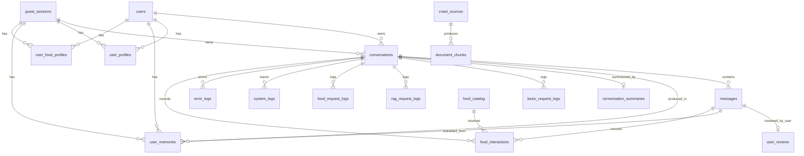
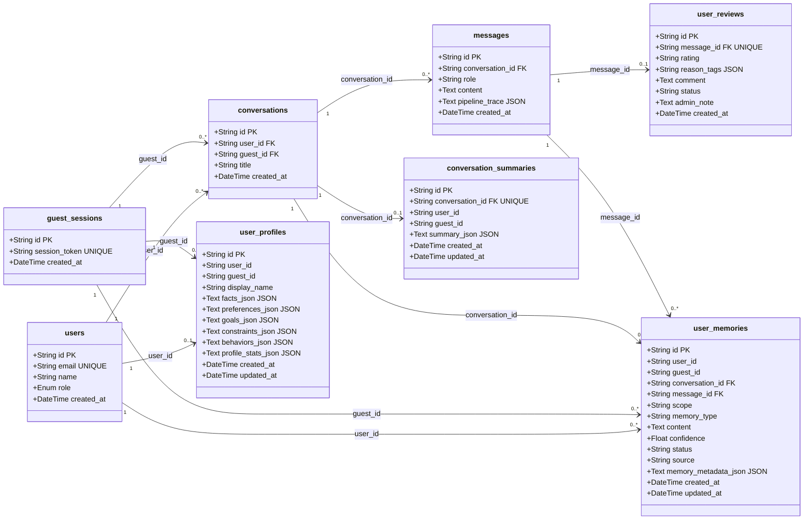
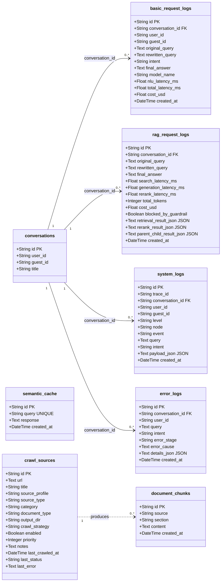
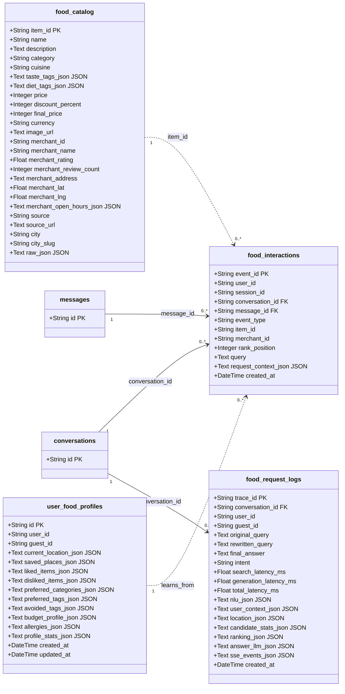

# Database Schema

Tài liệu này mô tả các bảng database hiện tại theo source of truth trong `app/db/models.py`. Một vài migration cũ có thể còn dấu vết cột legacy, nhưng phần dưới đây mô tả schema mà application đang sử dụng trong code.

## Tổng Quan

Hệ thống dùng database quan hệ cho 6 nhóm dữ liệu chính:

1. **Người dùng và hội thoại**: tài khoản, guest session, conversation, message.
2. **Bộ nhớ người dùng**: long-term memory, profile tổng hợp, summary hội thoại.
3. **RAG và telemetry**: log request RAG/basic, system log, error log.
4. **Nguồn tri thức**: cache, document chunk, crawl source.
5. **Food recommendation**: catalog món/quán, tương tác food, profile food, trace food request.
6. **Đánh giá offline**: evaluation run.

## ER Diagram

Ghi chú: một số quan hệ như `food_interactions.item_id -> food_catalog.item_id`, `user_profiles.user_id -> users.id`, `user_food_profiles.guest_id -> guest_sessions.id` đang được dùng theo convention trong application, không nhất thiết đều có foreign key cứng trong model.

## Database Class Diagram

Các diagram dưới đây trình bày database theo kiểu class diagram/UML giống Visual Paradigm hơn ER diagram. Mình tách thành nhiều lát cắt để khi đọc trong Markdown không bị quá nhỏ.

### Core Chat Và Memory

### RAG, Observability Và Knowledge Base

### Food Recommendation

## Nhóm Người Dùng Và Hội Thoại

### `users`

Lưu tài khoản đăng nhập thật, bao gồm user thường và admin.

| Trường | Kiểu | Tác dụng |
| --- | --- | --- |
| `id` | `String`, PK | Mã user dạng `user_<uuid>`. Dùng làm định danh xuyên suốt hệ thống. |
| `email` | `String`, unique, index | Email đăng nhập Google hoặc email admin hệ thống. |
| `name` | `String` | Tên hiển thị lấy từ Google/admin. |
| `role` | `Enum(UserRole)` | Phân quyền `user` hoặc `admin`. Admin dùng cho các trang quản trị. |
| `created_at` | `DateTime` | Thời điểm tạo user theo timezone Việt Nam. |

### `guest_sessions`

Lưu phiên khách chưa đăng nhập. Đây là điều kiện để memory/profile hoạt động cho guest; anonymous không có id nên không lưu long-term memory.

| Trường | Kiểu | Tác dụng |
| --- | --- | --- |
| `id` | `String`, PK | Mã guest dạng `guest_<uuid>`. |
| `session_token` | `String`, unique, index | Token session được ký vào JWT guest. |
| `created_at` | `DateTime` | Thời điểm tạo phiên guest. |

### `conversations`

Đại diện một phiên chat trong sidebar.

| Trường | Kiểu | Tác dụng |
| --- | --- | --- |
| `id` | `String`, PK | Mã conversation dạng `conv_<uuid>`. |
| `user_id` | `String`, FK nullable | Chủ hội thoại nếu là user đăng nhập. |
| `guest_id` | `String`, FK nullable | Chủ hội thoại nếu là guest. |
| `title` | `String` | Tiêu đề hội thoại, thường sinh từ câu hỏi đầu tiên. |
| `created_at` | `DateTime` | Thời điểm tạo hội thoại. |

### `messages`

Lưu từng lượt chat của user và assistant.

| Trường | Kiểu | Tác dụng |
| --- | --- | --- |
| `id` | `String`, PK | Mã message dạng `msg_<uuid>`. |
| `conversation_id` | `String`, FK | Hội thoại chứa message. |
| `role` | `String` | `user` hoặc `assistant`. |
| `content` | `Text` | Nội dung hiển thị. Với food, `content` có thể chứa marker `[[FOOD_CARD {...}]]` để FE parse thành card. |
| `pipeline_trace` | `Text`, JSON nullable | Snapshot metrics/pipeline trace của câu trả lời assistant. |
| `created_at` | `DateTime` | Thời điểm tạo message. |

### `user_reviews`

Lưu feedback thumbs up/down của người dùng cho một message assistant.

| Trường | Kiểu | Tác dụng |
| --- | --- | --- |
| `id` | `String`, PK | Mã review dạng `review_<uuid>`. |
| `message_id` | `String`, FK, unique | Message được đánh giá. Mỗi message chỉ có một review. |
| `rating` | `String` | `up` hoặc `down`. |
| `reason_tags` | `String`, JSON nullable | Danh sách tag lý do khi đánh giá xấu. |
| `comment` | `Text` | Góp ý tự do của người dùng. |
| `status` | `String`, index | Trạng thái xử lý nội bộ: `new`, `reviewed`, `promoted`, `rejected`. |
| `admin_note` | `Text` | Ghi chú của admin khi xử lý feedback. |
| `created_at` | `DateTime` | Thời điểm tạo review. |

## Nhóm Bộ Nhớ Người Dùng

### Cơ chế memory hiện tại

Hệ thống có 4 lớp nhớ:

1. **Short-term memory**: lấy các dòng gần nhất từ `messages` theo `conversation_id`.
2. **Long-term memory**: lưu fact/preference/constraint trong `user_memories`.
3. **Profile cache**: tổng hợp memory đang active vào `user_profiles` để prompt dùng nhanh hơn.
4. **Food profile**: lưu vị trí, món thích/không thích trong `user_food_profiles` để recommend cá nhân hóa.

### `user_memories`

Nguồn sự thật của long-term memory. NLU phát `memory_candidates`, backend lọc confidence rồi lưu vào bảng này.

| Trường | Kiểu | Tác dụng |
| --- | --- | --- |
| `id` | `String`, PK | Mã memory dạng `mem_<uuid>`. |
| `user_id` | `String`, index nullable | Memory thuộc user đăng nhập. |
| `guest_id` | `String`, index nullable | Memory thuộc guest. |
| `conversation_id` | `String`, FK nullable, index | Hội thoại nơi memory được phát hiện. |
| `message_id` | `String`, FK nullable, index | Message gốc dùng để trích memory. |
| `scope` | `String`, index | Phạm vi: `general`, `food`, `rag`, `project`, `support`. |
| `memory_type` | `String`, index | Loại memory: `fact`, `preference`, `dislike`, `goal`, `constraint`, `location`, `behavior`. |
| `content` | `Text` | Nội dung nhớ bằng ngôn ngữ tự nhiên, ví dụ “Người dùng thích trà sữa ít đường.” |
| `confidence` | `Float` | Độ tin cậy. Backend bỏ qua candidate dưới ngưỡng thấp. |
| `status` | `String`, index | Trạng thái, hiện chủ yếu là `active`. Có thể dùng để soft-delete/deprecate memory. |
| `source` | `String` | Nguồn tạo memory, ví dụ `nlu`. |
| `memory_metadata_json` | `Text`, JSON nullable | Metadata như `display_name`, `source`, tọa độ location, profile field. |
| `created_at` | `DateTime`, index | Thời điểm tạo. |
| `updated_at` | `DateTime`, index | Thời điểm cập nhật/dedupe. |

### `user_profiles`

Cache tổng hợp từ `user_memories`. Bảng này giúp prompt có profile gọn thay vì phải scan toàn bộ memory.

| Trường | Kiểu | Tác dụng |
| --- | --- | --- |
| `id` | `String`, PK | Mã profile dạng `profile_<uuid>`. |
| `user_id` | `String`, index nullable | Profile của user đăng nhập. |
| `guest_id` | `String`, index nullable | Profile của guest. |
| `display_name` | `String` | Tên/cách gọi người dùng, trích từ memory metadata. |
| `facts_json` | `Text`, JSON | Danh sách fact chung. |
| `preferences_json` | `Text`, JSON | Danh sách sở thích. |
| `goals_json` | `Text`, JSON | Danh sách mục tiêu dài hạn. |
| `constraints_json` | `Text`, JSON | Ràng buộc, điều không thích, location memory. |
| `behaviors_json` | `Text`, JSON | Thói quen/lặp lại, ví dụ “thường đặt gần nhà vào buổi trưa”. |
| `profile_stats_json` | `Text`, JSON | Metadata tổng hợp như số lượng memory. |
| `created_at` | `DateTime` | Thời điểm tạo profile. |
| `updated_at` | `DateTime`, index | Thời điểm refresh profile gần nhất. |

### `conversation_summaries`

Lưu summary hội thoại dài để giảm context khi conversation có nhiều message.

| Trường | Kiểu | Tác dụng |
| --- | --- | --- |
| `id` | `String`, PK | Mã summary dạng `summary_<uuid>`. |
| `conversation_id` | `String`, FK, unique, index | Conversation được tóm tắt. |
| `user_id` | `String`, index nullable | Chủ user nếu có. |
| `guest_id` | `String`, index nullable | Chủ guest nếu có. |
| `summary_json` | `Text`, JSON | Nội dung tóm tắt có cấu trúc. |
| `created_at` | `DateTime` | Thời điểm tạo summary. |
| `updated_at` | `DateTime`, index | Thời điểm cập nhật summary. |

## Nhóm RAG, Telemetry Và Debug

### `basic_request_logs`

Log nhẹ cho mọi intent chính sau khi pipeline kết thúc.

| Trường | Kiểu | Tác dụng |
| --- | --- | --- |
| `id` | `String`, PK | Mã log dạng `basicreq_<uuid>`. |
| `conversation_id` | `String`, FK nullable, index | Hội thoại liên quan. |
| `user_id` | `String`, index nullable | User tạo request. |
| `guest_id` | `String`, index nullable | Guest tạo request. |
| `original_query` | `Text` | Câu hỏi gốc người dùng gửi. |
| `rewritten_query` | `Text` | Câu hỏi đã rewrite bởi NLU. |
| `intent` | `String`, index | Intent cuối: `rag`, `food_recommendation`, `small-talk`, `missing_info`, `sensitive`, v.v. |
| `final_answer` | `Text` | Câu trả lời cuối. |
| `model_name` | `String` | Model dùng cho answer/NLU tùy luồng. |
| `nlu_latency_ms` | `Float` | Thời gian NLU. |
| `total_latency_ms` | `Float` | Tổng latency. |
| `cost_usd` | `Float` | Chi phí ước tính. |
| `created_at` | `DateTime`, index | Thời điểm log. |

### `rag_request_logs`

Log sâu hơn cho riêng luồng RAG.

| Trường | Kiểu | Tác dụng |
| --- | --- | --- |
| `id` | `String`, PK | Mã log dạng `ragreq_<uuid>`. |
| `conversation_id` | `String`, FK nullable | Hội thoại liên quan. |
| `user_id` | `String`, index nullable | User tạo request. |
| `guest_id` | `String`, index nullable | Guest tạo request. |
| `original_query` | `Text` | Câu hỏi gốc. |
| `rewritten_query` | `Text` | Câu query sau rewrite. |
| `final_answer` | `Text` | Câu trả lời cuối. |
| `search_latency_ms` | `Float` | Thời gian search retrieval. |
| `generation_latency_ms` | `Float` | Thời gian đến token đầu hoặc generation chính. |
| `total_latency_ms` | `Float` | Tổng thời gian xử lý. |
| `rewrite_latency_ms` | `Float` | Thời gian rewrite/classify. |
| `classification_latency_ms` | `Float` | Thời gian phân loại nếu tách riêng. |
| `expansion_latency_ms` | `Float` | Thời gian multi-query expansion. |
| `rerank_latency_ms` | `Float` | Thời gian rerank. |
| `total_tokens` | `Integer` | Tổng token LLM. |
| `cost_usd` | `Float` | Chi phí ước tính. |
| `blocked_by_guardrail` | `Boolean` | Request có bị guardrail chặn hay không. |
| `retrieval_result_json` | `Text`, JSON | Kết quả retrieval thô. |
| `rerank_result_json` | `Text`, JSON | Kết quả rerank. |
| `parent_child_result_json` | `Text`, JSON | Kết quả parent-child retrieval nếu có. |
| `created_at` | `DateTime` | Thời điểm log. |

### `system_logs`

Trace chi tiết theo từng node trong pipeline. Dùng để debug vì sao một request được route, search, rank hoặc answer như vậy.

| Trường | Kiểu | Tác dụng |
| --- | --- | --- |
| `id` | `String`, PK | Mã log dạng `syslog_<uuid>`. |
| `trace_id` | `String`, index nullable | Trace id liên kết, ví dụ `food_request_logs.trace_id`. |
| `conversation_id` | `String`, FK nullable, index | Hội thoại liên quan. |
| `user_id` | `String`, index nullable | User liên quan. |
| `guest_id` | `String`, index nullable | Guest liên quan. |
| `level` | `String`, index | `INFO`, `WARN`, `ERROR`, v.v. |
| `node` | `String`, index | Node pipeline, ví dụ `nlu.result`, `food.retrieval`, `food.answer_llm`. |
| `event` | `String`, index | Tên event trong node. |
| `query` | `Text` | Query tại thời điểm log. |
| `intent` | `String`, index | Intent nếu có. |
| `payload_json` | `Text`, JSON | Payload debug có cấu trúc. |
| `created_at` | `DateTime`, index | Thời điểm log. |

### `error_logs`

Lưu lỗi runtime để điều tra sự cố.

| Trường | Kiểu | Tác dụng |
| --- | --- | --- |
| `id` | `String`, PK | Mã lỗi dạng `err_<uuid>`. |
| `conversation_id` | `String`, FK nullable, index | Hội thoại liên quan. |
| `user_id` | `String`, index nullable | User liên quan nếu có. |
| `query` | `Text` | Query gây lỗi. |
| `intent` | `String` | Intent khi lỗi xảy ra. |
| `error_stage` | `String`, index | Giai đoạn lỗi, ví dụ `retrieval`, `generation`, `geocode`. |
| `error_cause` | `Text` | Mô tả lỗi ngắn. |
| `details_json` | `Text`, JSON | Chi tiết exception/context. |
| `created_at` | `DateTime`, index | Thời điểm lỗi. |

## Nhóm Nguồn Tri Thức Và Cache

### `semantic_cache`

Cache câu hỏi-câu trả lời để trả nhanh các câu phổ biến.

| Trường | Kiểu | Tác dụng |
| --- | --- | --- |
| `id` | `String`, PK | Mã cache dạng `cache_<uuid>`. |
| `query` | `String`, unique, index | Query đã chuẩn hóa. |
| `response` | `Text` | Câu trả lời cache. |
| `created_at` | `DateTime` | Thời điểm ghi cache. |

### `document_chunks`

Lưu chunk văn bản sau ingestion. Vector index có thể nằm ngoài DB, nhưng bảng này giữ nội dung/nguồn gốc chunk.

| Trường | Kiểu | Tác dụng |
| --- | --- | --- |
| `id` | `String`, PK | Mã chunk dạng `chunk_<uuid>`. |
| `source` | `String`, index | Nguồn file/trang. |
| `section` | `String` | Mục/section trong tài liệu. |
| `content` | `Text` | Nội dung chunk. |
| `created_at` | `DateTime` | Thời điểm tạo chunk. |

### `crawl_sources`

Cấu hình nguồn crawl/ingestion cho knowledge base.

| Trường | Kiểu | Tác dụng |
| --- | --- | --- |
| `id` | `String`, PK | Mã nguồn crawl dạng `crawlsrc_<uuid>`. |
| `url` | `Text` | URL nguồn. |
| `title` | `String` | Tên dễ đọc của nguồn. |
| `source_profile` | `String`, index | Profile crawl, ví dụ `main_site`. |
| `source_type` | `String`, index | Loại nguồn: web, file, v.v. |
| `category` | `String`, index | Nhóm nội dung. |
| `document_type` | `String`, index | Loại tài liệu: service, policy, news, v.v. |
| `output_dir` | `String` | Thư mục lưu dữ liệu crawl. |
| `crawl_strategy` | `String` | Chiến lược crawl. |
| `enabled` | `Boolean`, index | Có bật nguồn này không. |
| `priority` | `Integer` | Độ ưu tiên crawl. |
| `notes` | `Text` | Ghi chú admin. |
| `last_crawled_at` | `DateTime` | Lần crawl gần nhất. |
| `last_status` | `String` | Trạng thái crawl gần nhất. |
| `last_error` | `Text` | Lỗi crawl gần nhất nếu có. |
| `created_at` | `DateTime` | Thời điểm tạo config. |
| `updated_at` | `DateTime` | Thời điểm cập nhật config. |

## Nhóm Food Recommendation

### `food_catalog`

Catalog món/quán dùng cho retrieval, ranking và LLM card.

| Trường | Kiểu | Tác dụng |
| --- | --- | --- |
| `item_id` | `String`, PK | ID món/quán, ví dụ từ ShopeeFood. |
| `name` | `String`, index | Tên item/quán hiển thị. |
| `description` | `Text` | Mô tả nếu có. |
| `category` | `String`, index | Danh mục món/quán. |
| `cuisine` | `String` | Ẩm thực/vùng món. |
| `taste_tags_json` | `Text`, JSON | Tag khẩu vị, ví dụ cay, ngọt, ít đường. |
| `diet_tags_json` | `Text`, JSON | Tag chế độ ăn, ví dụ chay. |
| `ingredient_tags_json` | `Text`, JSON | Tag nguyên liệu. |
| `price` | `Integer` | Giá gốc. |
| `discount_percent` | `Integer` | Phần trăm giảm giá. |
| `final_price` | `Integer` | Giá sau giảm. |
| `currency` | `String` | Đơn vị tiền, mặc định `VND`. |
| `image_url` | `Text` | Ảnh item/quán. |
| `merchant_id` | `String`, index | ID merchant. |
| `merchant_name` | `String`, index | Tên merchant/quán. |
| `merchant_rating` | `Float` | Rating merchant. |
| `merchant_review_count` | `Integer` | Số review. |
| `merchant_address` | `Text` | Địa chỉ quán. |
| `merchant_lat` | `Float` | Vĩ độ quán. |
| `merchant_lng` | `Float` | Kinh độ quán. |
| `merchant_open_hours_json` | `Text`, JSON | Giờ mở cửa/trạng thái từ nguồn. |
| `avg_prep_minutes` | `Integer` | Thời gian chuẩn bị trung bình. |
| `base_delivery_fee` | `Integer` | Phí giao cơ bản. |
| `fee_per_km` | `Integer` | Phí theo km. |
| `service_radius_km` | `Float` | Bán kính phục vụ. |
| `source` | `String`, index | Nguồn dữ liệu, mặc định `shopeefood`. |
| `source_url` | `Text` | Link nguồn/đặt món. |
| `city` | `String`, index | Thành phố. |
| `city_slug` | `String`, index | Slug thành phố. |
| `raw_ref` | `String` | Reference raw crawl. |
| `raw_json` | `Text`, JSON | Payload raw đầy đủ để debug/re-ingest. |
| `last_seen_at` | `DateTime` | Lần cuối thấy item từ nguồn. |
| `imported_at` | `DateTime` | Thời điểm import vào DB. |

### `food_interactions`

Log tương tác của người dùng với food card. Bảng này vừa phục vụ analytics vừa làm nhãn cho ranking/personalization.

| Trường | Kiểu | Tác dụng |
| --- | --- | --- |
| `event_id` | `String`, PK | Mã event dạng `foodevt_<uuid>`. |
| `user_id` | `String`, index nullable | User tương tác. |
| `session_id` | `String`, index nullable | Guest tương tác. |
| `conversation_id` | `String`, FK nullable, index | Hội thoại chứa card. |
| `message_id` | `String`, FK nullable, index | Message assistant chứa card. |
| `event_type` | `String`, index | `impression`, `click_item`, `click_out`, `like`, `dismiss`, `dislike`. |
| `item_id` | `String`, index nullable | Item được tương tác. |
| `merchant_id` | `String`, index nullable | Merchant được tương tác. |
| `rank_position` | `Integer` | Vị trí card khi hiển thị. |
| `query` | `Text` | Query food gốc. |
| `request_context_json` | `Text`, JSON | Snapshot item/card tại thời điểm tương tác. |
| `created_at` | `DateTime`, index | Thời điểm tương tác. |

### `user_food_profiles`

Profile riêng cho food recommendation.

| Trường | Kiểu | Tác dụng |
| --- | --- | --- |
| `id` | `String`, PK | Mã profile food dạng `foodprof_<uuid>`. |
| `user_id` | `String`, index nullable | User sở hữu profile. |
| `guest_id` | `String`, index nullable | Guest sở hữu profile. |
| `current_location_json` | `Text`, JSON | Vị trí hiện tại hoặc vị trí giao gần nhất. |
| `saved_places_json` | `Text`, JSON | Danh sách vị trí đã lưu như Nhà, Công ty. |
| `liked_items_json` | `Text`, JSON | Món/quán người dùng like/click, dùng tăng personalization. |
| `disliked_items_json` | `Text`, JSON | Món/quán bị dislike/dismiss, dùng giảm rank hoặc loại bỏ. |
| `preferred_categories_json` | `Text`, JSON | Danh mục yêu thích. |
| `preferred_tags_json` | `Text`, JSON | Tag khẩu vị yêu thích. |
| `avoided_tags_json` | `Text`, JSON | Tag cần tránh. |
| `budget_profile_json` | `Text`, JSON | Hồ sơ ngân sách thường dùng. |
| `allergies_json` | `Text`, JSON | Dị ứng/ràng buộc ăn uống. |
| `profile_stats_json` | `Text`, JSON | Metadata thống kê profile. |
| `created_at` | `DateTime` | Thời điểm tạo. |
| `updated_at` | `DateTime`, index | Thời điểm cập nhật. |

### `food_request_logs`

Trace chi tiết cho mỗi request food recommendation.

| Trường | Kiểu | Tác dụng |
| --- | --- | --- |
| `trace_id` | `String`, PK | Mã trace dạng `foodreq_<uuid>`. |
| `conversation_id` | `String`, FK nullable, index | Hội thoại liên quan. |
| `user_id` | `String`, index nullable | User tạo request. |
| `guest_id` | `String`, index nullable | Guest tạo request. |
| `original_query` | `Text` | Query gốc. |
| `rewritten_query` | `Text` | Query sau NLU/rewrite. |
| `final_answer` | `Text` | Câu trả lời LLM cuối, có thể chứa marker FOOD_CARD. |
| `intent` | `String`, index | Intent, thường là `food_recommendation`. |
| `search_latency_ms` | `Float` | Thời gian retrieval/ranking food. |
| `generation_latency_ms` | `Float` | Thời gian nhận token đầu hoặc generation. |
| `total_latency_ms` | `Float` | Tổng latency. |
| `rewrite_latency_ms` | `Float` | Thời gian NLU/rewrite. |
| `classification_latency_ms` | `Float` | Thời gian phân loại nếu có. |
| `total_tokens` | `Integer` | Token LLM. |
| `cost_usd` | `Float` | Chi phí ước tính. |
| `nlu_json` | `Text`, JSON | Slots/intent/missing fields từ NLU. |
| `user_context_json` | `Text`, JSON | Food/user context tại thời điểm request. |
| `location_json` | `Text`, JSON | Vị trí được dùng để search. |
| `candidate_stats_json` | `Text`, JSON | Số lượng candidate, fallback, retrieval stats. |
| `ranking_json` | `Text`, JSON | Top item ids, score tổng thể, score breakdown nội bộ cho offline learning-to-rank. |
| `answer_llm_json` | `Text`, JSON | Metadata LLM answer, card count, error nếu có. |
| `sse_events_json` | `Text`, JSON | Các step SSE đã phát. |
| `created_at` | `DateTime`, index | Thời điểm request. |

## Nhóm Evaluation

### `evaluation_runs`

Lưu kết quả chạy benchmark/evaluation offline.

| Trường | Kiểu | Tác dụng |
| --- | --- | --- |
| `id` | `String`, PK | Mã run dạng `evalrun_<uuid>`. |
| `run_name` | `String`, index | Tên run. |
| `dataset_name` | `String` | Dataset dùng, mặc định `golden_50`. |
| `model_name` | `String` | Model được đánh giá. |
| `description` | `Text` | Mô tả run. |
| `total_cases` | `Integer` | Số case test. |
| `status` | `String`, index | Trạng thái run, mặc định `completed`. |
| `average_latency_sec` | `Float` | Latency trung bình. |
| `recall_5` | `Float` | Recall@5. |
| `recall_10` | `Float` | Recall@10. |
| `mrr` | `Float` | Mean Reciprocal Rank. |
| `ndcg_5` | `Float` | NDCG@5. |
| `faithfulness` | `Float` | Điểm trung thực so với context. |
| `correctness` | `Float` | Điểm đúng. |
| `relevancy` | `Float` | Điểm liên quan. |
| `metrics_json` | `Text`, JSON | Toàn bộ metrics chi tiết. |
| `details_json` | `Text`, JSON | Chi tiết từng case. |
| `created_at` | `DateTime` | Thời điểm tạo run. |

## Luồng Dữ Liệu Chính

### Chat/RAG

1. FE gọi `/api/chat`.
2. Backend tạo/lấy `conversations`.
3. Pipeline đọc `messages`, `user_profiles`, `user_memories`, `user_food_profiles`.
4. NLU phân loại intent và rewrite query.
5. Nếu RAG: retrieval từ knowledge base, answer LLM, lưu `rag_request_logs` và `basic_request_logs`.
6. User/assistant message được lưu vào `messages`.
7. Nếu NLU phát memory, backend lưu vào `user_memories` và refresh `user_profiles`.

### Food Recommendation

1. NLU trích food slots: category, budget, taste, location.
2. Nếu thiếu location, backend trả form yêu cầu vị trí.
3. Nếu có location, backend search/rank `food_catalog`.
4. Candidate item được đưa vào LLM answer. LLM trả text kèm marker `[[FOOD_CARD {...}]]`.
5. FE parse marker thành UI card.
6. Trace lưu vào `food_request_logs`.
7. Like/dislike/click card ghi vào `food_interactions`, đồng thời cập nhật `user_food_profiles`.

### Memory

1. User nói thông tin đáng nhớ, ví dụ “hãy nhớ tôi tên là Long”.
2. NLU trả `memory_candidates`.
3. Backend lưu candidate đủ confidence vào `user_memories`.
4. `user_profiles` được refresh từ các memory active.
5. Lượt sau, `assistant_context` đưa profile và relevant memories vào prompt.
