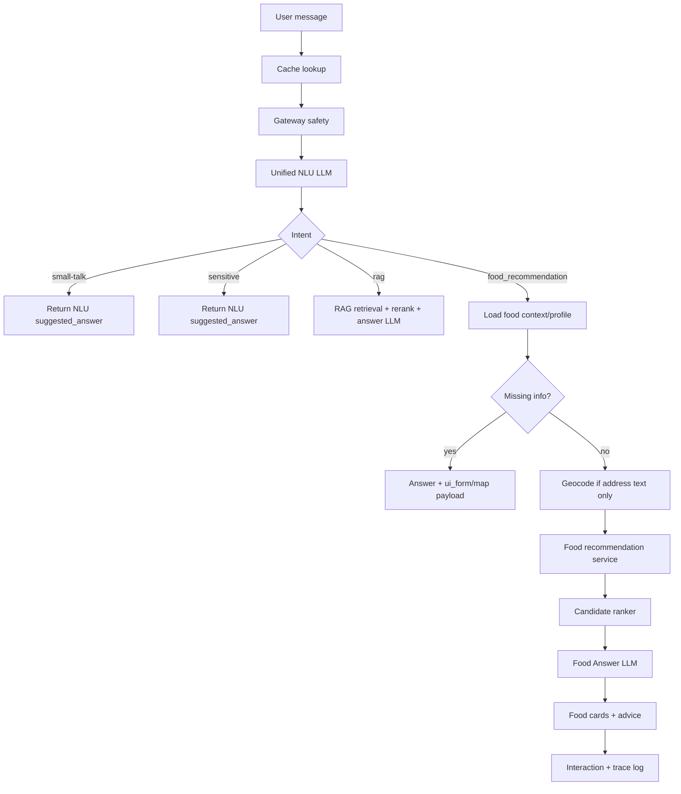

# Food Recommendation V2

Tài liệu này là bản thiết kế hiện hành cho luồng gợi ý món ăn trong Xanh SM Chatbot. Bản V2 thay thế các hướng MVP/fast-path cũ: không dùng keyword matching để tự rẽ nhánh food, không bỏ qua NLU LLM, và không trả lời food bằng markdown thô nếu có thể trả payload có cấu trúc cho FE render card đẹp.

## 1. Mục Tiêu

- Mọi câu hỏi vẫn đi qua cache, gateway/safety và Unified NLU LLM.
- NLU LLM phân loại intent: `rag`, `small-talk`, `sensitive`, `food_recommendation`.
- `sensitive` do NLU phát hiện thì dùng luôn `suggested_answer` của NLU, không gọi LLM khác.
- `food_recommendation` là một tool pipeline riêng: slot filling, geocode, candidate generation, ranking, Food Answer LLM, card UI.
- Thiếu thông tin thì backend trả `answer` + `ui_form` để FE render form/map, thay vì bắt user nhập tọa độ thập phân.
- Hệ thống phải sẵn sàng học hành vi nhiều user qua profile, interaction log và recommendation trace.

## 2. Luồng Tổng Quan



## 3. NLU Contract

Unified NLU phải trả JSON có cấu trúc:

```json
{
  "rewritten_query": "tìm cơm gần ngõ 67 phùng khoang",
  "intent": "food_recommendation",
  "expanded_queries": [],
  "suggested_answer": null,
  "food_slots": {
    "dish_or_category": "cơm",
    "taste_tags": [],
    "budget_min": null,
    "budget_max": null,
    "meal_time": null,
    "lat": null,
    "lng": null,
    "address_text": "ngõ 67 phùng khoang",
    "max_distance_km": 6
  },
  "user_context": {
    "current_location": null,
    "liked_foods": [],
    "disliked_foods": []
  },
  "missing_fields": [],
  "ui_form": null
}
```

Quy tắc:

- Không dùng keyword rule để tự quyết định food intent trong classifier/pipeline.
- Regex tọa độ chỉ được dùng như parser kỹ thuật cho `lat,lng` nếu NLU đã đi vào nhánh food.
- Nếu user nói “gần đây/gần tôi/quanh đây” mà không có vị trí trong context, NLU phải đưa `missing_fields=["location"]` và trả `ui_form`.
- Nếu user đưa địa chỉ chữ như “ngõ 67 Phùng Khoang”, NLU đưa vào `address_text`; recommendation service sẽ geocode.

## 4. User Food Context

Trước khi gọi NLU, backend lấy food profile từ DB và đưa vào prompt. Field chưa biết phải là `null` hoặc `[]` để NLU hiểu rõ dữ liệu thiếu.

```json
{
  "current_location": null,
  "saved_places": [],
  "liked_foods": [],
  "disliked_foods": [],
  "preferred_categories": [],
  "preferred_tags": [],
  "avoided_tags": [],
  "budget_profile": null,
  "allergies": []
}
```

Bảng chính:

- `user_food_profiles`: profile tổng hợp dùng nhanh cho NLU/recommender.
- `food_interactions`: event log thô từ FE.
- `food_recommendation_traces`: trace từng lần recommend để debug ranking, NLU, geocode, SSE và Food Answer LLM.

## 5. Missing Info UX

Backend trả payload:

```json
{
  "type": "food_missing_info",
  "answer": "Dạ, em cần vị trí giao món để sắp xếp các quán gần anh/chị chính xác hơn...",
  "ui_form": {
    "title": "Bạn muốn giao đến đâu?",
    "address_placeholder": "Nhập địa chỉ giao hàng",
    "current_location_label": "Dùng vị trí hiện tại",
    "submit_label": "Tìm quán gần đây"
  },
  "trace_id": "foodtrace_xxx"
}
```

FE cần render message đẹp:

- Nút chia sẻ vị trí hiện tại.
- Nút chọn trên bản đồ.
- Ô nhập địa chỉ.
- Nếu đã có vị trí thì hiển thị bản đồ thật và cho đổi lại.
- Không yêu cầu user nhập tọa độ thập phân.

Map thật không cần Google/Visa ở bản free:

- Backend geocode dùng OpenStreetMap Nominatim trước, Photon fallback sau.
- Không cần `GOOGLE_MAPS_API_KEY` cho backend.
- Frontend map nên dùng Leaflet + OpenStreetMap tile layer để không cần API key.
- Autocomplete địa chỉ có thể gọi backend `/api/food/geocode` hoặc sau này thêm endpoint search gợi ý từ Nominatim/Photon.
- Lưu ý free providers có rate limit và độ chính xác không bằng Google; nên cache kết quả và hỏi user xác nhận pin nếu địa chỉ mơ hồ.

### Cách dùng bản đồ/geocode miễn phí

1. Backend hiện dùng `app/food_recommendation/geocode.py`:
   - `Nominatim`: nguồn OpenStreetMap, ổn cho địa chỉ rõ.
   - `Photon`: fallback miễn phí, fuzzy hơn cho hẻm/ngõ/khu vực.
2. Frontend nên cài Leaflet nếu muốn map thật:

```bash
cd frontend
npm install leaflet react-leaflet
```

3. FE render map bằng OpenStreetMap tile:

```js
<TileLayer
  attribution='&copy; OpenStreetMap contributors'
  url="https://{s}.tile.openstreetmap.org/{z}/{x}/{y}.png"
/>
```

4. Khi user chọn pin, gửi `lat,lng` về chat như hiện tại hoặc qua structured form payload.
5. Khi user nhập địa chỉ, gọi `GET /api/food/geocode?address=...` để lấy tọa độ gần đúng rồi cho user xác nhận trên map.
## 6. Food Recommendation Service V2

Interface mục tiêu:

```python
recommend_food_v2(
    query: str,
    slots: FoodSlots,
    user_context: UserFoodContext,
    db: Session,
    limit: int = 8,
) -> FoodRecommendationResult
```

Các bước:

1. Chuẩn hóa slots từ NLU.
2. Nếu chỉ có `address_text`, geocode ra `lat,lng`.
3. Candidate generation từ `food_catalog`.
4. Hard filter tối thiểu: có vị trí, trong bán kính hợp lý, không vượt ràng buộc bắt buộc.
5. Ranking theo khoảng cách, ETA, phí ship, giá, rating, popularity, discount, profile người dùng.
6. Food Answer LLM nhận top candidates và viết lời gợi ý grounded.
7. Trả payload có cấu trúc cho FE render card.
8. Ghi trace đầy đủ.

Payload kết quả:

```json
{
  "type": "food_recommendation_result",
  "answer": "Dạ, em đã sắp xếp một vài lựa chọn phù hợp...",
  "food_recommendations": {
    "title": "Một vài quán cơm phù hợp gần bạn",
    "subtitle": "Đã sắp xếp theo khoảng cách, thời gian giao và mức độ phù hợp.",
    "trace_id": "foodtrace_xxx",
    "items": []
  },
  "trace_id": "foodtrace_xxx"
}
```

## 7. ML/DL Và Rerank Roadmap

Hiện chưa có đủ dữ liệu hành vi thật, nhưng kiến trúc phải sẵn sàng cho nhiều user.

### Tầng 0: Rule Ranker Có Giải Thích

Đang dùng để chạy được ngay:

- distance score
- ETA score
- delivery fee score
- budget score
- discount score
- rating/popularity score
- soft category/taste/profile score

Không dùng keyword matching để route intent. Category/taste chỉ còn là tín hiệu mềm trong ranker sau khi NLU đã xác định intent.

### Tầng 1: Embedding Recall

Tạo embedding cho món/quán bằng:

- name
- cuisine/category
- description
- tags
- merchant/address/city

Truy vấn food được embed để recall món tương tự. Có thể dùng `text-embedding-3-small` hoặc local embedding model.

### Tầng 2: Learning-to-Rank

Khi có log:

- impression
- click
- click out
- like
- dismiss
- dislike

Train LightGBM/XGBoost/CatBoost ranker với feature:

- user profile features
- item features
- context features: giờ ăn, vị trí, ngày trong tuần
- score từ rule/embedding/reranker

### Tầng 3: Neural Reranker / Cross Encoder

Dùng BGE/Cohere reranker hoặc cross-encoder riêng để rerank top 50 theo query + item text.

### Tầng 4: Two-Tower Retrieval

Khi có nhiều user/event:

- User tower: profile + lịch sử tương tác.
- Item tower: catalog + tags + text embedding.
- ANN index để recall nhanh.

### Tầng 5: Bandit / Online Learning

Dùng epsilon-greedy hoặc Thompson Sampling để cân bằng explore/exploit, tránh hệ thống chỉ đề xuất một nhóm món quen thuộc.

## 8. Food Answer LLM

Food Answer LLM không chọn món mới. Nó chỉ nhận top candidates đã rank và viết câu trả lời dễ hiểu.

Input:

```json
{
  "query": "có món nào gần ngõ 67 phùng khoang không",
  "food_slots": {},
  "user_context": {},
  "recommended_items": []
}
```

Output:

```json
{
  "answer": "Dạ, em đã tìm vài lựa chọn cơm gần khu vực anh/chị nói...",
  "cards_title": "Một vài quán cơm phù hợp gần bạn",
  "cards_subtitle": "Đã sắp xếp theo khoảng cách, thời gian giao và độ phù hợp.",
  "item_notes": [
    {"item_id": "shopeefood_x", "advice": "Gần nhất trong danh sách và phí giao dự kiến thấp."}
  ]
}
```

Không được:

- bịa quán/món ngoài `recommended_items`;
- bịa giá, rating, khoảng cách, địa chỉ;
- khuyên quá dài làm card khó đọc.

## 9. SSE Và Log

Mọi bước nên phát `pipeline_step` để FE hiển thị trạng thái rõ ràng.

RAG:

| Step | Message |
| --- | --- |
| `received` | `Chờ một chút...` |
| `gateway_safety` | `Đang kiểm tra an toàn nội dung...` |
| `cache_lookup` | `Đang kiểm tra câu trả lời đã có...` |
| `nlu_intent` | `Đang phân tích ý định...` |
| `retrieval_search` | `Đang tìm kiếm tài liệu...` |
| `rerank_documents` | `Đang xếp hạng tài liệu...` |
| `context_expansion` | `Đang gọi thêm tài liệu đầy đủ...` |
| `answer_prepare` | `Đang chuẩn bị trả lời...` |

Food:

| Step | Message |
| --- | --- |
| `food_context_load` | `Đang xem lại khẩu vị và vị trí của bạn...` |
| `food_missing_info` | `Em cần thêm một chút thông tin để gợi ý chính xác hơn...` |
| `food_geocode` | `Đang xác định vị trí trên bản đồ...` |
| `food_candidate_search` | `Đang tìm các món ăn phù hợp...` |
| `food_candidate_filter` | `Đang lọc quán theo vị trí, ngân sách và khẩu vị...` |
| `food_embedding_recall` | `Đang tìm các món có hương vị tương tự...` |
| `food_ml_rank` | `Đang xếp hạng món ăn phù hợp nhất...` |
| `food_found` | `Yeah, đã tìm được món ăn phù hợp, đang chuẩn bị lên món...` |
| `food_answer_llm` | `Đang viết lời gợi ý dễ hiểu hơn cho bạn...` |
| `food_done` | `Đã lên món xong.` |

Trace cần ghi:

- original query / rewritten query
- NLU slots / missing fields
- user context
- geocode source/result
- candidate count/fallback
- ranking model version
- top item ids/scores/score breakdown
- retrieval meta: `retrieval_version`, `geo_candidate_count`, `candidate_count`, `recall_mode`
- ML-ready notes: cách dùng score breakdown + interaction log để train LTR/cross-encoder/bandit sau này
- Food Answer LLM output
- SSE steps
- latency

## 10. Data Catalog

Catalog JSONL public có thể commit lên GitHub để deploy không cần Playwright.

Hiện dữ liệu đã crawl/import:

- file: `data/food_catalog/shopeefood_catalog.jsonl`
- DB: `food_catalog`
- số lượng hiện tại: 3277 rows
- thành phố lớn đã có: TP.HCM, Hà Nội, Đà Nẵng, Cần Thơ, Hải Phòng, Huế, Khánh Hoà, Đồng Nai, Vũng Tàu

Playwright chỉ dùng local để crawl JSON, không đưa vào runtime deploy.

## 11. Checklist Trạng Thái

### Đã làm

- [x] Crawl/catalog JSONL public cho ShopeeFood.
- [x] Import JSONL vào DB `food_catalog` với 3277 rows.
- [x] Admin Knowledge Builder có import food catalog từ JSON.
- [x] Bỏ food fast-path/keyword route trong classifier/pipeline.
- [x] Unified NLU prompt có `food_slots`, `user_context`, `missing_fields`, `ui_form`.
- [x] NLU gọi với food context từ DB.
- [x] Intent `sensitive` dùng `suggested_answer` của NLU.
- [x] Tạo `user_food_profiles`.
- [x] Tạo `food_recommendation_traces`.
- [x] Tạo `profile_store.py` để load food context.
- [x] `food_interactions` cập nhật liked/disliked profile.
- [x] Bỏ hard category filter; category/taste chỉ còn là tín hiệu mềm sau NLU.
- [x] Chuẩn hóa `pipeline_step` SSE cho RAG và food ở backend.
- [x] FE đã có card food recommendation và location request card nền tảng.
- [x] Backend food branch có payload `food_missing_info`, `food_recommendation_result`, `trace_id`.
- [x] Backend ghi recommendation trace cho missing-info và result.
- [x] Thêm Food Answer LLM bước đầu, có fallback khi thiếu API key/mock.
- [x] Tách `app/assistant/events.py` cho SSE pipeline steps và stream text.
- [x] Tách Food Answer LLM sang `app/food_recommendation/answer_llm.py`.
- [x] Tách food payload builders sang `app/food_recommendation/payloads.py`.
- [x] Tách recommendation trace writer sang `app/food_recommendation/trace_store.py`.
- [x] Dọn function food handler cũ khỏi `chain.py`; chỉ còn handler V2 đang được route tới.
- [x] Chuyển chat stream owner lên `app/assistant/pipeline.py`; `app/rag/pipeline.py` chỉ còn wrapper tương thích.
- [x] Tạo `app/assistant/orchestrator.py` làm tầng điều phối Assistant, không kế thừa RAG chain.
- [x] Tách RAG chain sang `app/rag/chain.py`: hybrid search, rerank, parent-child expansion, answer LLM.
- [x] Tách Food Recommendation chain sang `app/food_recommendation/chain.py`: geocode, recommend, fallback, Food Answer LLM, trace.
- [x] Backend free geocoding: OpenStreetMap Nominatim + Photon fallback, không cần Google Maps API key/Visa.
- [x] Tài liệu hướng dẫn dùng Leaflet/OpenStreetMap miễn phí cho map/geocode.
- [x] FE render đúng V2 form: map thật, chọn vị trí, nhập địa chỉ, hiển thị vị trí đã chọn.
- [x] FE render map thật bằng Leaflet + OpenStreetMap tiles, không cần API key.
- [x] Tách food service thành các module rõ: `geocode.py`, `retrieval.py`, `ranker.py`, `answer_llm.py`, `trace_store.py`.
- [x] Thêm candidate generation bằng BM25 + geo recall, ghi `food_bm25_geo_recall_v1` vào metrics/trace.
- [x] Ranker V2 ghi `food_weighted_ranker_v2_bm25_geo_profile_ready`, score breakdown và ML-ready notes vào trace.

### Còn lại

- [x] Chuẩn hóa toàn bộ message tiếng Việt trong source đang bị mojibake (Đã xử lý trong file).
- [x] Embedding/vector recall thật cho food catalog khi có vector store hoặc model embedding ổn định.
- [x] Learning-to-rank model khi đủ interaction log (Đã thiết lập khung kiến trúc `XGBoostFoodRanker` trong `ml_ranker.py` - Chờ dữ liệu).
- [x] Neural reranker/cross encoder cho top candidates (Đã thiết lập khung kiến trúc `CohereCrossEncoder` trong `ml_ranker.py`).
- [x] Two-tower retrieval khi có nhiều user/event (Đã thiết lập khung kiến trúc `TwoTowerRetriever` trong `ml_ranker.py`).
- [x] Bandit online learning để explore/exploit (Đã thiết lập và tích hợp `BanditExplorer` vào `ranker.py`).
- [x] Dashboard admin xem `food_recommendation_traces` (Đã hoàn thành với `FoodTraceDashboard.jsx`).
- [x] Test end-to-end với các câu: gần đây, địa chỉ chữ, có tọa độ, thiếu vị trí, có liked/disliked profile.
- [x] FE / Presentation: Thiết kế giao diện (UI) và hiệu ứng trình bày nguyên lý hoạt động của hệ thống recommend (hiển thị breakdown điểm, yếu tố ảnh hưởng, lý do đề xuất) để người dùng và admin hiểu rõ luồng gợi ý (Đã hoàn thành với Modal "Vì sao gợi ý?").

## 12. Kế Hoạch Clean Code / Assistant Architecture

Trạng thái hiện tại: orchestration cấp cao đã thuộc `app/assistant`, còn RAG và Food Recommendation là hai capability ngang hàng. RAG không sở hữu Food Recommendation nữa.

### Cấu trúc hiện hành

```text
app/assistant/
  pipeline.py                  # SSE orchestration cấp cao
  orchestrator.py              # cache -> gateway -> NLU -> route intent
  events.py                    # chuẩn pipeline_step / SSE payload
  metrics.py                   # metrics/trace helpers
  schemas.py                   # shared assistant payload schemas

app/rag/
  chain.py                     # RAG retrieval/rerank/context expansion/answer chain
  pipeline.py                  # wrapper tương thích, gọi app.assistant.pipeline
  cache.py
  classifier.py
  gateway.py

app/food_recommendation/
  chain.py                     # geocode + candidate retrieval + rank + Food Answer LLM
  answer_llm.py                # Food Answer LLM
  trace_store.py               # ghi food_recommendation_traces
  payloads.py                  # food_missing_info/result payload
  tool.py                      # recommend_food interface
  catalog.py
  retrieval.py                 # BM25 + geo recall, thay được bằng embedding/two-tower sau này
  ranker.py
  geocode.py
  nlu.py

app/prompts/
  system_prompts.py            # system prompts dùng chung: NLU, RAG answer, Food answer, faithfulness
```

### Việc đã refactor

1. Đã tách prompt rõ tên:
   - `RAG_ANSWER_SYSTEM_PROMPT`
   - `RAG_ANSWER_USER_PROMPT_TEMPLATE`
   - `FOOD_RECOMMENDER_ANSWER_SYSTEM_PROMPT`

2. Đã tách utility không đổi behavior:
   - `_sse_pipeline_step` -> `app/assistant/events.py`
   - food payload builders -> `app/food_recommendation/payloads.py`
   - trace writer -> `trace_store.py`
   - Food Answer LLM -> `answer_llm.py`

3. Đã tách RAG capability:
   - retrieval/search/rerank/answer generation vào `app/rag/chain.py`

4. Đã tách Food capability:
   - geocode, candidate generation, rank, answer, trace vào `app/food_recommendation`
   - giữ payload cũ để FE không vỡ.

5. Đã đổi owner orchestration:
   - `app/assistant/orchestrator.py` điều phối cache/gateway/NLU/route intent.
   - endpoint chat gọi assistant pipeline.
   - `app/rag/pipeline.py` chỉ còn wrapper tương thích.

6. Còn dọn legacy:
   - chuẩn hóa message tiếng Việt bị mojibake trong source.
   - thêm dashboard admin cho `food_recommendation_traces`.
   - mở rộng test end-to-end cho các kịch bản food.
