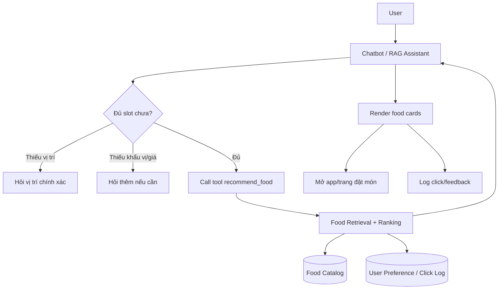
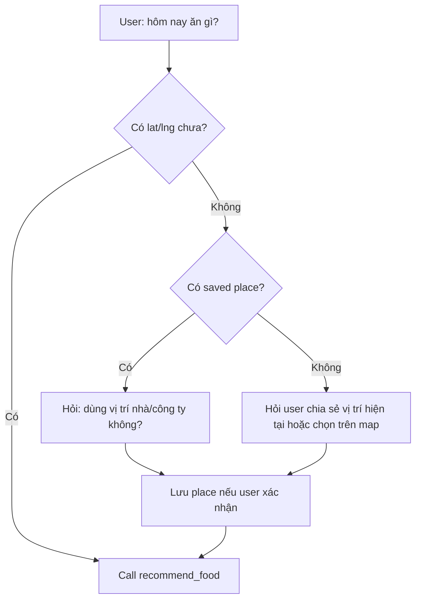
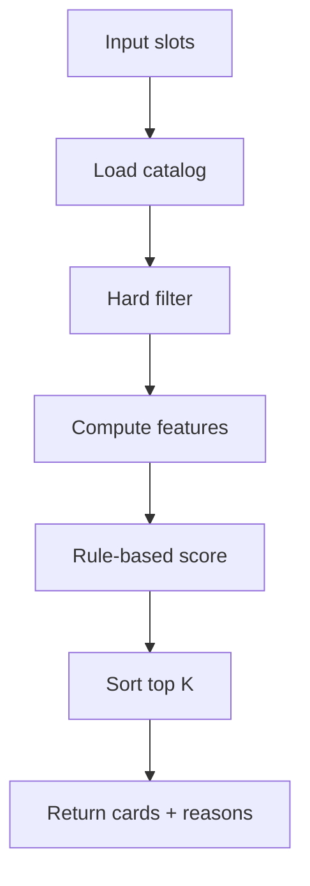
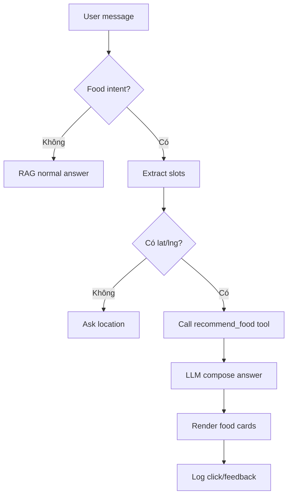
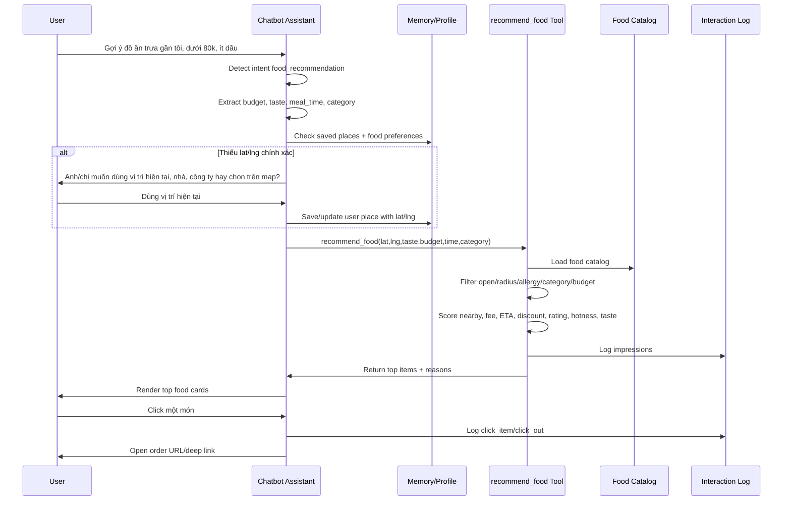
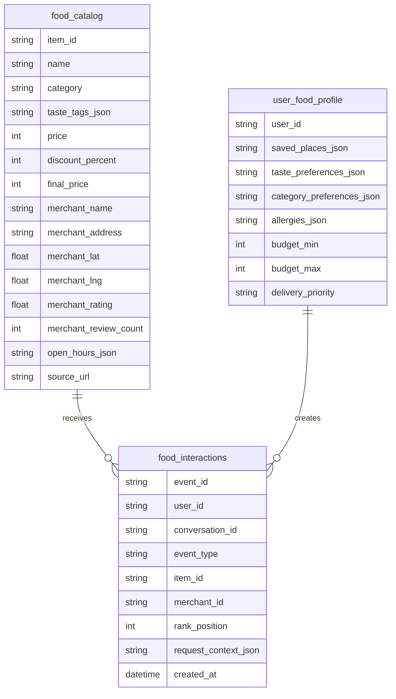
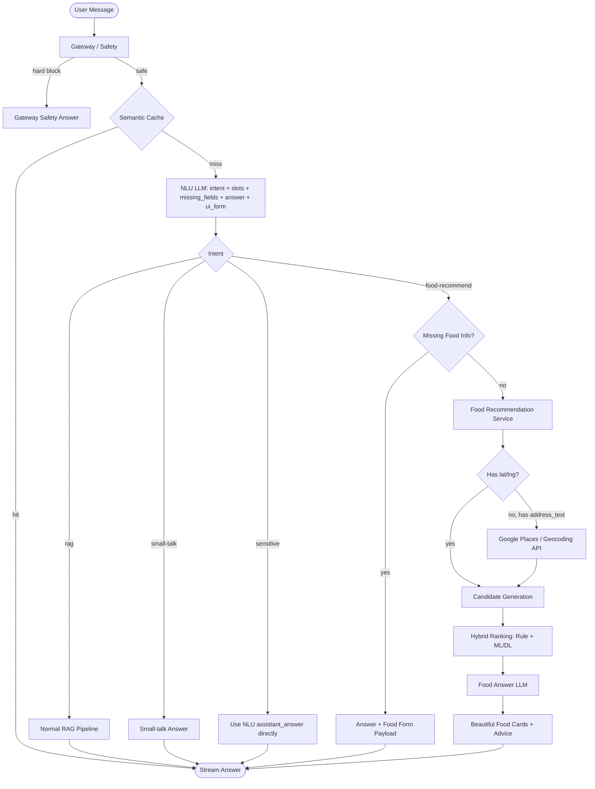
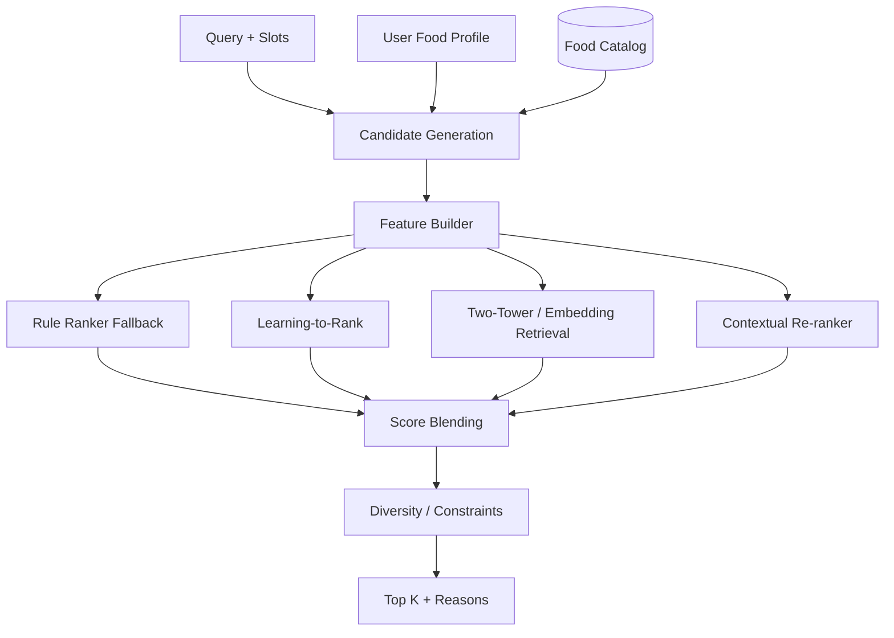

# Food Recommendation Tool Plan

Tài liệu này là kế hoạch mới cho tính năng gợi ý món ăn trong Xanh SM Chatbot. Ta coi như **chưa triển khai code recommend trước đó**; phần code service recommend cũ có thể revert. Hướng mới là: chatbot/RAG hoạt động như một AI Assistant và **call tool** để lấy danh sách món phù hợp.

> Update V2: bản cải biên bên dưới thay thế hướng vá nhanh trước đó. Không dùng fast-path rule để bỏ qua NLU LLM nữa. Tất cả câu hỏi vẫn đi qua cache, safety/gateway và NLU LLM để phân loại intent + trích xuất context. Food Recommendation trở thành một nhánh tool/service có slot filling, map/location UX, profile người dùng và một LLM tổng hợp câu trả lời riêng cho món ăn.

## 1. Quyết Định Mới

Không xây một recommendation platform riêng ngay từ đầu.

Thay vào đó:

```text
User chat
  -> Chatbot hiểu nhu cầu ăn uống
  -> Chatbot hỏi thêm nếu thiếu vị trí/giá/khẩu vị
  -> Chatbot gọi tool recommend_food(...)
  -> Tool tìm và rank món từ catalog
  -> Chatbot trả lời tự nhiên + render card
  -> User bấm card thì mở GreenSM/ShopeeFood/nguồn đặt món
  -> Hệ thống chỉ log click/feedback, không quản lý order
```

Lý do đổi hướng:

- Scope hiện tại chỉ là recommend, không đặt món.
- Chưa có order callback nên không biết user mua thật hay không.
- Xây service nhiều bảng quá sớm sẽ over-engineer.
- RAG/Assistant có tool hợp hơn: bot hỏi, hiểu context, gọi tool, giải thích kết quả.
- Sau này nếu tool lớn lên, vẫn có thể tách thành service riêng.

## 2. Ranh Giới Sản Phẩm

Chatbot làm:

- hiểu user muốn ăn gì;
- hỏi vị trí chính xác nếu thiếu;
- hỏi khẩu vị/ngân sách nếu cần;
- gọi tool recommend;
- giải thích vì sao gợi ý món;
- render card món ăn;
- log user đã xem/click/thích/bỏ qua.

Chatbot không làm:

- không đặt món;
- không quản lý giỏ hàng;
- không xử lý thanh toán;
- không xác nhận đơn;
- không biết chắc user có mua món hay không nếu không có callback từ app đặt món.

Tín hiệu học được ở MVP:

- user click món nào;
- user bỏ qua món nào;
- user thích/không thích gợi ý nào;
- user hay chọn loại món/tag/giá/vị trí nào.

Tín hiệu chưa có:

- user đã mua thật;
- user mua lại;
- giá trị đơn hàng;
- trạng thái giao hàng.

## 3. Kiến Trúc Tổng Quan



Tool không cần là service riêng ở MVP. Có thể là module nội bộ trong backend RAG:

```text
app/tools/food_recommendation/
  tool.py          interface recommend_food(...)
  catalog.py       load/search catalog
  ranker.py        rule-based rank
  profile.py       user preference helpers
  schemas.py       input/output schema
```

Khi lớn hơn, module này có thể tách ra:

```text
Chatbot -> HTTP -> Food Recommendation Service
```

Nhưng chưa cần làm ngay.

## 4. Tool Interface

Tool chính:

```python
recommend_food(
    lat: float,
    lng: float,
    category: str | None = None,
    taste_tags: list[str] | None = None,
    budget_min: int | None = None,
    budget_max: int | None = None,
    meal_time: str | None = None,
    max_distance_km: float = 4,
    user_id: str | None = None,
    limit: int = 5,
) -> list[FoodRecommendation]
```

Input ví dụ:

```json
{
  "lat": 21.0285,
  "lng": 105.8542,
  "category": "rice",
  "taste_tags": ["spicy", "less_oil"],
  "budget_max": 80000,
  "meal_time": "lunch",
  "max_distance_km": 4,
  "user_id": "user_123",
  "limit": 5
}
```

Output ví dụ:

```json
[
  {
    "item_id": "food_001",
    "name": "Cơm gà sốt cay",
    "merchant_name": "Bếp Việt Xanh",
    "address": "12 Nguyễn Hữu Huân, Hoàn Kiếm, Hà Nội",
    "lat": 21.0321,
    "lng": 105.8548,
    "distance_km": 1.1,
    "price": 62000,
    "discount_percent": 10,
    "final_price": 55800,
    "rating": 4.7,
    "review_count": 1200,
    "delivery_fee": 14000,
    "eta_minutes": 25,
    "image_url": "https://...",
    "order_url": "https://...",
    "score": 0.86,
    "reason": "Gần vị trí của bạn, hợp ngân sách, rating cao và đang giảm giá."
  }
]
```

## 5. Slot Filling Trong Chatbot

Slot bắt buộc:

- `lat`
- `lng`

Slot nên có:

- `category`: cơm, bún/phở, bánh mì, healthy, trà sữa, cà phê...
- `taste_tags`: cay, ít dầu, ngọt, mặn, thanh nhẹ, no lâu...
- `budget_max`: ngân sách tối đa;
- `meal_time`: sáng, trưa, tối, khuya;
- `max_distance_km`: bán kính giao.

Luồng hỏi vị trí:



Nguyên tắc vị trí:

- Không rank bằng chữ chung chung như "Hoàn Kiếm", "Bình Thạnh".
- Text location chỉ dùng để gợi ý/hỏi lại.
- Rank nghiêm túc phải có `lat/lng`.
- Nên lưu `accuracy_meters` nếu lấy từ browser/map.

## 6. Dữ Liệu Tối Thiểu

MVP chỉ cần 3 nhóm dữ liệu.

### 6.1. Food Catalog

Có thể lưu trong SQLite/Postgres hoặc JSON index ban đầu.

Một bản ghi nên đủ rộng để tránh quá nhiều bảng:

```text
food_catalog
  item_id
  name
  description
  category
  cuisine
  taste_tags_json
  diet_tags_json
  ingredient_tags_json
  price
  discount_percent
  final_price
  currency
  image_url
  merchant_id
  merchant_name
  merchant_rating
  merchant_review_count
  merchant_address
  merchant_lat
  merchant_lng
  merchant_open_hours_json
  avg_prep_minutes
  base_delivery_fee
  fee_per_km
  service_radius_km
  source
  source_url
  last_seen_at
```

Vì đây là catalog phục vụ retrieval/rank, một bảng rộng là chấp nhận được ở MVP.

### 6.2. User Food Profile

```text
user_food_profile
  user_id
  saved_places_json
  taste_preferences_json
  category_preferences_json
  allergies_json
  budget_min
  budget_max
  delivery_priority
  updated_at
```

Ví dụ `saved_places_json`:

```json
[
  {
    "label": "office",
    "address": "Hoàn Kiếm, Hà Nội",
    "lat": 21.0285,
    "lng": 105.8542,
    "accuracy_meters": 30
  }
]
```

### 6.3. Food Interaction Log

```text
food_interactions
  event_id
  user_id
  session_id
  conversation_id
  event_type
  item_id
  merchant_id
  rank_position
  query
  request_context_json
  created_at
```

Event type:

```text
impression
click_item
click_out
like
dismiss
dislike
```

Không có `order` ở MVP.

## 7. Retrieval Và Ranking MVP

Tool `recommend_food` làm 4 bước:



Hard filter:

- quán/món còn hoạt động;
- trong bán kính giao;
- đang mở theo `meal_time` hoặc thời gian hiện tại;
- không chứa allergy;
- nếu user chọn category thì ưu tiên/lọc category.

Feature score:

```text
nearby_score        khoảng cách càng gần càng tốt
delivery_fee_score  phí ship càng thấp càng tốt
eta_score           giao càng nhanh càng tốt
budget_score        hợp ngân sách
discount_score      giảm giá/final_price tốt
category_score      đúng loại món
taste_score         hợp khẩu vị
rating_score        rating/review tốt
popularity_score    click/rating/review cao
```

Score MVP:

```text
score =
  0.22 * nearby_score
+ 0.14 * delivery_fee_score
+ 0.12 * eta_score
+ 0.14 * budget_score
+ 0.10 * discount_score
+ 0.10 * category_score
+ 0.08 * taste_score
+ 0.06 * rating_score
+ 0.04 * popularity_score
```

Rule này đủ explainable, dễ debug, chưa cần ML.

## 8. Dữ Liệu Food Lấy Từ Đâu?

Nguồn demo/MVP:

- mock data tự tạo;
- scrape/crawl nguồn public ở mức nhỏ;
- data export thủ công;
- sau này nếu có nguồn hợp lệ từ GreenSM thì thay vào.

Về ShopeeFood:

- Có thể dùng làm nguồn tham khảo/demo nếu crawl giới hạn.
- Cần cẩn thận robots.txt, điều khoản sử dụng, CAPTCHA, rate limit.
- Không nên bypass login/CAPTCHA hoặc crawl dữ liệu cá nhân.
- Không nên phụ thuộc production vào scraping nếu chưa rõ quyền dữ liệu.

Data cần lấy:

```text
item name
description
category
price
discount
image
merchant name
merchant address
merchant lat/lng nếu có
rating
review_count
open hours nếu có
source_url
```

Nếu chỉ có địa chỉ text mà chưa có lat/lng, cần geocoding trước khi rank theo khoảng cách.

## 9. Tích Hợp Với RAG

RAG vẫn dùng cho tri thức Xanh SM bình thường.

Food intent đi nhánh tool:



LLM không được tự bịa món/giá/quán. LLM chỉ được:

- hỏi thêm thông tin;
- gọi tool;
- diễn giải kết quả tool trả về;
- sắp xếp câu trả lời tự nhiên.

## 10. Sơ Đồ Hệ Thống Sẽ Đổi So Với README

Trong `README.md`, luồng hiện tại là RAG hỏi-đáp tri thức:

```text
User Input
  -> Safety
  -> Cache
  -> NLU
  -> Intent
  -> RAG Retrieval
  -> Reranker
  -> LLM Synthesis
  -> Stream Answer
```

Khi hoàn thiện Food Recommendation Tool, kiến trúc không thay RAG lõi. Ta chỉ thêm một nhánh intent mới: `food_recommendation`. Nghĩa là chatbot trở thành Assistant có tool, không còn chỉ là RAG trả lời tài liệu.

### 10.1. Sơ Đồ Mới Ở Mức Tổng Quan


Điểm thay đổi quan trọng:

- `Intent` có thêm nhánh `food_recommendation`.
- Trước khi gọi tool, bot phải gom đủ slot: vị trí chính xác, ngân sách, khẩu vị, loại món, thời gian ăn.
- RAG retrieval vẫn dành cho tài liệu/chính sách Xanh SM.
- Food retrieval/ranking dùng catalog món ăn, không dùng chunk tài liệu chính sách.
- LLM không tự bịa món; LLM chỉ diễn giải kết quả từ tool.

### 10.2. Sơ Đồ Luồng Food Chi Tiết



### 10.3. Sơ Đồ Data Cho Food Tool

MVP chỉ cần 3 khối dữ liệu. Không cần nhiều bảng recommendation phức tạp.



### 10.4. Mermaid README Sau Khi Có Food Tool

Nếu sau này cập nhật `README.md`, sơ đồ RAG chính có thể đổi thành bản ngắn gọn này:


Như vậy README sau này sẽ thể hiện rõ hệ thống không chỉ là RAG hỏi-đáp, mà là:

```text
NLU Gateway RAG + Tool-Using Assistant
```

Trong đó Food Recommendation là một tool có retrieval/ranking riêng, nhận slot có cấu trúc và trả danh sách món có thể kiểm chứng.

## 11. UI Cần Có

Chat UI:

- card món có ảnh, tên món, quán, địa chỉ, giá, giảm giá, rating, phí ship, ETA;
- nút mở app/trang đặt món;
- nút thích/không hợp để học preference.

Location UX:

- nút dùng vị trí hiện tại;
- chọn nhà/công ty đã lưu;
- chọn trên map nếu cần chính xác.

Admin/dev UI:

- xem catalog;
- test tool bằng lat/lng;
- xem score breakdown;
- xem click log;
- xem món nào hay được click.

## 12. Phiên Bản Cải Biên V2

Phiên bản này thay thế hướng vá nhanh trước đó. Không dùng fast-path food intent để bỏ qua NLU LLM nữa. Tất cả user message đi qua cache, sau đó qua NLU LLM để phân loại intent và trích xuất context.

### 12.1. Luồng Chính



Thứ tự bắt buộc:

- Gateway/safety.
- Semantic cache.
- NLU LLM.
- Route theo intent: `rag`, `small-talk`, `sensitive`, `food-recommend`.
- Nếu NLU LLM trả `sensitive`, dùng luôn `assistant_answer` từ NLU để phản hồi. Không gọi thêm LLM lần nữa chỉ để từ chối.
- Food thiếu thông tin: trả `assistant_answer` + `ui_form`.
- Food đủ thông tin: gọi recommendation service.
- Recommendation service trả top candidates có score/reason.
- Food Answer LLM nhận top candidates + user context để viết câu trả lời hay, nhưng không bịa món ngoài candidates.

### 12.2. NLU LLM Contract

Không còn rule fast-path làm đường chính. NLU LLM là nơi quyết định intent:

```json
{
  "intent": "food-recommend",
  "confidence": 0.91,
  "rewritten_query": "Tìm món ăn ngon gần Ngõ 67 Phùng Khoang",
  "food_slots": {
    "dish_or_category": "món ăn ngon",
    "taste_tags": [],
    "budget_min": null,
    "budget_max": null,
    "meal_time": null,
    "party_size": null,
    "delivery_or_pickup": "delivery",
    "address_text": "Ngõ 67 Phùng Khoang",
    "lat": null,
    "lng": null,
    "max_distance_km": null
  },
  "user_context": {
    "current_location": null,
    "saved_places": null,
    "liked_foods": null,
    "disliked_foods": null,
    "preferred_categories": null,
    "budget_profile": null,
    "allergies": null
  },
  "missing_fields": ["lat_lng_confirmation"],
  "assistant_answer": "Dạ, em có thể tìm món ngon gần Ngõ 67 Phùng Khoang. Em sẽ xác định vị trí gần đúng trước; anh/chị có muốn chỉnh lại vị trí trên bản đồ không ạ?",
  "ui_form": {
    "type": "food_missing_info",
    "required_fields": ["location"],
    "optional_fields": ["budget", "taste", "liked_foods", "disliked_foods"],
    "map_required": true
  }
}
```

Nguyên tắc:

- Nếu user nói “gần đây/gần tôi/quanh đây” mà không có `current_location`, NLU đánh dấu thiếu location.
- Nếu user nói địa chỉ chữ như “Ngõ 67 Phùng Khoang”, NLU đưa vào `address_text`, không tự bịa lat/lng.
- Field nào profile chưa có thì ghi `null` hoặc `[]`, không đoán.
- Khi thiếu field, NLU vẫn trả lời tự nhiên giống small-talk/sensitive, đồng thời trả form schema cho FE.

### 12.3. User Food Context / Memory

Trước khi gọi NLU LLM, backend lấy food context từ DB và nhét vào prompt:

```json
{
  "current_location": {
    "lat": 10.7769,
    "lng": 106.7009,
    "label": "Vị trí hiện tại",
    "accuracy_meters": 30,
    "updated_at": "2026-06-17T10:30:00Z"
  },
  "saved_places": [
    {"label": "Nhà", "lat": null, "lng": null, "address": null},
    {"label": "Công ty", "lat": null, "lng": null, "address": null}
  ],
  "liked_foods": [
    {"item_id": "shopeefood_123", "name": "Cơm gạo lứt", "category": "cơm", "tags": ["healthy"]}
  ],
  "disliked_foods": [
    {"item_id": "shopeefood_456", "name": "Gà rán", "category": "fast_food", "tags": ["nhiều dầu"]}
  ],
  "preferred_categories": null,
  "budget_profile": null,
  "allergies": null
}
```

DB nên bổ sung:

```text
user_food_profile
  user_id / guest_id
  current_location_json
  saved_places_json
  liked_items_json
  disliked_items_json
  preferred_categories_json
  preferred_tags_json
  avoided_tags_json
  budget_profile_json
  allergies_json
  updated_at
```

`food_interactions` là event log thô. `user_food_profile` là bản tổng hợp để NLU và recommender dùng nhanh.

### 12.4. Missing Info UX

Backend trả cả answer và form payload:

```json
{
  "answer": "Dạ, để gợi ý món gần anh/chị chính xác hơn, em cần vị trí giao món trước ạ.",
  "ui_form": {
    "type": "food_missing_info",
    "required_fields": ["location"],
    "optional_fields": ["budget", "taste", "liked_foods", "disliked_foods"],
    "map": {
      "provider": "google_maps",
      "show_current_location": true,
      "allow_pin_drag": true,
      "allow_address_search": true
    },
    "preference_picker": {
      "show_liked_foods": true,
      "show_disliked_foods": true,
      "allow_edit": true
    }
  }
}
```

FE kỳ vọng:

- Không yêu cầu user tự nhập tọa độ thập phân.
- Map thật, hiển thị vị trí nếu có.
- Nếu chưa có vị trí: cho bật current location, nhập địa chỉ, autocomplete địa chỉ hoặc kéo pin.
- Nếu đã có vị trí: vẫn cho đổi lại.
- Hiển thị món/quán user đã thích hoặc không thích để chỉnh preference.
- Submit form gửi structured payload, không biến lat/lng thành message chính.

Map production:

```text
VITE_GOOGLE_MAPS_API_KEY=...
GOOGLE_MAPS_API_KEY=...
```

Cần Google Maps JavaScript API, Places Autocomplete và Geocoding API. Nếu chưa có key thì phải báo user cung cấp trước khi bật map thật.

### 12.5. Food Recommendation Service V2

Interface:

```python
recommend_food_v2(
    query: str,
    user_id: str | None,
    slots: FoodSlots,
    user_context: UserFoodContext,
    limit: int = 10,
) -> FoodRecommendationResult
```

Service chịu trách nhiệm:

- Có `lat/lng` thì dùng trực tiếp.
- Không có `lat/lng` nhưng có `address_text` thì gọi Google Geocoding/Places API.
- Nếu geocode confidence thấp thì trả `needs_confirmation=true` để FE hiện map xác nhận.
- Candidate generation từ DB food catalog.
- Ranking bằng hybrid ranker.
- Trả top items, score breakdown, reason, warnings.

Output:

```json
{
  "needs_confirmation": false,
  "resolved_location": {
    "lat": 20.9901,
    "lng": 105.7923,
    "address": "Ngõ 67 Phùng Khoang, Hà Nội",
    "confidence": 0.82,
    "source": "google_geocoding"
  },
  "items": [
    {
      "item_id": "shopeefood_abc",
      "name": "Phở Cồ - Phở Xào & Cơm Rang",
      "merchant_name": "Phở Cồ",
      "image_url": "...",
      "distance_km": 1.5,
      "eta_minutes": 21,
      "delivery_fee": 16543,
      "rating": 5,
      "score": 0.91,
      "reason": "Gần vị trí đã chọn, phù hợp nhu cầu cơm/phở, đánh giá tốt."
    }
  ]
}
```

### 12.6. Ranking ML/DL Được Phép Dùng

V2 cho phép nâng cấp ranking bằng ML/DL, miễn là vẫn có fallback rule-based và không bịa item.



Các tầng có thể dùng:

- Rule-based fallback: distance, ETA, fee, rating, discount, category/taste match.
- Content-based embedding: embed món/quán + query/user taste profile.
- Learning-to-rank: LightGBM/XGBoost LambdaMART hoặc CatBoost ranking từ click/like/dismiss.
- Two-tower retrieval: user tower + item tower khi data đủ lớn.
- Contextual re-ranker: cross-encoder hoặc LLM/reranker nhỏ chấm lại top 50.
- Multi-armed bandit nhẹ để exploration/exploitation.

Model chỉ được re-rank item có thật trong catalog.

#### 12.6.1. Stack ML/DL Cụ Thể Đề Xuất

Vì recommendation là bài toán nhiều tầng, không nên nhảy thẳng vào deep learning nếu chưa có event thật. Nhưng thiết kế V2 phải chừa đường cho các tầng sau:

| Tầng | Mục tiêu | Công nghệ cụ thể | Khi nào bật |
|---|---|---|---|
| Rule Ranker | Fallback chắc chắn, dễ debug | Python scoring + SQL/Postgres | Luôn bật |
| Content Embedding | Tìm món/quán tương tự query và taste profile | `sentence-transformers`/`BAAI/bge-m3` hoặc `intfloat/multilingual-e5-base`; index bằng `pgvector`, Qdrant hoặc FAISS | Khi catalog ổn định |
| Learning-to-Rank | Học từ click/like/dismiss để xếp hạng tốt hơn | LightGBM `lambdarank`, XGBoost `rank:ndcg`, CatBoostRanker | Khi có tối thiểu vài nghìn interaction |
| Contextual Re-ranker | Chấm lại top 30-50 theo query cụ thể | Cross-encoder `BAAI/bge-reranker-v2-m3`, Cohere Rerank, hoặc LLM judge nhỏ | Khi latency cho phép |
| Two-Tower Retrieval | Candidate generation cá nhân hóa ở scale lớn | PyTorch/TensorFlow: user tower + item tower, negative sampling từ impression/click | Khi có nhiều user/event |
| Bandit | Exploration/exploitation, tránh lặp món quá mức | Thompson Sampling hoặc LinUCB | Khi có traffic thật |

Stack MVP nên đi theo thứ tự:

```text
Rule Ranker
  -> Rule + Embedding Recall
  -> Rule + Embedding + Cross-Encoder Rerank
  -> Learning-to-Rank từ interaction
  -> Two-Tower nếu data đủ lớn
```

Không bật ML/DL khi chưa có dữ liệu:

- Dưới 1.000 interaction: chỉ rule + manual score.
- 1.000-10.000 interaction: có thể thử embedding recall và re-ranker.
- 10.000+ interaction: bắt đầu train LightGBM/CatBoost ranking.
- 100.000+ interaction: cân nhắc two-tower/deep retrieval.

#### 12.6.2. Feature Set Cho Ranker

Feature nên log và build rõ ràng để ML học được:

```text
Query/User features
  intent_confidence
  dish_or_category
  taste_tags
  budget_min / budget_max
  meal_time
  current_city
  preferred_categories
  preferred_tags
  avoided_tags

Item features
  category
  cuisine
  price / final_price
  discount_percent
  merchant_rating
  merchant_review_count
  historical_ctr
  historical_like_rate
  historical_dismiss_rate

Context features
  distance_km
  eta_minutes
  delivery_fee
  is_open_now
  query_item_text_similarity
  user_item_embedding_similarity
  category_match
  taste_match
  budget_match
```

Score blend ban đầu:

```text
final_score =
  0.25 * rule_score
  + 0.20 * embedding_similarity
  + 0.20 * ltr_score
  + 0.15 * contextual_rerank_score
  + 0.10 * profile_match
  + 0.10 * exploration_bonus
```

Nếu model nào chưa bật thì trọng số của nó phân bổ lại cho `rule_score` và `embedding_similarity`.

#### 12.6.3. Log/Telemetry Bắt Buộc Cho Recommendation

Mỗi request food phải ghi trace để debug vì sao hệ thống chọn món đó:

```json
{
  "trace_id": "food_trace_xxx",
  "conversation_id": "conv_xxx",
  "message_id": "msg_xxx",
  "intent": "food-recommend",
  "nlu": {
    "confidence": 0.91,
    "slots": {},
    "missing_fields": []
  },
  "location": {
    "input_type": "address_text|current_location|saved_place|map_pin",
    "address_text": "Ngõ 67 Phùng Khoang",
    "lat": 20.9901,
    "lng": 105.7923,
    "geocode_provider": "google",
    "geocode_confidence": 0.82
  },
  "candidate_generation": {
    "catalog_size": 3277,
    "geo_filtered_count": 120,
    "category_filtered_count": 48,
    "candidate_count": 50
  },
  "ranking": {
    "ranker_version": "rule_v1+embedding_v1",
    "models_used": ["rule_ranker", "embedding_recall", "cross_encoder"],
    "top_item_ids": ["shopeefood_1", "shopeefood_2"],
    "score_breakdown_available": true
  },
  "answer_llm": {
    "model": "gpt-4o-mini",
    "used": true,
    "grounded_item_count": 5
  },
  "latency_ms": {
    "nlu": 420,
    "geocode": 180,
    "candidate_generation": 60,
    "ranking": 90,
    "answer_llm": 850,
    "total": 1600
  }
}
```

Log interaction vẫn cần event thô:

```text
food_form_shown
food_location_confirmed
food_recommendation_impression
food_item_click
food_item_click_out
food_item_like
food_item_dismiss
food_item_dislike
food_answer_regenerated
```

Không xóa log khi catalog import lại. Log nên lưu `item_id`, `merchant_name`, `item_snapshot_json` để vẫn phân tích được nếu item sau này bị đổi/xóa.

### 12.7. SSE Events / User-Facing Progress

Streaming không chỉ gửi token text. Backend cần phát event tiến trình cụ thể để FE hiển thị trạng thái dễ hiểu.

Chuẩn SSE payload:

```text
event: pipeline_step
data: {"step":"nlu_intent","message":"Đang phân tích ý định...","trace_id":"trace_xxx"}
```

Hoặc nếu hệ thống đang dùng `data: {...}` một kênh, vẫn giữ schema:

```json
{
  "type": "pipeline_step",
  "step": "nlu_intent",
  "message": "Đang phân tích ý định...",
  "trace_id": "trace_xxx",
  "progress": 0.2
}
```

#### 12.7.1. SSE Cho Luồng Chung / RAG

| Step | Message hiển thị |
|---|---|
| `received` | `Chờ một chút...` |
| `cache_lookup` | `Đang kiểm tra câu trả lời đã có...` |
| `gateway_safety` | `Đang kiểm tra an toàn nội dung...` |
| `nlu_intent` | `Đang phân tích ý định...` |
| `query_rewrite` | `Đang hiểu lại câu hỏi của bạn...` |
| `retrieval_search` | `Đang tìm kiếm tài liệu...` |
| `rerank_documents` | `Đang xếp hạng tài liệu...` |
| `context_expansion` | `Đang gọi thêm tài liệu đầy đủ...` |
| `answer_prepare` | `Đang chuẩn bị trả lời...` |
| `answer_stream` | `Đang viết câu trả lời...` |
| `done` | `Hoàn tất.` |

`context_expansion` chỉ phát nếu thật sự có bước lấy chunk cha/con/lân cận. Không phát giả.

#### 12.7.2. SSE Cho Luồng Food Recommendation

| Step | Message hiển thị |
|---|---|
| `food_context_load` | `Đang xem lại khẩu vị và vị trí của bạn...` |
| `food_missing_info` | `Em cần thêm một chút thông tin để gợi ý chính xác hơn...` |
| `food_geocode` | `Đang xác định vị trí trên bản đồ...` |
| `food_candidate_search` | `Đang tìm các món ăn phù hợp...` |
| `food_candidate_filter` | `Đang lọc quán theo vị trí, ngân sách và khẩu vị...` |
| `food_embedding_recall` | `Đang tìm các món có hương vị tương tự...` |
| `food_ml_rank` | `Đang xếp hạng món ăn phù hợp nhất...` |
| `food_rerank` | `Đang kiểm tra lại các lựa chọn tốt nhất...` |
| `food_found` | `Yeah, đã tìm được món ăn phù hợp, đang chuẩn bị lên món...` |
| `food_answer_llm` | `Đang viết lời gợi ý dễ hiểu hơn cho bạn...` |
| `food_done` | `Đã lên món xong.` |

SSE food payload nên có thêm metadata:

```json
{
  "type": "pipeline_step",
  "step": "food_candidate_search",
  "message": "Đang tìm các món ăn phù hợp...",
  "trace_id": "food_trace_xxx",
  "progress": 0.45,
  "debug": {
    "city": "Hà Nội",
    "radius_km": 4,
    "candidate_count": 120
  }
}
```

Trong production có thể ẩn `debug`, nhưng backend vẫn nên log.

#### 12.7.3. SSE Final Payloads

Kết quả food không nên nhét hết vào markdown. Nên có payload riêng:

```json
{
  "type": "food_recommendation_result",
  "answer": "Dạ, em đã chọn vài quán hợp lý gần bạn...",
  "cards_title": "Một vài quán cơm phù hợp gần bạn",
  "cards_subtitle": "Sắp xếp theo khoảng cách, thời gian giao và khẩu vị của bạn.",
  "resolved_location": {},
  "items": [],
  "trace_id": "food_trace_xxx"
}
```

Thiếu thông tin:

```json
{
  "type": "food_missing_info",
  "answer": "Dạ, em cần vị trí giao món trước ạ.",
  "ui_form": {},
  "trace_id": "food_trace_xxx"
}
```

### 12.8. Food Answer LLM

Sau khi service trả top items, một LLM cuối đóng vai trò giống LLM synthesis trong RAG nhưng dành riêng cho món ăn.

Input:

```json
{
  "user_query": "Có món nào gần ngõ 67 Phùng Khoang không",
  "resolved_location": "...",
  "user_preferences": {
    "liked_foods": [],
    "disliked_foods": [],
    "preferred_tags": [],
    "avoided_tags": []
  },
  "recommended_items": [],
  "constraints": {
    "do_not_invent_items": true,
    "must_use_only_recommended_items": true,
    "tone": "friendly_vietnamese_assistant"
  }
}
```

Output:

```json
{
  "answer": "Dạ, em đã chọn vài quán hợp lý quanh Ngõ 67 Phùng Khoang. Nếu anh/chị muốn ăn no nhanh thì ưu tiên quán đầu; còn muốn nhẹ bụng hơn thì chọn quán thứ ba.",
  "cards_title": "Một vài quán cơm/phở phù hợp gần bạn",
  "cards_subtitle": "Sắp xếp theo khoảng cách, thời gian giao, đánh giá và thói quen món bạn từng thích.",
  "items": []
}
```

Food Answer LLM được phép:

- viết lời khuyên hay hơn;
- nhóm lựa chọn theo nhu cầu;
- nhắc món phù hợp với món user từng thích;
- giải thích vì sao tránh món user từng dislike;
- đề xuất chỉnh budget/khoảng cách nếu ít kết quả.

Food Answer LLM không được:

- thêm quán/món không có trong `recommended_items`;
- bịa giá, phí giao, rating, địa chỉ;
- nói đã đặt món hoặc xác nhận đơn.

### 12.9. Checklist V2

- [ ] Gỡ fast-path food intent khỏi classifier/pipeline; NLU LLM quyết định `food-recommend`.
- [ ] Mở rộng NLU schema: `food_slots`, `user_context`, `missing_fields`, `assistant_answer`, `ui_form`.
- [ ] Tạo `user_food_profile` DB/model/API.
- [ ] FE gửi structured form payload cho food, không gửi lat/lng như message chính.
- [ ] Tích hợp Google Maps thật: map, Places Autocomplete, draggable pin.
- [ ] Backend geocode dùng Google Geocoding/Places API; confidence thấp thì yêu cầu confirm map.
- [ ] Tách `recommend_food_v2`: geocode, candidate generation, ranking, personalization.
- [ ] Thêm Food Answer LLM prompt và JSON output contract.
- [ ] Card UI render từ Food Answer LLM output + item payload.
- [ ] Log full funnel: form shown, location confirmed, impression, click, like, dismiss, dislike.
- [ ] Log recommendation trace: NLU, geocode, candidate count, ranking model, score breakdown, latency.
- [ ] Chuẩn hóa SSE `pipeline_step` cho RAG và Food theo bảng message ở mục 12.7.
- [ ] ML/DL ranking chỉ bật khi có đủ interaction; luôn giữ rule fallback.

## 13. Milestones Mới

### Level 0: Chốt Hướng

- [x] Bỏ hướng recommendation platform nặng ở MVP.
- [x] Chuyển sang RAG/Assistant call tool.
- [x] Chốt không quản lý order/cart/payment.
- [x] Chốt chỉ log click/feedback.

### Level 1: Data MVP

- [x] Thiết kế `food_catalog` dạng bảng rộng hoặc JSON index. Đã có bảng DB `food_catalog` và JSONL `data/food_catalog/shopeefood_catalog.jsonl`.
- [ ] Có món, quán, giá, ảnh, rating, địa chỉ. Đã có quán/ảnh/rating/địa chỉ; giá món chi tiết còn thiếu vì nguồn public hiện mới trả merchant/card.
- [x] Có lat/lng cho merchant.
- [x] Có tag khẩu vị/category. Hiện đã có category/cuisine; taste tag chi tiết sẽ enrich sau.
- [x] Có source/source_url.

### Level 2: Food Tool MVP

- [x] Tạo `app/tools/food_recommendation/`.
- [x] Viết schema input/output.
- [x] Viết loader catalog.
- [x] Viết filter theo vị trí/bán kính/category/budget.
- [x] Viết rule ranker.
- [x] Trả reason rõ ràng.

### Level 3: Chatbot Integration

- [x] Detect food intent.
- [x] Extract slot: vị trí, giá, khẩu vị, category, time.
- [x] Hỏi lại nếu thiếu lat/lng.
- [x] Call `recommend_food`.
- [x] Render card.
- [x] Render structured food recommendation list: ảnh, rating, thời gian giao, khoảng cách, phí giao, CTA xem thực đơn.
- [x] Missing location message dùng UI nhập địa chỉ/dùng vị trí hiện tại thay vì yêu cầu user tự gõ tọa độ.
- [x] Không để LLM bịa món ngoài tool.

### Level 4: Interaction Logging

- [x] Log impression.
- [x] Log click item.
- [x] Log click out.
- [x] Log like/dismiss/dislike.
- [x] Tạo dashboard/dev endpoint xem log: `GET /api/food/interactions/stats` và bảng `food_interactions` trong DB viewer.

### Level 5: Location UX

- [x] Lưu nhà/công ty/current location.
- [x] Cho user xác nhận vị trí.
- [x] Cho chọn current location trong message thiếu vị trí.
- [x] Cho chọn map/pin MVP và xác nhận pin trong message.
- [x] Dùng lat/lng chính xác để rank.

### Level 6: Data Collection

- [x] Script tạo/crawl catalog JSON public: `crawler/shopeefood_crawler.py`.
- [x] Script/API import JSON vào DB: `POST /api/admin/food-catalog/import` và nút Admin trong Knowledge Builder.
- [x] Nếu crawl ShopeeFood/public source: có rate limit, cache, source_url. Playwright chỉ dùng local để sinh JSON, không đưa vào deploy runtime.
- [x] Geocode địa chỉ thiếu lat/lng: frontend gọi `GET /api/food/geocode`, backend RAG cũng fallback geocode nếu query có địa chỉ chữ.

### Level 7: Personalization Nhẹ

- [ ] Từ click/like cập nhật tag preference.
- [ ] Từ dismiss giảm điểm tag/category tương ứng.
- [ ] Ưu tiên budget/quán/category user hay click.
- [ ] Vẫn dùng rule-based, chưa ML.

### Level 8: Content-Based

- [ ] Tạo text profile món/quán.
- [ ] Sinh embedding.
- [ ] Retrieval món tương tự theo embedding.
- [ ] Blend embedding score với rule score.

### Level 9: Collaborative Filtering

- [ ] Chỉ làm khi có nhiều click/event thật.
- [ ] Train từ interaction, không gọi là order model.
- [ ] Đánh giá Recall@K/NDCG@K.

### Level 10: Tách Service Nếu Cần

- [ ] Khi tool lớn, traffic cao, hoặc DB riêng cần scale.
- [ ] Tách thành Food Recommendation Service.
- [ ] Chatbot gọi qua HTTP.
- [ ] Lúc đó mới chuẩn hóa schema nhiều bảng hơn.

## 14. Kết Luận

Hướng đúng cho hiện tại:

```text
RAG Assistant + Food Recommendation Tool + catalog gọn + click log
```

Không nên bắt đầu bằng một hệ thống recommendation nhiều bảng/ML/service riêng. MVP cần chạy được, dễ debug, dữ liệu dễ thay, và bot phải biết hỏi vị trí chính xác trước khi gợi ý.

Khi có đủ dữ liệu thật và click thật, ta mới nâng dần:

```text
Rule-based tool
  -> personalized rule
  -> content-based embedding
  -> collaborative filtering
  -> hybrid ranking/service riêng
```
