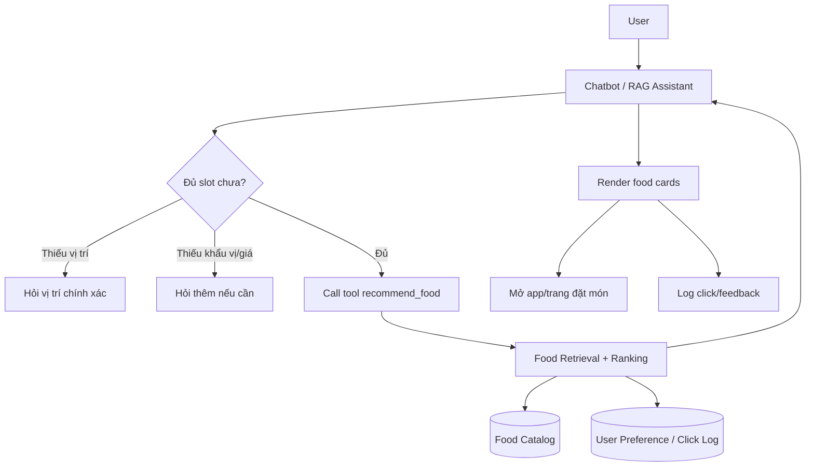
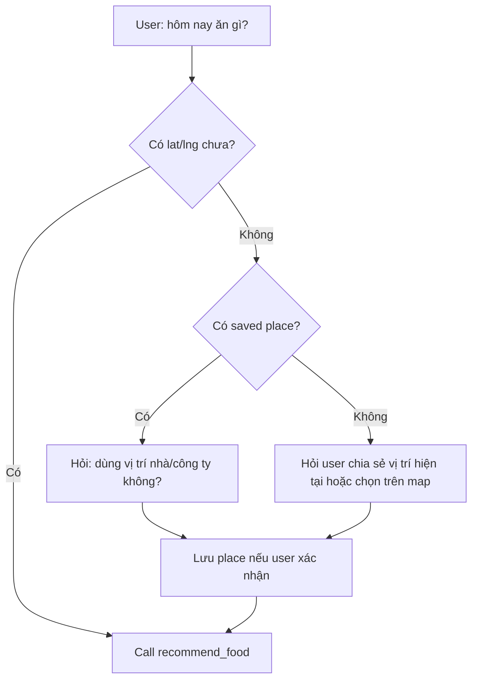
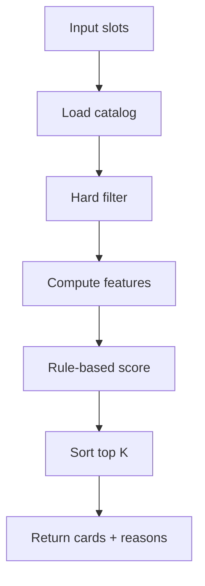
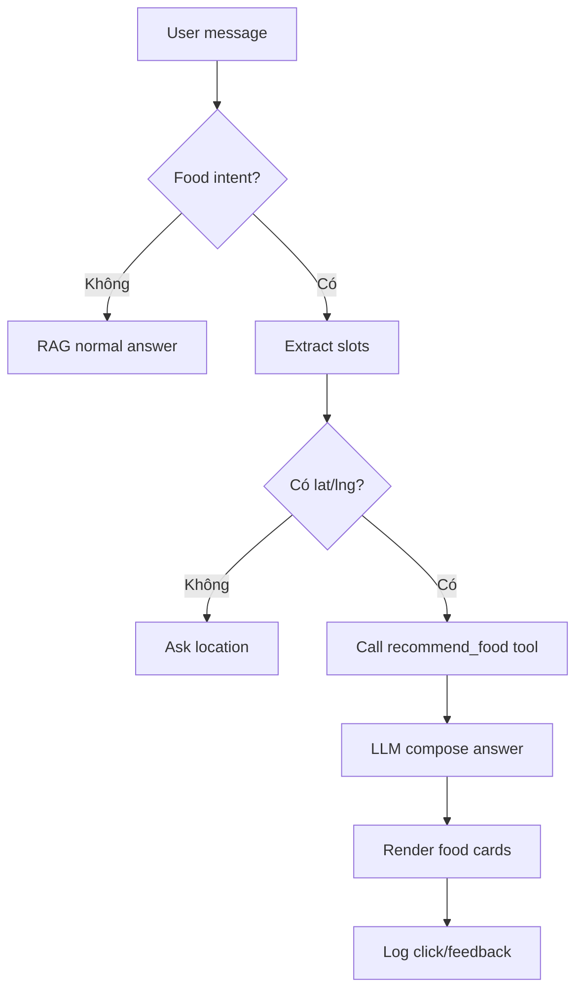
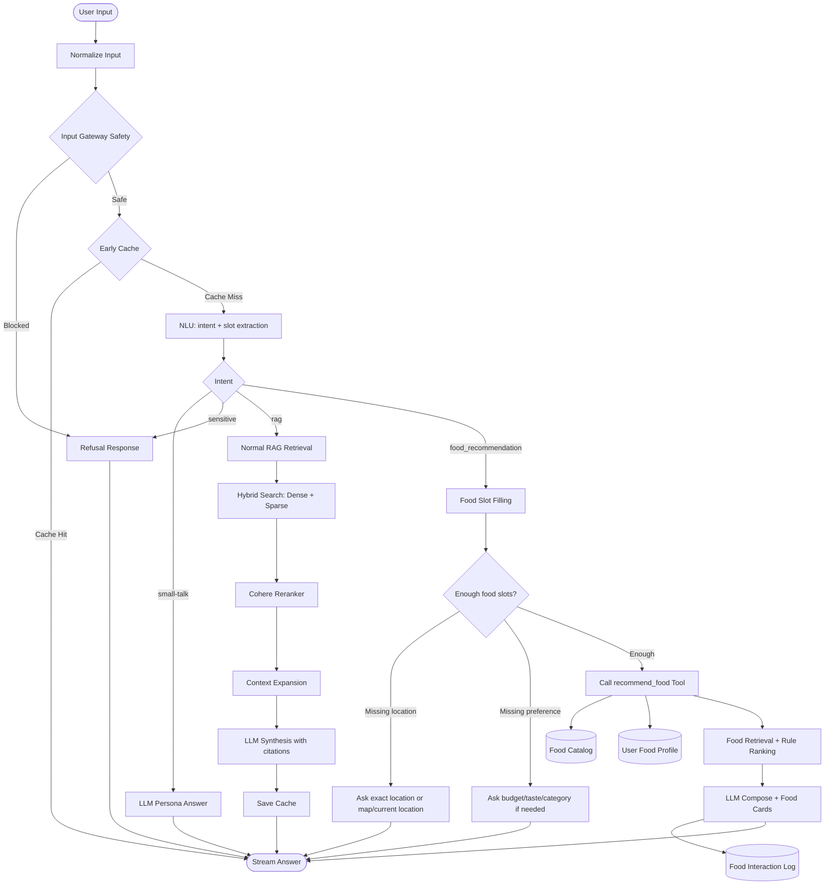
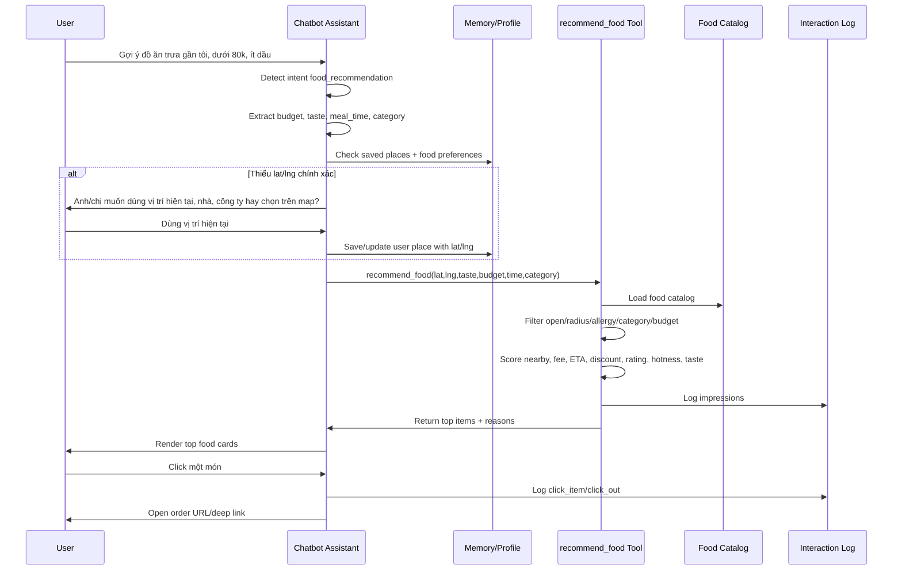
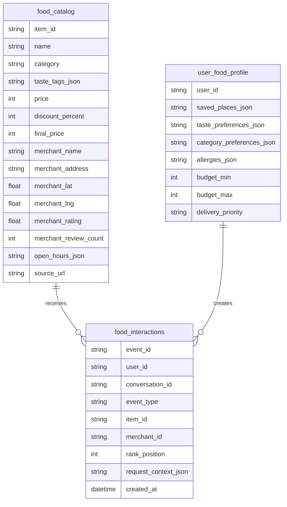
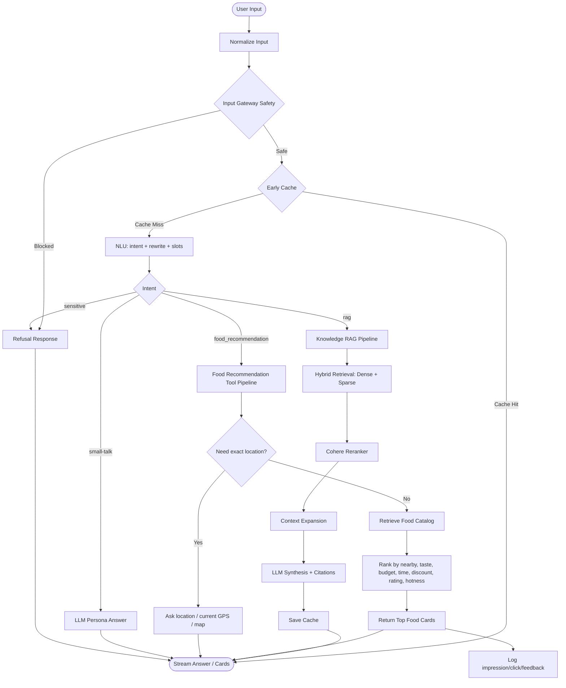

# Food Recommendation Tool Plan

Tài liệu này là kế hoạch mới cho tính năng gợi ý món ăn trong Xanh SM Chatbot. Ta coi như **chưa triển khai code recommend trước đó**; phần code service recommend cũ có thể revert. Hướng mới là: chatbot/RAG hoạt động như một AI Assistant và **call tool** để lấy danh sách món phù hợp.

## 1. Quyết Định Mới

Không xây một recommendation platform riêng ngay từ đầu.

Thay vào đó:

```text
User chat
  -> Chatbot hiểu nhu cầu ăn uống
  -> Chatbot hỏi thêm nếu thiếu vị trí/giá/khẩu vị
  -> Chatbot gọi tool recommend_food(...)
  -> Tool tìm và rank món từ catalog
  -> Chatbot trả lời tự nhiên + render card
  -> User bấm card thì mở GreenSM/ShopeeFood/nguồn đặt món
  -> Hệ thống chỉ log click/feedback, không quản lý order
```

Lý do đổi hướng:

- Scope hiện tại chỉ là recommend, không đặt món.
- Chưa có order callback nên không biết user mua thật hay không.
- Xây service nhiều bảng quá sớm sẽ over-engineer.
- RAG/Assistant có tool hợp hơn: bot hỏi, hiểu context, gọi tool, giải thích kết quả.
- Sau này nếu tool lớn lên, vẫn có thể tách thành service riêng.

## 2. Ranh Giới Sản Phẩm

Chatbot làm:

- hiểu user muốn ăn gì;
- hỏi vị trí chính xác nếu thiếu;
- hỏi khẩu vị/ngân sách nếu cần;
- gọi tool recommend;
- giải thích vì sao gợi ý món;
- render card món ăn;
- log user đã xem/click/thích/bỏ qua.

Chatbot không làm:

- không đặt món;
- không quản lý giỏ hàng;
- không xử lý thanh toán;
- không xác nhận đơn;
- không biết chắc user có mua món hay không nếu không có callback từ app đặt món.

Tín hiệu học được ở MVP:

- user click món nào;
- user bỏ qua món nào;
- user thích/không thích gợi ý nào;
- user hay chọn loại món/tag/giá/vị trí nào.

Tín hiệu chưa có:

- user đã mua thật;
- user mua lại;
- giá trị đơn hàng;
- trạng thái giao hàng.

## 3. Kiến Trúc Tổng Quan



Tool không cần là service riêng ở MVP. Có thể là module nội bộ trong backend RAG:

```text
app/tools/food_recommendation/
  tool.py          interface recommend_food(...)
  catalog.py       load/search catalog
  ranker.py        rule-based rank
  profile.py       user preference helpers
  schemas.py       input/output schema
```

Khi lớn hơn, module này có thể tách ra:

```text
Chatbot -> HTTP -> Food Recommendation Service
```

Nhưng chưa cần làm ngay.

## 4. Tool Interface

Tool chính:

```python
recommend_food(
    lat: float,
    lng: float,
    category: str | None = None,
    taste_tags: list[str] | None = None,
    budget_min: int | None = None,
    budget_max: int | None = None,
    meal_time: str | None = None,
    max_distance_km: float = 4,
    user_id: str | None = None,
    limit: int = 5,
) -> list[FoodRecommendation]
```

Input ví dụ:

```json
{
  "lat": 21.0285,
  "lng": 105.8542,
  "category": "rice",
  "taste_tags": ["spicy", "less_oil"],
  "budget_max": 80000,
  "meal_time": "lunch",
  "max_distance_km": 4,
  "user_id": "user_123",
  "limit": 5
}
```

Output ví dụ:

```json
[
  {
    "item_id": "food_001",
    "name": "Cơm gà sốt cay",
    "merchant_name": "Bếp Việt Xanh",
    "address": "12 Nguyễn Hữu Huân, Hoàn Kiếm, Hà Nội",
    "lat": 21.0321,
    "lng": 105.8548,
    "distance_km": 1.1,
    "price": 62000,
    "discount_percent": 10,
    "final_price": 55800,
    "rating": 4.7,
    "review_count": 1200,
    "delivery_fee": 14000,
    "eta_minutes": 25,
    "image_url": "https://...",
    "order_url": "https://...",
    "score": 0.86,
    "reason": "Gần vị trí của bạn, hợp ngân sách, rating cao và đang giảm giá."
  }
]
```

## 5. Slot Filling Trong Chatbot

Slot bắt buộc:

- `lat`
- `lng`

Slot nên có:

- `category`: cơm, bún/phở, bánh mì, healthy, trà sữa, cà phê...
- `taste_tags`: cay, ít dầu, ngọt, mặn, thanh nhẹ, no lâu...
- `budget_max`: ngân sách tối đa;
- `meal_time`: sáng, trưa, tối, khuya;
- `max_distance_km`: bán kính giao.

Luồng hỏi vị trí:



Nguyên tắc vị trí:

- Không rank bằng chữ chung chung như "Hoàn Kiếm", "Bình Thạnh".
- Text location chỉ dùng để gợi ý/hỏi lại.
- Rank nghiêm túc phải có `lat/lng`.
- Nên lưu `accuracy_meters` nếu lấy từ browser/map.

## 6. Dữ Liệu Tối Thiểu

MVP chỉ cần 3 nhóm dữ liệu.

### 6.1. Food Catalog

Có thể lưu trong SQLite/Postgres hoặc JSON index ban đầu.

Một bản ghi nên đủ rộng để tránh quá nhiều bảng:

```text
food_catalog
  item_id
  name
  description
  category
  cuisine
  taste_tags_json
  diet_tags_json
  ingredient_tags_json
  price
  discount_percent
  final_price
  currency
  image_url
  merchant_id
  merchant_name
  merchant_rating
  merchant_review_count
  merchant_address
  merchant_lat
  merchant_lng
  merchant_open_hours_json
  avg_prep_minutes
  base_delivery_fee
  fee_per_km
  service_radius_km
  source
  source_url
  last_seen_at
```

Vì đây là catalog phục vụ retrieval/rank, một bảng rộng là chấp nhận được ở MVP.

### 6.2. User Food Profile

```text
user_food_profile
  user_id
  saved_places_json
  taste_preferences_json
  category_preferences_json
  allergies_json
  budget_min
  budget_max
  delivery_priority
  updated_at
```

Ví dụ `saved_places_json`:

```json
[
  {
    "label": "office",
    "address": "Hoàn Kiếm, Hà Nội",
    "lat": 21.0285,
    "lng": 105.8542,
    "accuracy_meters": 30
  }
]
```

### 6.3. Food Interaction Log

```text
food_interactions
  event_id
  user_id
  session_id
  conversation_id
  event_type
  item_id
  merchant_id
  rank_position
  query
  request_context_json
  created_at
```

Event type:

```text
impression
click_item
click_out
like
dismiss
dislike
```

Không có `order` ở MVP.

## 7. Retrieval Và Ranking MVP

Tool `recommend_food` làm 4 bước:



Hard filter:

- quán/món còn hoạt động;
- trong bán kính giao;
- đang mở theo `meal_time` hoặc thời gian hiện tại;
- không chứa allergy;
- nếu user chọn category thì ưu tiên/lọc category.

Feature score:

```text
nearby_score        khoảng cách càng gần càng tốt
delivery_fee_score  phí ship càng thấp càng tốt
eta_score           giao càng nhanh càng tốt
budget_score        hợp ngân sách
discount_score      giảm giá/final_price tốt
category_score      đúng loại món
taste_score         hợp khẩu vị
rating_score        rating/review tốt
popularity_score    click/rating/review cao
```

Score MVP:

```text
score =
  0.22 * nearby_score
+ 0.14 * delivery_fee_score
+ 0.12 * eta_score
+ 0.14 * budget_score
+ 0.10 * discount_score
+ 0.10 * category_score
+ 0.08 * taste_score
+ 0.06 * rating_score
+ 0.04 * popularity_score
```

Rule này đủ explainable, dễ debug, chưa cần ML.

## 8. Dữ Liệu Food Lấy Từ Đâu?

Nguồn demo/MVP:

- mock data tự tạo;
- scrape/crawl nguồn public ở mức nhỏ;
- data export thủ công;
- sau này nếu có nguồn hợp lệ từ GreenSM thì thay vào.

Về ShopeeFood:

- Có thể dùng làm nguồn tham khảo/demo nếu crawl giới hạn.
- Cần cẩn thận robots.txt, điều khoản sử dụng, CAPTCHA, rate limit.
- Không nên bypass login/CAPTCHA hoặc crawl dữ liệu cá nhân.
- Không nên phụ thuộc production vào scraping nếu chưa rõ quyền dữ liệu.

Data cần lấy:

```text
item name
description
category
price
discount
image
merchant name
merchant address
merchant lat/lng nếu có
rating
review_count
open hours nếu có
source_url
```

Nếu chỉ có địa chỉ text mà chưa có lat/lng, cần geocoding trước khi rank theo khoảng cách.

## 9. Tích Hợp Với RAG

RAG vẫn dùng cho tri thức Xanh SM bình thường.

Food intent đi nhánh tool:



LLM không được tự bịa món/giá/quán. LLM chỉ được:

- hỏi thêm thông tin;
- gọi tool;
- diễn giải kết quả tool trả về;
- sắp xếp câu trả lời tự nhiên.

## 10. Sơ Đồ Hệ Thống Sẽ Đổi So Với README

Trong `README.md`, luồng hiện tại là RAG hỏi-đáp tri thức:

```text
User Input
  -> Safety
  -> Cache
  -> NLU
  -> Intent
  -> RAG Retrieval
  -> Reranker
  -> LLM Synthesis
  -> Stream Answer
```

Khi hoàn thiện Food Recommendation Tool, kiến trúc không thay RAG lõi. Ta chỉ thêm một nhánh intent mới: `food_recommendation`. Nghĩa là chatbot trở thành Assistant có tool, không còn chỉ là RAG trả lời tài liệu.

### 10.1. Sơ Đồ Mới Ở Mức Tổng Quan



Điểm thay đổi quan trọng:

- `Intent` có thêm nhánh `food_recommendation`.
- Trước khi gọi tool, bot phải gom đủ slot: vị trí chính xác, ngân sách, khẩu vị, loại món, thời gian ăn.
- RAG retrieval vẫn dành cho tài liệu/chính sách Xanh SM.
- Food retrieval/ranking dùng catalog món ăn, không dùng chunk tài liệu chính sách.
- LLM không tự bịa món; LLM chỉ diễn giải kết quả từ tool.

### 10.2. Sơ Đồ Luồng Food Chi Tiết



### 10.3. Sơ Đồ Data Cho Food Tool

MVP chỉ cần 3 khối dữ liệu. Không cần nhiều bảng recommendation phức tạp.



### 10.4. Mermaid README Sau Khi Có Food Tool

Nếu sau này cập nhật `README.md`, sơ đồ RAG chính có thể đổi thành bản ngắn gọn này:



Như vậy README sau này sẽ thể hiện rõ hệ thống không chỉ là RAG hỏi-đáp, mà là:

```text
NLU Gateway RAG + Tool-Using Assistant
```

Trong đó Food Recommendation là một tool có retrieval/ranking riêng, nhận slot có cấu trúc và trả danh sách món có thể kiểm chứng.

## 11. UI Cần Có

Chat UI:

- card món có ảnh, tên món, quán, địa chỉ, giá, giảm giá, rating, phí ship, ETA;
- nút mở app/trang đặt món;
- nút thích/không hợp để học preference.

Location UX:

- nút dùng vị trí hiện tại;
- chọn nhà/công ty đã lưu;
- chọn trên map nếu cần chính xác.

Admin/dev UI:

- xem catalog;
- test tool bằng lat/lng;
- xem score breakdown;
- xem click log;
- xem món nào hay được click.

## 12. Milestones Mới

### Level 0: Chốt Hướng

- [x] Bỏ hướng recommendation platform nặng ở MVP.
- [x] Chuyển sang RAG/Assistant call tool.
- [x] Chốt không quản lý order/cart/payment.
- [x] Chốt chỉ log click/feedback.

### Level 1: Data MVP

- [ ] Thiết kế `food_catalog` dạng bảng rộng hoặc JSON index.
- [ ] Có món, quán, giá, ảnh, rating, địa chỉ.
- [ ] Có lat/lng cho merchant.
- [ ] Có tag khẩu vị/category.
- [ ] Có source/source_url.

### Level 2: Food Tool MVP

- [ ] Tạo `app/tools/food_recommendation/`.
- [ ] Viết schema input/output.
- [ ] Viết loader catalog.
- [ ] Viết filter theo vị trí/bán kính/category/budget.
- [ ] Viết rule ranker.
- [ ] Trả reason rõ ràng.

### Level 3: Chatbot Integration

- [ ] Detect food intent.
- [ ] Extract slot: vị trí, giá, khẩu vị, category, time.
- [ ] Hỏi lại nếu thiếu lat/lng.
- [ ] Call `recommend_food`.
- [ ] Render card.
- [ ] Không để LLM bịa món ngoài tool.

### Level 4: Interaction Logging

- [ ] Log impression.
- [ ] Log click item.
- [ ] Log click out.
- [ ] Log like/dismiss/dislike.
- [ ] Tạo dashboard/dev endpoint xem log.

### Level 5: Location UX

- [ ] Lưu nhà/công ty/current location.
- [ ] Cho user xác nhận vị trí.
- [ ] Cho chọn map/current location.
- [ ] Dùng lat/lng chính xác để rank.

### Level 6: Data Collection

- [ ] Script tạo mock catalog.
- [ ] Script import CSV/JSON.
- [ ] Nếu crawl ShopeeFood/public source: có rate limit, cache, source_url.
- [ ] Geocode địa chỉ thiếu lat/lng.

### Level 7: Personalization Nhẹ

- [ ] Từ click/like cập nhật tag preference.
- [ ] Từ dismiss giảm điểm tag/category tương ứng.
- [ ] Ưu tiên budget/quán/category user hay click.
- [ ] Vẫn dùng rule-based, chưa ML.

### Level 8: Content-Based

- [ ] Tạo text profile món/quán.
- [ ] Sinh embedding.
- [ ] Retrieval món tương tự theo embedding.
- [ ] Blend embedding score với rule score.

### Level 9: Collaborative Filtering

- [ ] Chỉ làm khi có nhiều click/event thật.
- [ ] Train từ interaction, không gọi là order model.
- [ ] Đánh giá Recall@K/NDCG@K.

### Level 10: Tách Service Nếu Cần

- [ ] Khi tool lớn, traffic cao, hoặc DB riêng cần scale.
- [ ] Tách thành Food Recommendation Service.
- [ ] Chatbot gọi qua HTTP.
- [ ] Lúc đó mới chuẩn hóa schema nhiều bảng hơn.

## 13. Kết Luận

Hướng đúng cho hiện tại:

```text
RAG Assistant + Food Recommendation Tool + catalog gọn + click log
```

Không nên bắt đầu bằng một hệ thống recommendation nhiều bảng/ML/service riêng. MVP cần chạy được, dễ debug, dữ liệu dễ thay, và bot phải biết hỏi vị trí chính xác trước khi gợi ý.

Khi có đủ dữ liệu thật và click thật, ta mới nâng dần:

```text
Rule-based tool
  -> personalized rule
  -> content-based embedding
  -> collaborative filtering
  -> hybrid ranking/service riêng
```
