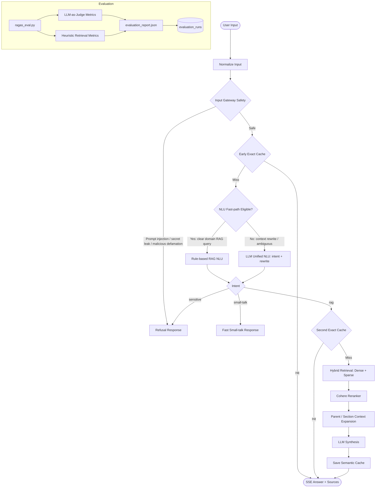

# Kiến trúc RAG Pipeline hiện tại

Tài liệu này mô tả pipeline đang chạy của Xanh SM RAG sau khi safety được đưa về tầng đầu vào, NLU có fast-path cho câu RAG rõ ràng, và benchmark có lịch sử so sánh theo từng lần eval.

## Sơ đồ tổng quan

## 1. Input Gateway Safety

Gateway chạy trước cache, NLU, retriever và LLM. Tầng này chặn sớm các câu hỏi có dấu hiệu prompt injection, yêu cầu lộ system prompt/API key/cấu hình nội bộ, hoặc yêu cầu bôi nhọ không có căn cứ.

Việc chặn ở đầu vào giúp answer path không phải quét lại câu trả lời hợp lệ. Đây là thay đổi quan trọng để tránh false-positive với các câu trả lời có thông số kỹ thuật như EC Van.

## 2. Early Exact Cache

Sau khi câu hỏi vượt qua gateway, hệ thống tìm exact match trong `SemanticCache` bằng câu hỏi thô đã normalize. Nếu hit, câu trả lời được trả về ngay qua SSE với latency rất thấp và không tốn token LLM.

## 3. Unified NLU Gateway

NLU hiện có hai đường:

- **Fast-path rule-based**: dùng cho câu hỏi RAG rõ ràng, có domain keyword mạnh như VinFast, Xanh SM, V-GREEN, tài xế, sạc, pin, giá, phí, ưu đãi, bảo hiểm, hoàn tiền, chính sách. Đường này không gọi OpenAI, giữ nguyên query làm `rewritten_query` và được làm giàu bằng `domain_vocabulary`.
- **Domain Vocabulary**: chạy regex/local dictionary để map câu viết tắt, sai chính tả, từ đời thường như `xsm/gsm`, `vgreen`, `dk/đk`, `platfom`, `sạc free`, `ăn chia`, `đền hàng` sang thuật ngữ tài liệu. Đây là lớp bảo hiểm tốc độ cao cho fast-path.
- **LLM Unified NLU**: dùng khi câu hỏi cần rewrite theo lịch sử hội thoại, có tham chiếu mơ hồ như “nó”, “cái này”, “vậy còn”, hoặc không đủ tín hiệu domain. Prompt `UNIFIED_NLU_PROMPT` gom intent classification và rewrite vào một lần gọi LLM. Model NLU tách bằng biến `NLU_MODEL`, mặc định hiện là `gpt-4o-mini`.
- **Xử Lý Ảnh (Multimodal Vision)**: Khi có hình ảnh đính kèm, fast-path bị vô hiệu hóa. NLU đóng vai trò thị giác máy tính đọc hiểu ảnh và chuyển đổi toàn bộ nội dung ảnh thành truy vấn chữ (`rewritten_query`). Hình ảnh bị hủy sau bước NLU để LLM Generator phía sau chỉ nhận Text, qua đó tiết kiệm tối đa Token và ngăn chặn lỗi Crash Data.
  *(Lưu ý: Tính năng Query Expansion đã được tắt bỏ hoàn toàn trên tất cả các luồng để tránh gánh nặng sinh token, giảm tải cho Qdrant/backend và hạ thấp latency của LLM).*

`max_tokens` NLU đang là `220`. Ảnh hưởng dự kiến thấp vì output NLU là JSON ngắn; đổi lại giúp giảm trần sinh token, chi phí và latency xấu nhất. Rủi ro chính là JSON bị cắt nếu prompt sinh quá dài, nhưng pipeline đã có fallback rule-based khi parse lỗi.

## 4. Second Exact Cache

Nếu NLU trả về intent `rag`, pipeline kiểm tra cache lần hai bằng `rewritten_query`. Lớp cache này bắt được các câu hỏi diễn đạt khác nhau nhưng cùng ý nghĩa.

## 5. Hybrid Retrieval

Retriever kết hợp:

- Dense vector với OpenAI embedding.
- Sparse/BM25 trong Qdrant.
- Qdrant Vector Search kết hợp semantic (dense vector) và keyword (sparse vector BM25) qua cơ chế RRF (Reciprocal Rank Fusion).
- Metadata/domain hints để ưu tiên đúng nhóm tài liệu.

Kết quả thô được hợp nhất và khử trùng trước khi đưa sang reranker.

## 6. Cohere Reranker

Pipeline dùng Cohere rerank để sắp xếp lại các chunk ứng viên theo mức độ liên quan trực tiếp với câu hỏi đã rewrite. Sau rerank, hệ thống giữ top chunk tốt nhất để tránh đưa quá nhiều context nhiễu vào LLM.

## 7. Parent / Section Context Expansion

Với chunk có điểm rerank đủ cao, pipeline mở rộng theo `parent_chunk_id` hoặc section liên quan để lấy trọn bảng biểu/điều khoản/chính sách. Với chunk điểm thấp hơn, pipeline giữ chunk gốc để tránh làm loãng context.

Trong bước này hệ thống cũng dedupe header và nội dung trùng lặp để giảm prompt size.

## 8. LLM Synthesis & SSE

LLM nhận context đã rerank/mở rộng, câu hỏi đã rewrite và lịch sử hội thoại gần nhất. Câu trả lời được stream về client qua SSE kèm sources/citations.

Safety chính nằm ở Input Gateway/NLU. Output guardrail không còn là node chặn chính trên đường sinh câu trả lời để tránh chặn nhầm nội dung hợp lệ.

## 9. Semantic Cache Saving

Sau khi sinh câu trả lời thành công, pipeline lưu cache cho cả câu hỏi gốc và câu hỏi đã rewrite. Những lần hỏi sau có thể hit ở Early Cache hoặc Second Cache.

## 10. Evaluation & History

`evaluation/ragas_eval.py` đọc `evaluation/golden_dataset.json`, chạy qua RAG pipeline và xuất `evaluation_report.json`.

Benchmark kết hợp:

- Retrieval metrics heuristic: Recall@5, Recall@10, MRR, NDCG@5.
- LLM-as-Judge: faithfulness, correctness, relevancy, và context recall khi có OpenAI API key.
- Latency trung bình và latency từng case.

Mỗi lần eval ghi thêm snapshot vào bảng `evaluation_runs`, gồm metrics tổng, details JSON, model, dataset, total cases và thời điểm chạy. Admin UI đọc `/api/admin/eval/runs` để hiển thị recent runs, trend và delta so với lần trước.

## Các nguồn latency chính

Latency cao thường đến từ bốn điểm:

- NLU Gateway: trước đây luôn gọi LLM nên có thể tốn 1-5 giây. Fast-path mới bỏ qua LLM NLU cho câu RAG rõ ràng.
- Embedding + hybrid retrieval: phụ thuộc Qdrant và kích thước tập ứng viên.
- Cohere rerank: là API call riêng, thường tốn thêm hàng trăm ms đến vài giây nếu network chậm.
- LLM synthesis: phụ thuộc độ dài context sau expansion và độ dài câu trả lời; đây thường là phần lớn nhất nếu context/document dài.

Cache hit là cách giảm latency mạnh nhất vì bỏ qua NLU, retrieval, rerank và generation.
