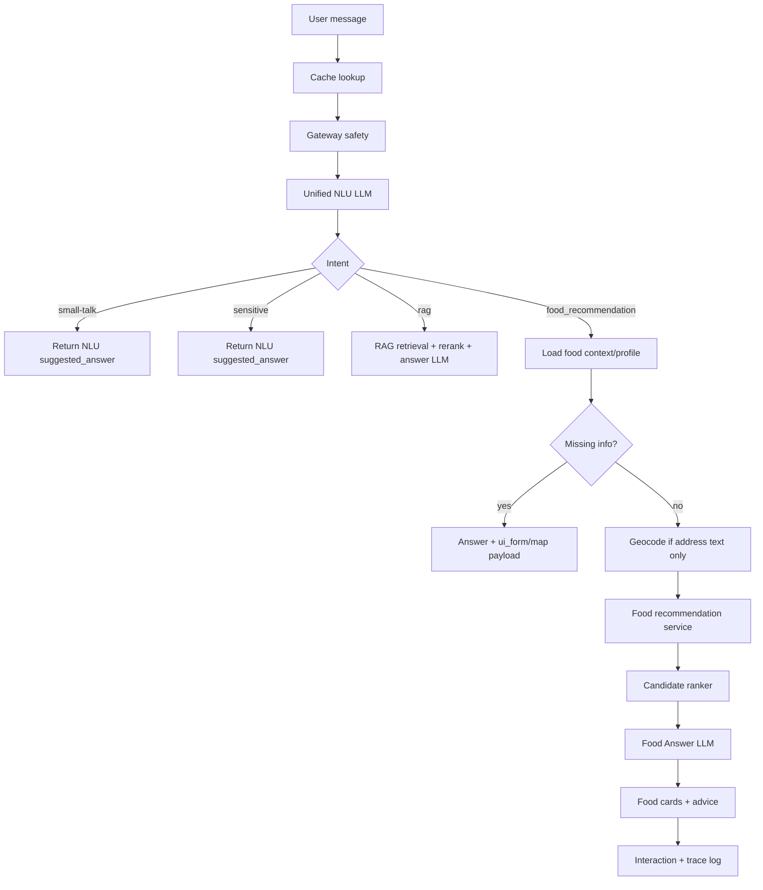

# Kiến trúc RAG Pipeline hiện tại

Tài liệu này mô tả pipeline đang chạy của Xanh SM RAG sau khi được nâng cấp lên Phase 9 với Unified NLU Orchestrator và ML-Ready Food Recommendation, và benchmark có lịch sử so sánh theo từng lần eval.

## Sơ đồ tổng quan

## 1. Input Gateway Safety

Gateway chạy trước cache, NLU, retriever và LLM. Tầng này chặn sớm các câu hỏi có dấu hiệu prompt injection, yêu cầu lộ system prompt/API key/cấu hình nội bộ, hoặc yêu cầu bôi nhọ không có căn cứ.

Việc chặn ở đầu vào giúp answer path không phải quét lại câu trả lời hợp lệ. Đây là thay đổi quan trọng để tránh false-positive với các câu trả lời có thông số kỹ thuật như EC Van.

## 2. Early Exact Cache

Sau khi câu hỏi vượt qua gateway, hệ thống tìm exact match trong `SemanticCache` bằng câu hỏi thô đã normalize. Nếu hit, câu trả lời được trả về ngay qua SSE với latency rất thấp và không tốn token LLM.

## 3. Unified NLU Orchestrator

Hệ thống hiện sử dụng một mô hình ngôn ngữ trung tâm (Unified LLM NLU) để điều phối toàn bộ các tác vụ. Mô hình này nhận câu hỏi, lịch sử hội thoại và tự động phân loại `intent`:
- **rag**: Hỏi đáp thông tin chính sách, tiếp tục luồng RAG retrieval + rerank + answer LLM.
- **food_recommendation**: Gợi ý món ăn, rẽ nhánh sang luồng Geocode & ML Ranking.
- **small-talk**: Giao tiếp xã giao, sử dụng suggested_answer từ NLU.
- **sensitive**: Nhận diện câu hỏi nhạy cảm và sử dụng luôn suggested_answer từ NLU để phản hồi, không chặn cụt lủn.

## 4. Second Exact Cache

Nếu NLU trả về intent `rag`, pipeline kiểm tra cache lần hai bằng `rewritten_query`. Lớp cache này bắt được các câu hỏi diễn đạt khác nhau nhưng cùng ý nghĩa.

## 5. Hybrid Retrieval

Retriever kết hợp:

- Dense vector với OpenAI embedding.
- Sparse/BM25 trong Qdrant.
- Qdrant Vector Search kết hợp semantic (dense vector) và keyword (sparse vector BM25) qua cơ chế RRF (Reciprocal Rank Fusion).
- Metadata/domain hints để ưu tiên đúng nhóm tài liệu.

Kết quả thô được hợp nhất và khử trùng trước khi đưa sang reranker.

## 6. Cohere Reranker

Pipeline dùng Cohere rerank để sắp xếp lại các chunk ứng viên theo mức độ liên quan trực tiếp với câu hỏi đã rewrite. Sau rerank, hệ thống giữ top chunk tốt nhất để tránh đưa quá nhiều context nhiễu vào LLM.

## 7. Parent / Section Context Expansion

Với chunk có điểm rerank đủ cao, pipeline mở rộng theo `parent_chunk_id` hoặc section liên quan để lấy trọn bảng biểu/điều khoản/chính sách. Với chunk điểm thấp hơn, pipeline giữ chunk gốc để tránh làm loãng context.

Trong bước này hệ thống cũng dedupe header và nội dung trùng lặp để giảm prompt size.

## 8. LLM Synthesis & SSE

LLM nhận context đã rerank/mở rộng, câu hỏi đã rewrite và lịch sử hội thoại gần nhất. Câu trả lời được stream về client qua SSE kèm sources/citations.

Safety chính nằm ở Input Gateway/NLU. Output guardrail không còn là node chặn chính trên đường sinh câu trả lời để tránh chặn nhầm nội dung hợp lệ.

## 9. Semantic Cache Saving

Sau khi sinh câu trả lời thành công, pipeline lưu cache cho cả câu hỏi gốc và câu hỏi đã rewrite. Những lần hỏi sau có thể hit ở Early Cache hoặc Second Cache.

## 10. Evaluation & History

`evaluation/ragas_eval.py` đọc `evaluation/golden_dataset.json`, chạy qua RAG pipeline và xuất `evaluation_report.json`.

Benchmark kết hợp:

- Retrieval metrics heuristic: Recall@5, Recall@10, MRR, NDCG@5.
- LLM-as-Judge: faithfulness, correctness, relevancy, và context recall khi có OpenAI API key.
- Latency trung bình và latency từng case.

Mỗi lần eval ghi thêm snapshot vào bảng `evaluation_runs`, gồm metrics tổng, details JSON, model, dataset, total cases và thời điểm chạy. Admin UI đọc `/api/admin/eval/runs` để hiển thị recent runs, trend và delta so với lần trước.

## Các nguồn latency chính

Latency cao thường đến từ bốn điểm:

- NLU Orchestrator: Gọi Unified NLU LLM để phân loại intent. Tốn khoảng 1-2 giây nhưng độ chính xác rất cao.
- Embedding + hybrid retrieval: phụ thuộc Qdrant và kích thước tập ứng viên.
- Cohere rerank: là API call riêng, thường tốn thêm hàng trăm ms đến vài giây nếu network chậm.
- LLM synthesis: phụ thuộc độ dài context sau expansion và độ dài câu trả lời; đây thường là phần lớn nhất nếu context/document dài.

Cache hit là cách giảm latency mạnh nhất vì bỏ qua NLU, retrieval, rerank và generation.
