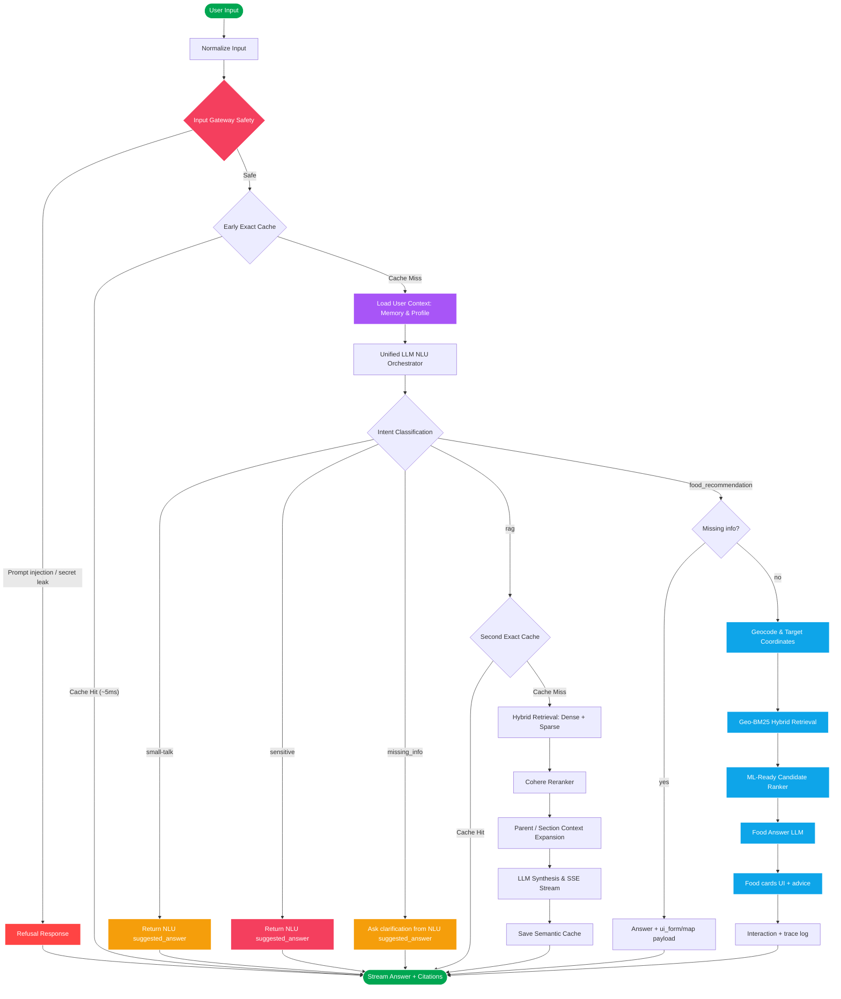

# 🚀 Kiến trúc Luồng Chi Tiết & Quy Trình Xử Lý (Pipeline Nodes)

Tài liệu này cung cấp chi tiết kỹ thuật chuyên sâu về các Node xử lý trong hệ thống **Xanh SM Enterprise Production RAG & Food Recommendation (Phase 9)**.

---

## 📊 Sơ Đồ Mermaid Tổng Quan

---

## ⚙️ Chi Tiết Quy Trình Hoạt Động Của Các Node

Hệ thống được cấu trúc thành một chuỗi tuần tự gồm các Node xử lý độc lập từ đầu vào đến đầu ra, tự động rẽ nhánh giữa RAG và Food Recommendation, kết hợp nhiều kỹ thuật nâng cao để tối ưu hóa độ trễ, tài nguyên và độ chính xác:

### 1. NODE 1: API Gateway & Input Guardrail (Kiểm duyệt đầu vào)
* **Công nghệ áp dụng**: Thư viện biểu thức chính quy (`re` Python) kết hợp bộ quy tắc phân loại cục bộ.
* **Logic xử lý**: Kiểm tra heuristic siêu tốc trên câu hỏi gốc của người dùng nhằm phát hiện sớm các tấn công Prompt Injection (tấn công thao túng chỉ thị), System Prompt Leakage (nỗ lực rò rỉ prompt hệ thống) và các từ khóa thô tục, nhạy cảm.
* **Thông số kỹ thuật**: Độ trễ **< 1ms**. Nếu phát hiện vi phạm, hệ thống lập tức chặn và trả về thông điệp từ chối mà không cần chuyển tới các Node xử lý LLM/VectorDB, tiết kiệm 100% tài nguyên tính toán.

### 2. NODE 2: Early Cache Lookup (Kiểm tra Cache sớm)
* **Công nghệ áp dụng**: Hệ quản trị cơ sở dữ liệu (PostgreSQL / SQLite) qua SQLAlchemy ORM.
* **Logic xử lý**: Thực hiện đối sánh chuỗi chính xác (Exact Match) giữa câu hỏi thô của người dùng với cơ sở dữ liệu `SemanticCache`.
* **Thông số kỹ thuật**: Độ trễ **~5-10ms**. Nếu xảy ra Cache Hit (đã có câu trả lời hợp lệ và còn hiệu lực TTL), hệ thống trả kết quả ngay lập tức về client, bỏ qua toàn bộ các bước RAG sau đó.

### 3. NODE 3: Unified NLU Orchestrator (Bộ não điều phối)
* **Công nghệ áp dụng**: Mô hình LLM phân loại intent thông qua function calling / structured JSON output (Llama 3.3 70B hoặc GPT-4o-mini).
* **Logic xử lý**: Nhận câu hỏi thô, Working Memory và lịch sử trò chuyện để phân loại vào 1 trong 5 Intent chính:
  * `small-talk`: Chào hỏi đời thường, lấy luôn `suggested_answer` để trả về cho người dùng nhanh chóng.
  * `sensitive`: Phát hiện câu hỏi vi phạm nhạy cảm, sinh `suggested_answer` lịch sự từ chối thay vì chặn ngang.
  * `missing_info`: Câu hỏi quá thiếu thông tin hoặc câu nối tiếp không thể resolve chắc chắn từ lịch sử; NLU sinh `suggested_answer` để hỏi lại đúng phần còn thiếu, không gọi RAG/Food.
  * `rag`: Rẽ nhánh vào luồng tìm kiếm RAG chính sách/tài liệu Qdrant.
  * `food_recommendation`: Bóc tách slot (budget, time, address, dish) và rẽ nhánh vào luồng gợi ý món ăn.
* **Ghi chú NLU follow-up**: Các câu ngắn như `cái đầu`, `mục đó`, `chi tiết hơn`, `so sánh 2 cái`, hoặc lựa chọn bằng số/tên rút gọn sẽ được resolve bằng Working Memory trước. Nếu chưa đủ chắc chắn, hệ thống trả `missing_info` để hỏi rõ thay vì đoán bừa hoặc rơi nhầm vào `sensitive`.
* Hệ thống không sử dụng fast-path rule-based cứng nhắc. Mọi truy vấn đều qua mô hình NLU này để đảm bảo độ chuẩn xác cao.
* Không yêu cầu khóa API Google Maps cho Geocode: Hệ thống sử dụng OpenStreetMap Nominatim/Photon miễn phí.

---

### 📚 A. Nhánh RAG (Truy xuất tài liệu chính sách)
Nếu tại **NODE 3**, hệ thống phân loại intent là `rag`, truy vấn sẽ tiếp tục đi vào luồng xử lý truy xuất tài liệu:

#### 4. NODE 4: Second Cache Lookup (Kiểm tra Cache lần 2)
* **Công nghệ áp dụng**: PostgreSQL / SQLite SQL Query.
* **Logic xử lý**: Thực hiện đối sánh Cache lần 2 dựa trên câu hỏi đã được chuẩn hóa ở Node 3. Điều này giúp nâng cao đáng kể tỷ lệ trúng cache trong trường hợp câu hỏi thô của người dùng dài dòng hoặc viết sai chính tả nhưng có cùng bản chất ngữ nghĩa với câu hỏi đã lưu.
* **Thông số kỹ thuật**: Độ trễ **~5-10ms**.

#### 5. NODE 5: Hybrid Search (Dense + Sparse + Metadata Boost)
* **Công nghệ áp dụng**: Qdrant Vector Database (`qdrant-client`) kết hợp Dense Vectors (mô hình `text-embedding-3-small` của OpenAI, 1536 chiều), Sparse Vectors (BM25/FastEmbed), và SQL fallback trên bảng `document_chunks`.
* **Logic xử lý**: Chuyển đổi câu hỏi chuẩn hóa thành Dense/Sparse vectors (Query Expansion đã được tắt bỏ hoàn toàn để tránh quá tải hệ thống và giảm độ trễ). Qdrant dùng **RRF (Reciprocal Rank Fusion)** để hợp nhất kết quả. Domain metadata hints sẽ boost tài liệu theo `category`, `document_type`, `service` và ưu tiên `data/overview/service_catalog.md` cho câu hỏi tổng quát.
* **Thông số kỹ thuật**: Kích thước Dense Vector `dimensions = 1536`. Lấy ra **Top 25 tài liệu thô** (`limit = 25`) trước khi rerank.

#### 6. NODE 6: Cohere Reranker (Tái xếp hạng ngữ nghĩa chuyên sâu)
* **Công nghệ áp dụng**: API Cohere Rerank (thư viện client `cohere`) với mô hình `rerank-multilingual-v3.0`.
* **Logic xử lý**: Đưa cặp câu hỏi chuẩn hóa và nội dung của 25 tài liệu thô vào API Cohere Rerank để tính toán điểm số tương thích ngữ nghĩa trực tiếp. Cohere Rerank sử dụng cơ chế Cross-Attention tự động tối ưu hóa cho tài liệu đa ngôn ngữ (đặc biệt là tiếng Việt), khắc phục hoàn toàn điểm yếu mất ngữ cảnh của Embedding Bi-Encoder thông thường.
* **Thông số kỹ thuật**: Lọc lấy **Top 10 tài liệu tinh** khắt khe nhất (`top_n = 10`). Ngưỡng điểm relevance tối thiểu để kích hoạt mở rộng parent-child thích ứng là `relevance_score >= 0.7`.

#### 7. NODE 7: Adaptive Parent-Child Section Expansion (Mở rộng ngữ cảnh thích ứng)
* **Công nghệ áp dụng**: Bộ lọc truy vấn metadata Qdrant & PostgreSQL.
* **Logic xử lý**: 
  * Với các chunk tinh có `relevance_score >= 0.7`, hệ thống truy quét VectorDB dựa trên `parent_chunk_id` để lấy thêm toàn bộ các chunk con khác thuộc cùng một chương/mục/bảng biểu lớn (tối đa 10 chunks). Kỹ thuật này giúp tái cấu trúc trọn vẹn ngữ cảnh gốc (như bảng biểu đầy đủ hoặc điều khoản luật nguyên vẹn) để LLM đọc hiểu.
  * Với các chunk có điểm `< 0.7`, giữ nguyên nội dung chunk gốc để tránh làm loãng prompt.
  * *Deduplication (Khử trùng lặp)*: Tự động loại bỏ tiêu đề trùng lặp ở đầu các chunk con thứ cấp (index > 0) và loại bỏ các chunk bị lồng nhau để tối ưu hóa kích thước context.
* **Thông số kỹ thuật**: Ngưỡng điểm thích ứng `0.7`. Số lượng chunk con tối đa `max_parent_chunks = 10`.

#### 8. NODE 8: LLM Synthesis & Stream (Tổng hợp phản hồi dạng Stream)
* **Công nghệ áp dụng**: OpenAI API `chat/completions` với mô hình `gpt-4o-mini`.
* **Logic xử lý**: Nhận prompt chứa toàn bộ ngữ cảnh đã qua giải nén parent-child, câu hỏi chuẩn hóa và lịch sử hội thoại gần nhất. LLM tổng hợp câu trả lời khách quan, trung thực dựa trên tài liệu được cung cấp và truyền dữ liệu từng chữ về client qua giao thức **Server-Sent Events (SSE)** kèm Metadata nguồn trích dẫn (`sources`).
* **Thông số kỹ thuật**: Nhiệt độ `temperature = 0.2` (giảm thiểu tối đa ảo tưởng thông tin), `max_tokens = 2048`. Chỉ số độ trễ xử lý của máy chủ (`TTFT - Time To First Token`) được chốt ngay khi nhận ký tự đầu tiên từ OpenAI để phản ánh trung thực hiệu năng máy chủ.

#### 9. NODE 9: Semantic Cache Saving & Output (Lưu cache và trả kết quả)
* **Công nghệ áp dụng**: PostgreSQL / SQLite Cache Storage.
* **Logic xử lý**: Sau khi sinh câu trả lời, hệ thống lưu câu trả lời hợp lệ vào `SemanticCache` cho cả hai khóa: câu hỏi thô ban đầu (Node 2) và câu hỏi đã được chuẩn hóa (Node 4) nhằm tối đa hóa cơ hội Cache Hit cho các lượt truy vấn tương lai.

---

### 🍔 B. Nhánh Food Recommendation (Gợi Ý Món Ăn)
Nếu tại **NODE 3**, hệ thống phân loại intent là `food_recommendation`, truy vấn sẽ không đi vào luồng RAG truyền thống mà sẽ rẽ nhánh sang luồng sau:

#### 10. NODE 4F: Geocode & Target Coordinates
* **Logic xử lý**: Nếu người dùng cung cấp địa chỉ (VD: "ngõ 67 phùng khoang"), hệ thống gọi API Geocode (OpenStreetMap Nominatim/Photon) để chuyển đổi địa chỉ thành tọa độ `(lat, lng)`. Nếu NLU không bóc tách được vị trí và người dùng chưa cấp quyền GPS, backend trả về Payload UI Form để Frontend hiển thị bản đồ bắt người dùng ghim vị trí.

#### 11. NODE 5F: Candidate Retrieval (Geo-BM25 Hybrid)
* **Logic xử lý**: Lọc thô ứng viên (Candidate Generation) từ kho dữ liệu nhà hàng. Sử dụng kỹ thuật `Geo-Filtering` (chỉ lấy nhà hàng trong bán kính cho phép) kết hợp `BM25 Sparse Vector` (tìm theo tên món, category do NLU bóc tách).

#### 12. NODE 6F: ML-Ready Candidate Ranker (Trí tuệ nhân tạo xếp hạng)
* **Logic xử lý**: Chấm điểm và xếp hạng lại danh sách ứng viên thông qua module `XGBoostFoodRanker`, `CohereCrossEncoder` và bộ lọc hành vi khám phá `BanditExplorer`. Xếp hạng được tổng hợp dựa trên: Khoảng cách địa lý, Thời gian giao dự kiến (ETA), Điểm đánh giá (Rating/Review Count), Độ khớp giá cả, và Điểm tương đồng ngữ nghĩa.
* **Sẵn sàng cho MLOps**: Kiến trúc tách bạch rõ ràng giữa Retrieval và Ranking, tạo bản lề để huấn luyện các mô hình cá nhân hóa (Personalization) dựa trên hành vi người dùng sau này.

#### 13. NODE 7F: Food Answer LLM (Chuyên gia Ẩm thực)
* **Logic xử lý**: Nhận danh sách các món ăn đã được Ranker chấm điểm cao nhất. Mô hình ngôn ngữ (GPT-4o-mini) sẽ đóng vai trò như một chuyên gia ẩm thực, đọc thông số (giá, khoảng cách, review) để sinh ra một lời khuyên tư vấn mượt mà, cá nhân hóa.

#### 14. NODE 8F: Trace Logging & Analytics (Lưu vết đánh giá)
* **Logic xử lý**: Lưu vết toàn bộ dữ liệu suy luận (lý do chọn món, các điểm số thành phần của Ranker, tọa độ) vào bảng `food_recommendation_traces`. Dữ liệu này được hiển thị trực quan trên Admin Dashboard, giúp các Kỹ sư AI theo dõi và tinh chỉnh trọng số thuật toán dễ dàng.

---

## 💎 Giải Thích Các Node Đặc Thù Trong Mermaid

* **Domain Vocabulary**: Lớp ánh xạ từ vựng cục bộ được chạy ngay sau khi NLU hoàn tất nhằm chuẩn hóa các từ viết sai chính tả hoặc từ địa phương của người dùng (VD: `đền hàng` -> `bồi thường`, `ăn chia` -> `chiết khấu/doanh thu`). Nhờ đó tăng tỷ lệ trúng từ khóa khi tìm kiếm.
* **Hybrid Search (Dense + Sparse)**: Cơ chế tìm kiếm lai kết hợp thế mạnh của Dense Embedding (hiểu ngữ nghĩa sâu) và BM25 Sparse Vector (khớp từ khóa chính xác tuyệt đối như mã hiệu, số hiệu xe, v.v.).

---

## 🛠️ Kỹ Thuật Phân Đoạn Tài Liệu Nâng Cao (Table & Heading-Aware Chunking)

Hệ thống tích hợp một ingestion pipeline chuyên sâu với bộ phân đoạn tài liệu thông minh nhằm đảm bảo tính toàn vẹn ngữ nghĩa của cấu trúc tài liệu pháp lý và bảng biểu:

### A. Phân Đoạn Nhận Biết Tiêu Đề (Heading-Aware Splitting)
* **Logic hoạt động**: Sử dụng bộ thư viện `MarkdownHeaderTextSplitter` để bóc tách tài liệu theo phân cấp cấu trúc tiêu đề Markdown từ `#` đến `####`. Đường dẫn mục lục được ghi nhận thẳng vào metadata `"section"` (ví dụ: `Dịch vụ di chuyển > Xanh SM Taxi > Biểu phí Hà Nội`).
* **Đặc tính chống mất ngữ cảnh**: Đối với các chunk con thứ cấp (index > 0) thuộc cùng một chương/mục lớn, hệ thống tự động nhúng thêm tiêu đề ở đầu văn bản dưới dạng `### {meta['section']}`. Điều này giúp mô hình Embedding ghi nhận đầy đủ ngữ cảnh của chủ đề mục lớn, tránh tình trạng chunk con bị cắt vụn rời rạc và mất thông tin nguồn gốc.

### B. Phân Đoạn Đệ Quy Mềm (Recursive Character Splitting)
* **Thông số kỹ thuật**: Sau khi chia nhỏ theo tiêu đề, hệ thống áp dụng `RecursiveCharacterTextSplitter` với kích thước `chunk_size = 400` ký tự và độ chồng lấn `chunk_overlap = 50` ký tự.
* **Logic xử lý**: Các ký tự phân tách được chọn ưu tiên theo thứ tự `["\n\n", "\n", ". ", " ", ""]`. Thuật toán đảm bảo văn bản được ngắt ở ranh giới đoạn văn hoặc dấu chấm câu phù hợp, không bị cắt đôi một câu hoặc một từ dở dang.

### C. Bảo Toàn Cấu Trúc Bảng Biểu (Table-Aware Parsing)
Hệ thống tích hợp bộ phát hiện và xử lý bảng biểu Markdown thông minh (Table-Aware Splitter) để đối phó với các bảng giá cước phức tạp của Xanh SM:
1. **Cô lập cấu trúc bảng (Table Isolation)**: Tự động tách biệt các khối bảng biểu Markdown. Đối với các bảng biểu vừa và nhỏ (dưới 1500 ký tự), hệ thống cô lập bảng đó thành một chunk độc lập hoàn chỉnh, tuyệt đối không cắt nhỏ, tránh việc trộn lẫn với văn bản mô tả xung quanh.
2. **Nhân bản tiêu đề dòng/cột (Header Replication)**: Đối với các bảng lớn (vượt quá 1500 ký tự), thuật toán tiến hành cắt bảng theo từng dòng nhưng **luôn tự động nhân bản hai dòng tiêu đề đầu tiên** (column headers) vào đầu mỗi chunk con thứ cấp. Nhờ đó, mô hình VectorDB tìm kiếm đúng bản ghi theo từng cột và LLM đọc hiểu chính xác giá trị tương ứng của từng dòng trong bảng biểu lớn.

### D. Khóa Định Danh Không Xung Đột (Collision-Free Unique UUID)
* **Logic xử lý**: Mỗi chunk được định danh bằng một chuỗi ASCII MD5 hash sạch (`chunk_id`) sinh ra từ metadata tọa độ: `hash(filename + section + chunk_index)`.
* **Mục đích**: Loại bỏ hoàn toàn nguy cơ lỗi/crash của PostgreSQL và Qdrant khi xử lý các ký tự Unicode tiếng Việt phức tạp trong tên file hoặc mục lục tiêu đề của tài liệu.

### E. Trình Đọc Tài Liệu Đồng Bộ (Unified Document Loader)
* **Công nghệ**: Sử dụng `pymupdf4llm` thay thế cho thư viện `pypdf` truyền thống để bóc tách các file PDF. Thư viện này hỗ trợ bóc tách PDF trực tiếp thành định dạng Markdown, giữ nguyên cấu trúc tiêu đề và các bảng số liệu phức tạp trước khi chuyển qua bộ cắt chunk.

### F. Table-First Retrieval Chunking
Chiến thuật chunking mới được tối ưu cho truy hồi, không chỉ cho ingestion:
* **HTML table giữ nguyên bản đầy đủ**: Mỗi bảng HTML được lưu thành một chunk `html_table_full` riêng để bảo toàn `rowspan`, `colspan` và toàn bộ cấu trúc gốc.
* **Sinh thêm chunk chỉ mục theo dòng**: Cùng một bảng HTML còn tạo thêm các chunk `table_row_index` gộp 1-3 dòng dữ liệu mỗi chunk để tăng recall khi người dùng hỏi chi tiết theo cột hoặc theo giá trị rời rạc.
* **Metadata bắt buộc cho bảng**: Mỗi chunk bảng mang các trường `chunk_type`, `table_id`, `table_title`, `row_start`, `row_end`, `derived_from`, `chunk_id`, `parent_chunk_id`.
* **Chunk ID ổn định**: `chunk_id` được tạo từ metadata ổn định + hash nội dung, tránh collision và giúp Qdrant/Postgres không bị lỗi khi tái ingest.
* **Retrieval-first expansion**: Khi reranker trả về chunk `table_row_index`, pipeline sẽ tự động truy ngược `derived_from` để lấy lại chunk `html_table_full` tương ứng. Nhờ vậy context trả cho LLM vẫn là bảng đầy đủ, nhưng retrieval ban đầu vẫn bám được các giá trị nhỏ trong bảng.
* **Qdrant payload indexes**: Hệ thống đã index sẵn các trường `metadata.chunk_type`, `metadata.table_id`, `metadata.derived_from`, `metadata.row_start`, `metadata.row_end`, `metadata.chunk_index` để truy vấn và mở rộng context nhanh hơn.
