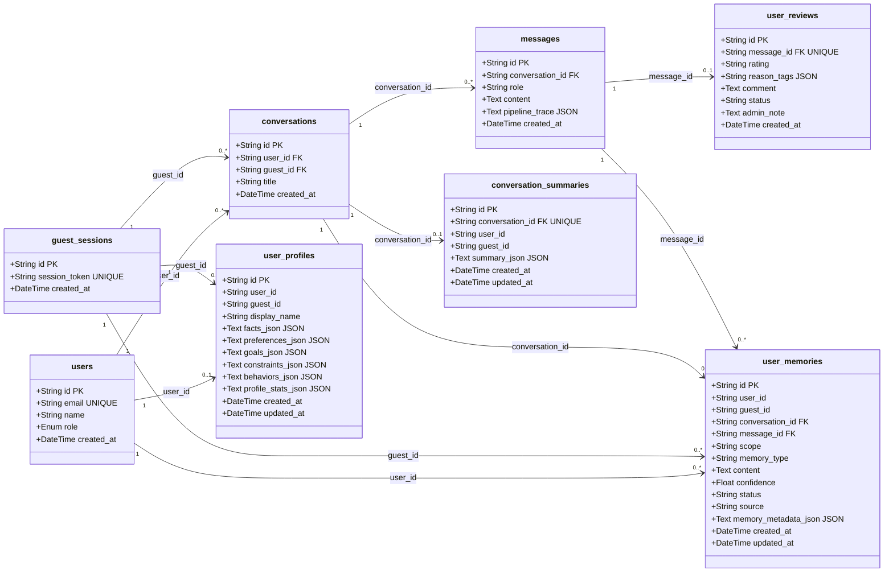
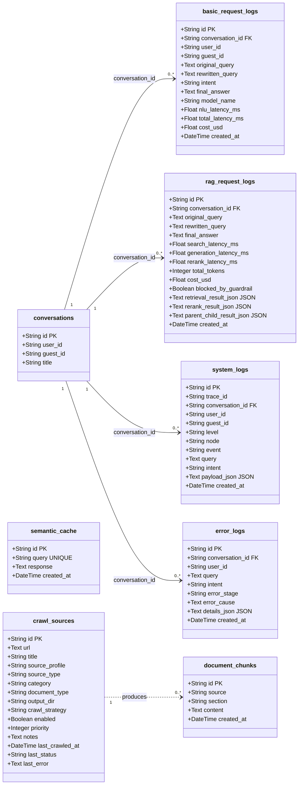
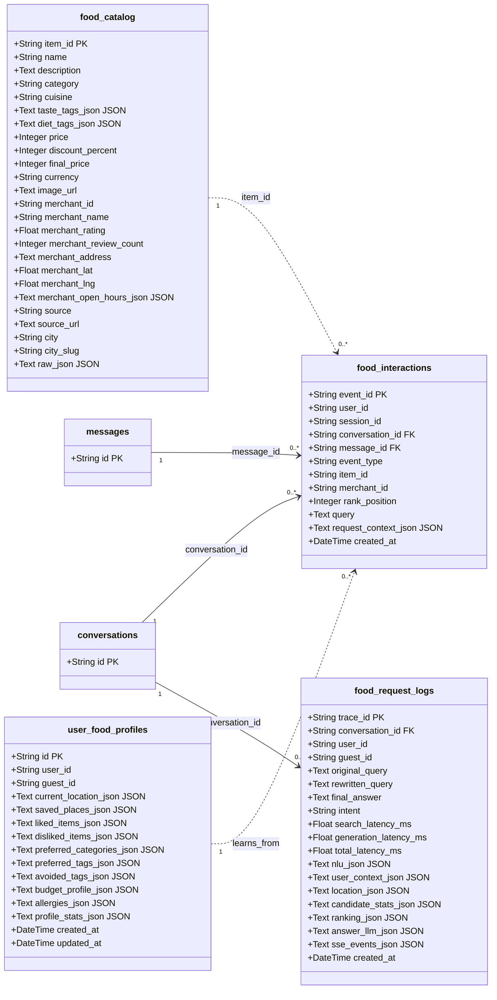
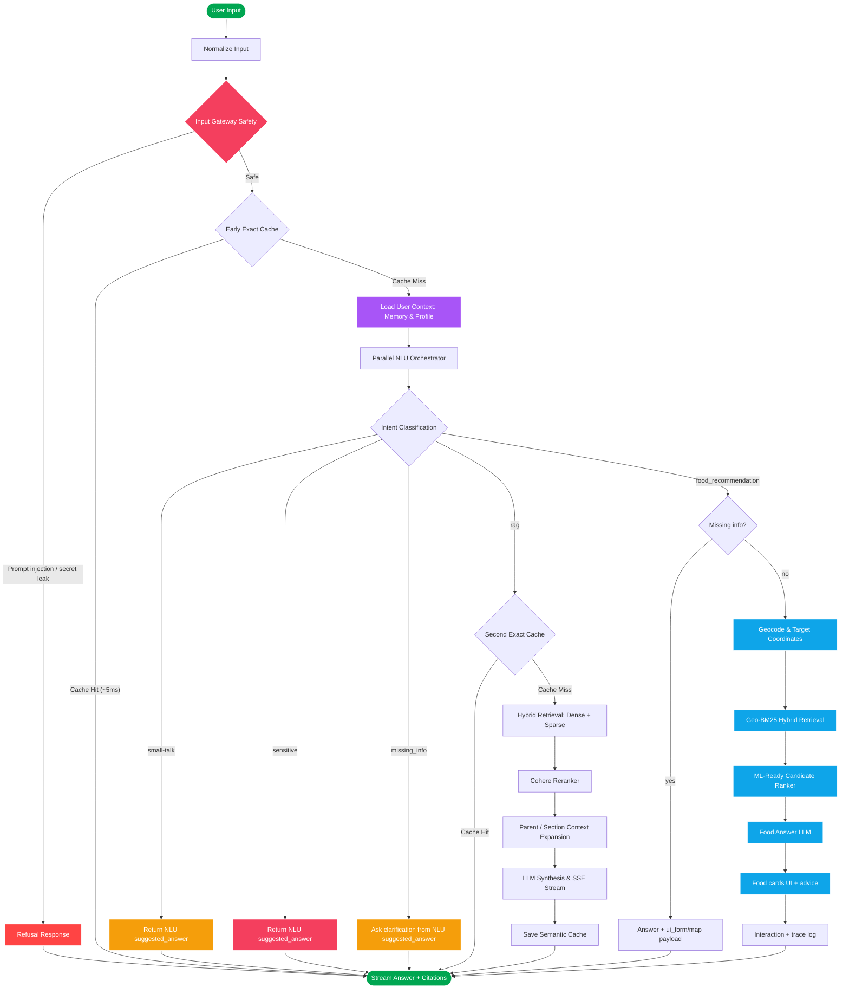
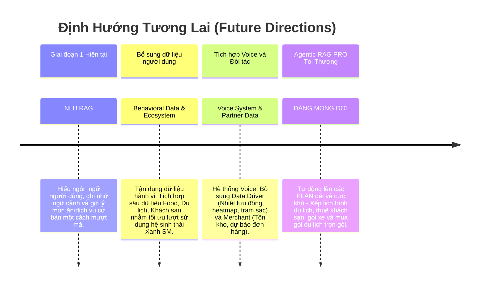

## 1. Bài Toán & Motivation Từ Góc Độ Business

Xanh SM sở hữu một khối lượng khổng lồ các tài liệu nghiệp vụ, bao gồm: bảng cước phí taxi, chính sách đối tác, cẩm nang vận hành, và từ điển dịch vụ (Service Catalog). Với tốc độ mở rộng dịch vụ nhanh chóng, các tổng đài viên (CSKH) và cả khách hàng cá nhân thường gặp khó khăn trong việc tra cứu chính xác một thông tin cụ thể (ví dụ: "Phí chờ của Xanh SM Luxury là bao nhiêu?").

Các hệ thống Chatbot Rule-based truyền thống tỏ ra thiếu linh hoạt, tốn kém chi phí bảo trì kịch bản và không thể xử lý những câu hỏi phức tạp hoặc đa ý định.

**Motivation (Động lực cốt lõi):**

* **Tự động hóa hỗ trợ:** Xây dựng một AI Assistant có khả năng đọc hiểu tự nhiên, tra cứu chéo các tài liệu nội bộ để đưa ra câu trả lời chính xác, kèm trích dẫn (citation) minh bạch.
* **Tối ưu trải nghiệm:** Tích hợp thêm các luồng nghiệp vụ mở rộng như "Gợi ý ẩm thực" (Food Recommendation) dựa trên định vị, nhằm giữ chân khách hàng trên siêu ứng dụng Xanh SM.
* **Hiệu năng & Chi phí:** Tối ưu hóa kiến trúc RAG để hệ thống phản hồi siêu tốc (dưới 5 giây), tiết kiệm token LLM và giảm tải cho hệ thống dữ liệu.
* **Giảm thiểu Hallucination:** Giảm thiểu hiện tượng sinh thông tin sai lệch (hallucination) nhờ việc áp dụng chặt chẽ kiến trúc RAG, dựa trên dữ liệu thực tế thay vì phụ thuộc hoàn toàn vào kiến thức nội tại của LLM.
* **Bảo mật & Tùy biến:** Tùy biến chatbot dành riêng cho doanh nghiệp (Enterprise Agents) dựa trên dữ liệu độc quyền, đảm bảo quyền riêng tư và bảo mật dữ liệu tuyệt đối so với việc sử dụng các general chatbot hay AI công cộng như ChatGPT.

**Mục Tiêu & KPI (Key Performance Indicators):**
* **Độ trễ hệ thống (Latency):** < 5 giây cho mỗi truy vấn (End-to-End).
* **Tỷ lệ chính xác (Correctness & Relevancy):** Đạt > 90% trên tập đánh giá chuyên sâu.
* **Độ trung thực (Faithfulness):** Đạt > 95%, đảm bảo không sinh thông tin ngoài tài liệu.

---

## 2. Mô Tả Dữ Liệu Hệ Thống

Hệ thống được thiết kế để xử lý và lưu trữ dữ liệu đa phương thức với độ phức tạp cao.

**Bảng Thống Kê Quy Mô Dữ Liệu:**

| Loại Dữ Liệu | Số Lượng / Quy Mô (Thực tế & Ước tính) | Ghi Chú |
| :--- | :--- | :--- |
| Tài liệu Text (PDF/Markdown) | 75 Documents | Chứa chính sách, cước phí pháp lý |
| Vector Embeddings (Qdrant) | 2,817 Chunks | Dense (1536d) & Sparse vectors |
| Database POI (Nhà hàng) | 3.277 Điểm bán | Tọa độ, menu, đánh giá |
| Lịch sử hội thoại & Cache | Mở rộng theo thời gian | Semantic Cache, User Profile |

### 2.1 Định Dạng & Độ Phức Tạp

* **PDF / Word:** Chứa các điều khoản hợp đồng pháp lý, chính sách bảo mật, và quy định bồi thường. Đây là dữ liệu có cấu trúc phân cấp (chương, điều, khoản).
* **Excel / CSV / Bảng biểu Markdown:** Chứa các bảng giá cước phí cực kỳ phức tạp (phân rã theo khung giờ, dòng xe, loại dịch vụ, khoảng cách di chuyển).
* **SQL Tables & Geospatial:** Hệ thống cơ sở dữ liệu nhà hàng với 3.277 điểm bán (POI) chứa thông tin tọa độ (Lat/Lng), khoảng giá, menu, và đánh giá.

### 2.2 Kiến Trúc Lưu Trữ (Storage Systems)

* **PostgreSQL (Relational DB):** Lưu trữ thông tin tĩnh có tính xác định cao như: `Semantic Cache`, hồ sơ người dùng (User Profiles), và lịch sử hội thoại.
* **Qdrant DB (Vector DB):** Hệ cơ sở dữ liệu Vector chuyên dụng, lưu trữ hàng triệu Document Chunks với kích thước `1536` chiều (Dense) kết hợp cùng Sparse Vectors để phục vụ truy vấn tốc độ siêu cao.
* **Railway:** Toàn bộ cụm Server và Database hiện tại đang được deploy đồng bộ trên nền tảng đám mây Railway để đảm bảo độ trễ kết nối mạng nội bộ là thấp nhất.

### 2.3 Cấu Trúc Database Chi Tiết (Database Schema)

Để đáp ứng được độ phức tạp của bài toán RAG và Agentic, hệ thống sử dụng một Schema quan hệ được thiết kế chuẩn mực với 6 nhóm dữ liệu chính:
1. **Người dùng và hội thoại**: Quản lý tài khoản, phiên khách (guest sessions), và lịch sử tin nhắn.
2. **Bộ nhớ người dùng (Memory)**: Quản lý Long-term memory, Profile cá nhân hóa, và tóm tắt hội thoại tự động.
3. **RAG và Telemetry**: Ghi nhận chi tiết từng request, độ trễ từng node (Search, Rerank, LLM), log hệ thống và log lỗi để phục vụ Observability.
4. **Nguồn tri thức**: Quản lý Semantic Cache, Document Chunks và cấu hình các nguồn Crawl.
5. **Food Recommendation**: Quản lý Catalog món ăn/quán ăn (POI), lịch sử tương tác người dùng, và profile ẩm thực.
6. **Hệ thống & Đánh giá**: Quản lý thông báo (Notifications) từ Admin và các Evaluation run.

Dưới đây là các sơ đồ UML Class Diagram chi tiết cho từng phân hệ (Domain) cốt lõi của hệ thống:

#### A. Phân Hệ Core Chat & Memory
Quản lý người dùng, phiên chat và bộ nhớ cá nhân hóa dài hạn (Long-term memory).

#### B. Phân Hệ RAG, Observability & Knowledge Base
Lưu trữ nguồn tri thức, cache và ghi log chi tiết từng truy vấn (telemetry/traces).

#### C. Phân Hệ Gợi Ý Ẩm Thực (Food Recommendation)
Quản lý catalog nhà hàng, tương tác người dùng, và profile sở thích ăn uống.

*(Chi tiết Data Dictionary của từng bảng được mô tả trong [DATABASE_SCHEMA.md](./DATABASE_SCHEMA.md))*

---

## 3. Công Nghệ Và Triển Khai (Technical Stack)

### A. Các Công Nghệ Lõi Được Sử Dụng

* **Backend Framework:** Python 3.10+, FastAPI (ASGI Framework).
* **Cơ sở dữ liệu (Database):** 
  * **PostgreSQL** thông qua SQLAlchemy ORM để lưu trữ thông tin tĩnh (Semantic Cache, User Profiles).
  * **Qdrant DB** (Vector Database) dùng để phục vụ tính năng tìm kiếm ngữ nghĩa Dense/Sparse Vectors tốc độ cao.
* **AI/ML & NLU:** OpenAI GPT-4o-mini, Cohere Reranker, XGBoost (Ranker).
* **Thư viện xử lý:** LangChain (để orchestration), `pymupdf4llm` (xử lý tài liệu PDF).

### B. Hướng Dẫn Cài Đặt Triển Khai (Deployment Guide)

* **Triển Khai Local (Cục bộ):**
  * Tận dụng **Docker Compose** để khởi chạy nhanh các dịch vụ DB cục bộ (Qdrant trên port 6333, PostgreSQL trên port 5432).
  * Backend chạy trực tiếp thông qua `uvicorn app.main:app --host 0.0.0.0 --port 8000`. Cần đảm bảo file `.env` chứa đầy đủ API keys của OpenAI, Cohere và thông tin truy cập DB.
* **Triển Khai Remote (Môi trường Đám mây / Production):**
  * Hiện tại, toàn bộ kiến trúc Backend API, **PostgreSQL**, và cả Vector DB **Qdrant** đều đang được chạy tập trung trên nền tảng đám mây **Railway** để đảm bảo độ trễ thấp nhất giữa các dịch vụ.

---

## 4. Sơ Đồ Kiến Trúc Tổng Quan (Chatbot Architecture)

---

## 5. Chi Tiết Quy Trình Luồng Xử Lý User Query

Hệ thống được cấu trúc thành một chuỗi tuần tự gồm các Node xử lý độc lập từ đầu vào đến đầu ra, tự động rẽ nhánh (tool calls / intent routing) giữa RAG và Food Recommendation, kết hợp nhiều kỹ thuật nâng cao để tối ưu hóa độ trễ, tài nguyên và độ chính xác:

### 5.1 Node 1: API Gateway & Input Guardrail

* **Công nghệ áp dụng**: Thư viện biểu thức chính quy (`re` Python) kết hợp bộ quy tắc phân loại cục bộ.
* **Logic xử lý**: Kiểm tra heuristic siêu tốc trên câu hỏi gốc của người dùng nhằm phát hiện sớm các tấn công Prompt Injection (tấn công thao túng chỉ thị), System Prompt Leakage (nỗ lực rò rỉ prompt hệ thống) và các từ khóa thô tục, nhạy cảm.
* **Thông số kỹ thuật**: Độ trễ **< 1ms**. Nếu phát hiện vi phạm, hệ thống lập tức chặn và trả về thông điệp từ chối mà không cần chuyển tới các Node xử lý LLM/VectorDB, tiết kiệm 100% tài nguyên tính toán.

### 5.2 Node 2: Early Cache Lookup

* **Công nghệ áp dụng**: Hệ quản trị cơ sở dữ liệu (PostgreSQL / SQLite) qua SQLAlchemy ORM.
* **Logic xử lý**: Thực hiện đối sánh chuỗi chính xác (Exact Match) giữa câu hỏi thô của người dùng với cơ sở dữ liệu `SemanticCache`.
* **Thông số kỹ thuật**: Độ trễ **~5-10ms**. Nếu xảy ra Cache Hit (đã có câu trả lời hợp lệ và còn hiệu lực TTL), hệ thống trả kết quả ngay lập tức về client, bỏ qua toàn bộ các bước RAG sau đó.

### 5.3 Node 3: Parallel NLU Orchestrator

* **Công nghệ áp dụng**: Mô hình LLM phân loại intent thông qua function calling / structured JSON output (Llama 3.3 70B hoặc GPT-4o-mini) kết hợp **Multi-threading (ThreadPoolExecutor)**.
* **Logic xử lý**: Nhận câu hỏi thô, Working Memory và lịch sử trò chuyện để phân loại vào 1 trong 5 Intent chính, đồng thời trích xuất ký ức (Memory) song song:
  * **Luồng 1 (Intent & Rewrite)**: Thực hiện siêu tốc việc phân loại vào 5 Intent (small-talk, sensitive, missing_info, rag, food_recommendation) và viết lại câu.
  * **Luồng 2 (Memory Extraction)**: Chạy song song với Luồng 1 để trích xuất các sở thích/nhu cầu của người dùng lưu vào Database.
  * **Luồng 3 (Food Slots)**: Chỉ được kích hoạt tuần tự nếu Luồng 1 xác định Intent là `food_recommendation` để bóc tách (budget, time, address, dish) và rẽ nhánh vào luồng gợi ý món ăn.
* **Ghi chú các Intent**:
  * `small-talk`: Chào hỏi đời thường, lấy luôn `suggested_answer` để trả về cho người dùng nhanh chóng.
  * `sensitive`: Phát hiện câu hỏi vi phạm nhạy cảm, sinh `suggested_answer` lịch sự từ chối thay vì chặn ngang.
  * `missing_info`: Câu hỏi quá thiếu thông tin hoặc câu nối tiếp không thể resolve chắc chắn từ lịch sử; NLU sinh `suggested_answer` để hỏi lại đúng phần còn thiếu, không gọi RAG/Food.
  * `rag`: Rẽ nhánh vào luồng tìm kiếm RAG chính sách/tài liệu Qdrant.
  * `food_recommendation`: Rẽ nhánh vào luồng gợi ý món ăn.
* **Ghi chú NLU follow-up**: Các câu ngắn như `cái đầu`, `mục đó`, `chi tiết hơn`, `so sánh 2 cái`, hoặc lựa chọn bằng số/tên rút gọn sẽ được resolve bằng Working Memory trước. Nếu chưa đủ chắc chắn, hệ thống trả `missing_info` để hỏi rõ thay vì đoán bừa hoặc rơi nhầm vào `sensitive`.
* Hệ thống không sử dụng fast-path rule-based cứng nhắc. Mọi truy vấn đều qua mô hình NLU này để đảm bảo độ chuẩn xác cao.
* Không yêu cầu khóa API Google Maps cho Geocode: Hệ thống sử dụng OpenStreetMap Nominatim/Photon miễn phí.

---

### A. Nhánh RAG (Truy xuất tài liệu chính sách)

Nếu tại **NODE 3**, hệ thống phân loại intent là `rag`, truy vấn sẽ tiếp tục đi vào luồng xử lý truy xuất tài liệu:

#### 5.4 Node 4: Second Cache Lookup

* **Công nghệ áp dụng**: PostgreSQL / SQLite SQL Query.
* **Logic xử lý**: Thực hiện đối sánh Cache lần 2 dựa trên câu hỏi đã được chuẩn hóa ở Node 3. Điều này giúp nâng cao đáng kể tỷ lệ trúng cache trong trường hợp câu hỏi thô của người dùng dài dòng hoặc viết sai chính tả nhưng có cùng bản chất ngữ nghĩa với câu hỏi đã lưu.
* **Thông số kỹ thuật**: Độ trễ **~5-10ms**.

#### 5.5 Node 5: Hybrid Search (Dense + Sparse + Metadata Boost)

* **Công nghệ áp dụng**: Qdrant Vector Database (`qdrant-client`) kết hợp Dense Vectors (mô hình `text-embedding-3-small` của OpenAI, 1536 chiều), Sparse Vectors (BM25/FastEmbed), và SQL fallback trên bảng `document_chunks`.
* **Logic xử lý**: Chuyển đổi câu hỏi chuẩn hóa thành Dense/Sparse vectors (Query Expansion đã được tắt bỏ hoàn toàn để tránh quá tải hệ thống và giảm độ trễ). Qdrant dùng **RRF (Reciprocal Rank Fusion)** để hợp nhất kết quả. Domain metadata hints sẽ boost tài liệu theo `category`, `document_type`, `service` và ưu tiên `data/overview/service_catalog.md` cho câu hỏi tổng quát.
* **Thông số kỹ thuật**: Kích thước Dense Vector `dimensions = 1536`. Lấy ra **Top 25 tài liệu thô** (`limit = 25`) trước khi rerank.

Hệ thống kết hợp 2 phương pháp tính điểm độc lập và hợp nhất thông qua thuật toán RRF. Dù sử dụng hàm có sẵn của Qdrant, cơ sở toán học bên dưới được thiết lập như sau:

**a. Dense Search (Tìm kiếm ngữ nghĩa):** Đo lường góc giữa 2 vector A (Query) và B (Document Chunk) trong không gian 1536 chiều bằng Cosine Similarity:

$$ \text{Cosine}(A, B) = \frac{A \cdot B}{||A|| \times ||B||} $$

**b. Sparse Search (BM25 Okapi):** Đo lường tần suất xuất hiện từ khóa chính xác (Exact match):

$$ \text{Score}_{BM25}(Q, d) = \sum_{q_i \in Q} IDF(q_i) \times \frac{f(q_i, d) \times (k_1 + 1)}{f(q_i, d) + k_1 \times (1 - b + b \times \frac{|d|}{avgdl})} $$

**c. Reciprocal Rank Fusion (RRF):** Thuật toán hợp nhất điểm hạng từ 2 thuật toán trên để ưu tiên những tài liệu vừa có ngữ nghĩa tốt vừa chứa đúng từ khóa:

$$ \text{RRF\_Score}(d) = \frac{1}{k + \text{Rank}_{Dense}(d)} + \frac{1}{k + \text{Rank}_{Sparse}(d)} $$

*(Với hằng số k thường được đặt bằng 60).*

#### 5.6 Node 6: Cohere Reranker (Tái xếp hạng ngữ nghĩa chuyên sâu)

* **Công nghệ áp dụng**: API Cohere Rerank (thư viện client `cohere`) với mô hình `rerank-multilingual-v3.0`.
* **Logic xử lý**: Đưa cặp câu hỏi chuẩn hóa và nội dung của 25 tài liệu thô vào API Cohere Rerank để tính toán điểm số tương thích ngữ nghĩa trực tiếp. Cohere Rerank sử dụng cơ chế Cross-Attention tự động tối ưu hóa cho tài liệu đa ngôn ngữ (đặc biệt là tiếng Việt), khắc phục hoàn toàn điểm yếu mất ngữ cảnh của Embedding Bi-Encoder thông thường.
* **Thông số kỹ thuật**: Lọc lấy **Top 10 tài liệu tinh** khắt khe nhất (`top_n = 10`). Ngưỡng điểm relevance tối thiểu để kích hoạt mở rộng parent-child thích ứng là `relevance_score >= 0.7`.

#### 5.7 Node 7: Adaptive Parent-Child Section Expansion

* **Công nghệ áp dụng**: Bộ lọc truy vấn metadata Qdrant & PostgreSQL.
* **Logic xử lý**: 
  * Với các chunk tinh có `relevance_score >= 0.7`, hệ thống truy quét VectorDB dựa trên `parent_chunk_id` để lấy thêm toàn bộ các chunk con khác thuộc cùng một chương/mục/bảng biểu lớn (tối đa 10 chunks). Kỹ thuật này giúp tái cấu trúc trọn vẹn ngữ cảnh gốc (như bảng biểu đầy đủ hoặc điều khoản luật nguyên vẹn) để LLM đọc hiểu.
  * Với các chunk có điểm `< 0.7`, giữ nguyên nội dung chunk gốc để tránh làm loãng prompt.
  * *Deduplication (Khử trùng lặp)*: Tự động loại bỏ tiêu đề trùng lặp ở đầu các chunk con thứ cấp (index > 0) và loại bỏ các chunk bị lồng nhau để tối ưu hóa kích thước context.
* **Thông số kỹ thuật**: Ngưỡng điểm thích ứng `0.7`. Số lượng chunk con tối đa `max_parent_chunks = 10`.

#### 5.8 Node 8: LLM Synthesis & Stream

* **Công nghệ áp dụng**: OpenAI API `chat/completions` với mô hình `gpt-4o-mini`.
* **Logic xử lý**: Nhận prompt chứa toàn bộ ngữ cảnh đã qua giải nén parent-child, câu hỏi chuẩn hóa và lịch sử hội thoại gần nhất. LLM tổng hợp câu trả lời khách quan, trung thực dựa trên tài liệu được cung cấp và truyền dữ liệu từng chữ về client qua giao thức **Server-Sent Events (SSE)** kèm Metadata nguồn trích dẫn (`sources`).
* **Thông số kỹ thuật**: Nhiệt độ `temperature = 0.2` (giảm thiểu tối đa ảo tưởng thông tin), `max_tokens = 2048`. Chỉ số độ trễ xử lý của máy chủ (`TTFT - Time To First Token`) được chốt ngay khi nhận ký tự đầu tiên từ OpenAI để phản ánh trung thực hiệu năng máy chủ.

#### 5.9 Node 9: Semantic Cache Saving & Output

* **Công nghệ áp dụng**: PostgreSQL / SQLite Cache Storage.
* **Logic xử lý**: Sau khi sinh câu trả lời, hệ thống lưu câu trả lời hợp lệ vào `SemanticCache` cho cả hai khóa: câu hỏi thô ban đầu (Node 2) và câu hỏi đã được chuẩn hóa (Node 4) nhằm tối đa hóa cơ hội Cache Hit cho các lượt truy vấn tương lai.

---

### B. Nhánh Food Recommendation (Gợi Ý Món Ăn)

Nếu tại **NODE 3**, hệ thống phân loại intent là `food_recommendation`, truy vấn sẽ không đi vào luồng RAG truyền thống mà sẽ rẽ nhánh sang luồng sau:

#### 5.10 Node 4F: Geocode & Target Coordinates

* **Logic xử lý**: Nếu người dùng cung cấp địa chỉ (VD: "ngõ 67 phùng khoang"), hệ thống gọi API Geocode (OpenStreetMap Nominatim/Photon) để chuyển đổi địa chỉ thành tọa độ `(lat, lng)`. Nếu NLU không bóc tách được vị trí và người dùng chưa cấp quyền GPS, backend trả về Payload UI Form để Frontend hiển thị bản đồ bắt người dùng ghim vị trí.

#### 5.11 Node 5F: Candidate Retrieval (Geo-BM25 Hybrid)

* **Logic xử lý**: Lọc thô ứng viên (Candidate Generation) từ kho dữ liệu nhà hàng. Sử dụng kỹ thuật `Geo-Filtering` (chỉ lấy nhà hàng trong bán kính cho phép) kết hợp `BM25 Sparse Vector` (tìm theo tên món, category do NLU bóc tách).

#### 5.12 Node 6F: ML-Ready Candidate Ranker

* **Logic xử lý**: Chấm điểm và xếp hạng lại danh sách ứng viên thông qua module `XGBoostFoodRanker`, `CohereCrossEncoder` và bộ lọc hành vi khám phá `BanditExplorer`. Xếp hạng được tổng hợp dựa trên: Khoảng cách địa lý, Thời gian giao dự kiến (ETA), Điểm đánh giá (Rating/Review Count), Độ khớp giá cả, và Điểm tương đồng ngữ nghĩa.
* **Sẵn sàng cho MLOps**: Kiến trúc tách bạch rõ ràng giữa Retrieval và Ranking, tạo bản lề để huấn luyện các mô hình cá nhân hóa (Personalization) dựa trên hành vi người dùng sau này.

Thuật toán xếp hạng ứng viên dựa trên **Heuristic Score** (trước khi XGBoost Ranker tiếp quản hoàn toàn). Tổng điểm (Total Score) được tính toán theo công thức trọng số tuyến tính kết hợp hàm phạt mũ (Exponential Penalty):

$$ \text{Base\_Score} = 0.15 \times \text{Recall} + 0.16 \times \text{Distance\_Score} + 0.10 \times \text{DeliveryFee\_Score} + 0.08 \times \text{ETA\_Score} + 0.10 \times \text{Budget\_Score} + 0.15 \times \text{Rating\_Score} $$

$$ \text{Final\_Rank\_Score} = \text{Base\_Score} \times (1.5^{-\text{Category\_Mismatch\_Penalty}}) $$

*Cơ chế Bandit Explorer:* Thuật toán **Epsilon-Greedy** được cài đặt với $\epsilon = 0.1$. Cụ thể, có 90% khả năng hệ thống sẽ đề xuất các nhà hàng có $Final\_Rank\_Score$ cao nhất, và 10% khả năng bốc ngẫu nhiên một nhà hàng xếp hạng thấp hơn nhằm khai phá dữ liệu mới cho quá trình huấn luyện ML tương lai.

#### 5.13 Node 7F: Food Answer LLM

* **Logic xử lý**: Nhận danh sách các món ăn đã được Ranker chấm điểm cao nhất. Mô hình ngôn ngữ (GPT-4o-mini) sẽ đóng vai trò như một chuyên gia ẩm thực, đọc thông số (giá, khoảng cách, review) để sinh ra một lời khuyên tư vấn mượt mà, cá nhân hóa.

#### 5.14 Node 8F: Trace Logging & Analytics

* **Logic xử lý**: Lưu vết toàn bộ dữ liệu suy luận (lý do chọn món, các điểm số thành phần của Ranker, tọa độ) vào bảng `food_recommendation_traces`. Dữ liệu này được hiển thị trực quan trên Admin Dashboard, giúp các Kỹ sư AI theo dõi và tinh chỉnh trọng số thuật toán dễ dàng.

---

## 6. Cơ Chế Tiền Xử Lý Data & Vector DB (Smart Chunking)

Hệ thống tích hợp một ingestion pipeline chuyên sâu với bộ phân đoạn tài liệu thông minh nhằm đảm bảo tính toàn vẹn ngữ nghĩa của cấu trúc tài liệu pháp lý và bảng biểu:

### 6.1 Phân Đoạn Nhận Biết Tiêu Đề (Heading-Aware Splitting)

* **Logic hoạt động**: Sử dụng bộ thư viện `MarkdownHeaderTextSplitter` để bóc tách tài liệu theo phân cấp cấu trúc tiêu đề Markdown từ `#` đến `####`. Đường dẫn mục lục được ghi nhận thẳng vào metadata `"section"` (ví dụ: `Dịch vụ di chuyển > Xanh SM Taxi > Biểu phí Hà Nội`).
* **Đặc tính chống mất ngữ cảnh**: Đối với các chunk con thứ cấp (index > 0) thuộc cùng một chương/mục lớn, hệ thống tự động nhúng thêm tiêu đề ở đầu văn bản dưới dạng `### {meta['section']}`. Điều này giúp mô hình Embedding ghi nhận đầy đủ ngữ cảnh của chủ đề mục lớn, tránh tình trạng chunk con bị cắt vụn rời rạc và mất thông tin nguồn gốc.

### 6.2 Phân Đoạn Đệ Quy Mềm (Recursive Character Splitting)

* **Thông số kỹ thuật**: Sau khi chia nhỏ theo tiêu đề, hệ thống áp dụng `RecursiveCharacterTextSplitter` với kích thước `chunk_size = 400` ký tự và độ chồng lấn `chunk_overlap = 50` ký tự.
* **Logic xử lý**: Các ký tự phân tách được chọn ưu tiên theo thứ tự `["\n\n", "\n", ". ", " ", ""]`. Thuật toán đảm bảo văn bản được ngắt ở ranh giới đoạn văn hoặc dấu chấm câu phù hợp, không bị cắt đôi một câu hoặc một từ dở dang.

### 6.3 Bảo Toàn Cấu Trúc Bảng Biểu (Table-Aware Parsing)

Hệ thống tích hợp bộ phát hiện và xử lý bảng biểu Markdown thông minh (Table-Aware Splitter) để đối phó với các bảng giá cước phức tạp của Xanh SM:

1. **Cô lập cấu trúc bảng (Table Isolation)**: Tự động tách biệt các khối bảng biểu Markdown. Đối với các bảng biểu vừa và nhỏ (dưới 1500 ký tự), hệ thống cô lập bảng đó thành một chunk độc lập hoàn chỉnh, tuyệt đối không cắt nhỏ, tránh việc trộn lẫn với văn bản mô tả xung quanh.
2. **Nhân bản tiêu đề dòng/cột (Header Replication)**: Đối với các bảng lớn (vượt quá 1500 ký tự), thuật toán tiến hành cắt bảng theo từng dòng nhưng **luôn tự động nhân bản hai dòng tiêu đề đầu tiên** (column headers) vào đầu mỗi chunk con thứ cấp. Nhờ đó, mô hình VectorDB tìm kiếm đúng bản ghi theo từng cột và LLM đọc hiểu chính xác giá trị tương ứng của từng dòng trong bảng biểu lớn.

### 6.4 Khóa Định Danh Không Xung Đột (Collision-Free Unique UUID)

* **Logic xử lý**: Mỗi chunk được định danh bằng một chuỗi ASCII MD5 hash sạch (`chunk_id`) sinh ra từ metadata tọa độ: `hash(filename + section + chunk_index)`.
* **Mục đích**: Loại bỏ hoàn toàn nguy cơ lỗi/crash của PostgreSQL và Qdrant khi xử lý các ký tự Unicode tiếng Việt phức tạp trong tên file hoặc mục lục tiêu đề của tài liệu.

### 6.5 Trình Đọc Tài Liệu Đồng Đồng Bộ (Unified Document Loader)

* **Công nghệ**: Sử dụng `pymupdf4llm` thay thế cho thư viện `pypdf` truyền thống để bóc tách các file PDF. Thư viện này hỗ trợ bóc tách PDF trực tiếp thành định dạng Markdown, giữ nguyên cấu trúc tiêu đề và các bảng số liệu phức tạp trước khi chuyển qua bộ cắt chunk.

### 6.6 Table-First Retrieval Chunking

Chiến thuật chunking mới được tối ưu cho truy hồi, không chỉ cho ingestion:

* **HTML table giữ nguyên bản đầy đủ**: Mỗi bảng HTML được lưu thành một chunk `html_table_full` riêng để bảo toàn `rowspan`, `colspan` và toàn bộ cấu trúc gốc.
* **Sinh thêm chunk chỉ mục theo dòng**: Cùng một bảng HTML còn tạo thêm các chunk `table_row_index` gộp 1-3 dòng dữ liệu mỗi chunk để tăng recall khi người dùng hỏi chi tiết theo cột hoặc theo giá trị rời rạc.
* **Metadata bắt buộc cho bảng**: Mỗi chunk bảng mang các trường `chunk_type`, `table_id`, `table_title`, `row_start`, `row_end`, `derived_from`, `chunk_id`, `parent_chunk_id`.
* **Chunk ID ổn định**: `chunk_id` được tạo từ metadata ổn định + hash nội dung, tránh collision và giúp Qdrant/Postgres không bị lỗi khi tái ingest.
* **Retrieval-first expansion**: Khi reranker trả về chunk `table_row_index`, pipeline sẽ tự động truy ngược `derived_from` để lấy lại chunk `html_table_full` tương ứng. Nhờ vậy context trả cho LLM vẫn là bảng đầy đủ, nhưng retrieval ban đầu vẫn bám được các giá trị nhỏ trong bảng.
* **Qdrant payload indexes**: Hệ thống đã index sẵn các trường `metadata.chunk_type`, `metadata.table_id`, `metadata.derived_from`, `metadata.row_start`, `metadata.row_end`, `metadata.chunk_index` để truy vấn và mở rộng context nhanh hơn.

---

## 7. Các Tính Năng Và Giải Thích Khác

* **Domain Vocabulary**: Lớp ánh xạ từ vựng cục bộ được chạy ngay sau khi NLU hoàn tất nhằm chuẩn hóa các từ viết sai chính tả hoặc từ địa phương của người dùng (VD: `đền hàng` -> `bồi thường`, `ăn chia` -> `chiết khấu/doanh thu`). Nhờ đó tăng tỷ lệ trúng từ khóa khi tìm kiếm.
* **Hybrid Search (Dense + Sparse)**: Cơ chế tìm kiếm lai kết hợp thế mạnh của Dense Embedding (hiểu ngữ nghĩa sâu) và BM25 Sparse Vector (khớp từ khóa chính xác tuyệt đối như mã hiệu, số hiệu xe, v.v.).

---

## 8. Đánh Giá & Kết Quả (Metrics & Results)

Hệ thống RAG đã được đánh giá hiệu năng nghiêm ngặt thông qua tập Golden Dataset. Các thư viện và mô hình cơ sở đóng vai trò then chốt:

### 8.1 Các Công Nghệ & Mô Hình Cơ Sở (Base Models)

* **Backend:** Python 3.10+, FastAPI, LangChain orchestration.
* **Intent & Synthesis LLM:** Llama 3.3 70B / OpenAI `gpt-4o-mini`.
* **Embedding Model:** `text-embedding-3-small` (1536 chiều).
* **Reranker Model:** `rerank-multilingual-v3.0` (Cohere API).
* **Ranking Model (Food):** XGBoost + Heuristic.

### 8.2 Kết Quả Đánh Giá Hiệu Năng (Evaluation Results)

Kiểm thử được chạy trên tập dữ liệu tiêu chuẩn `golden_50`. 

**Quy trình xây dựng tập đánh giá (Golden Dataset):** Tập `golden_50` được tổng hợp và tinh chọn từ hàng ngàn câu hỏi thực tế của khách hàng và bộ phận CSKH Xanh SM. Các câu hỏi này bao phủ các kịch bản khó nhất, bao gồm câu hỏi đa ý định, câu hỏi yêu cầu so sánh bảng giá, và các trường hợp có nhiễu ngôn ngữ. Đội ngũ chuyên gia (SMEs) đã tiến hành gán nhãn thủ công (human annotation) để xác định câu trả lời chuẩn (Ground Truth) và các tài liệu tham chiếu (Context) tương ứng.

Các bộ chỉ số (Metrics) dùng để đo lường bao gồm:
* **Recall@5 / Recall@10:** Tỷ lệ tài liệu liên quan thực sự xuất hiện trong top 5 hoặc top 10 kết quả truy xuất.
* **MRR (Mean Reciprocal Rank):** Đo lường việc tài liệu đúng đầu tiên xuất hiện ở thứ hạng cao như thế nào.
* **NDCG@5:** Đo lường chất lượng xếp hạng tổng thể của Reranker trong 5 kết quả đầu tiên.
* **Faithfulness:** Độ trung thực, đảm bảo câu trả lời LLM sinh ra hoàn toàn dựa trên tài liệu (chống ảo giác - hallucination).
* **Correctness:** Tỷ lệ câu trả lời khớp chính xác với đáp án chuẩn (Ground Truth).
* **Relevancy:** Độ bám sát của câu trả lời với chủ đề câu hỏi (không trả lời lan man).
* **Latency:** Tổng độ trễ toàn trình (End-to-End) của hệ thống.

| Run ID | Model | Dataset | Cases | Status | Recall@5 | Recall@10 | MRR | NDCG@5 | Faithfulness | Correctness | Relevancy | Latency |
| :--- | :--- | :--- | :--- | :--- | :--- | :--- | :--- | :--- | :--- | :--- | :--- | :--- |
| `run_20260619_124600` | `gpt-4o-mini` | `golden_50` | 50 | Completed | **0.87** | **0.87** | **0.83** | **0.61** | **0.98** | **0.90** | **1.00** | **4.59s** |

**Phân Tích Kết Quả Chi Tiết:**
* **Khả năng Truy Xuất (Retrieval):** Với mức điểm **Recall@5 đạt 0.87** và **MRR 0.83**, hệ thống Hybrid Search kết hợp Cohere Reranker đã chứng minh hiệu năng xuất sắc khi hầu hết tài liệu cần thiết đều nằm ngay vị trí top 1 hoặc top 2.
* **Chất lượng Tổng Hợp (Generation):** Bộ ba chỉ số **Faithfulness (0.98)**, **Relevancy (1.00)** và **Correctness (0.90)** chứng minh hệ thống LLM tuân thủ tuyệt đối vào tài liệu được cung cấp, trả lời đúng trọng tâm câu hỏi cực khó về bảng biểu giá cước, tỷ lệ sinh thông tin ảo (hallucination) gần như bằng 0.
* **Hiệu suất Vận Hành:** Thời gian phản hồi tổng thể (E2E) **Latency 4.59s** hoàn toàn đáp ứng được tiêu chuẩn thời gian thực của một hệ thống Production Chatbot (< 5 giây), ngay cả khi phải chạy đồng thời nhiều luồng Geocode và Vector Search nặng.

**Kế Hoạch Cải Tiến Dựa Trên Phản Hồi (User Feedback Loop):**
Hệ thống sẽ được thiết kế một quy trình để thu thập phản hồi (Thumbs Up/Down và nhận xét chi tiết) trực tiếp từ người dùng trên giao diện Chatbot. Các tín hiệu phản hồi này sẽ được lưu trữ đồng bộ cùng với Session ID và hệ thống trace log hiện tại. Định kỳ, các phiên hỏi đáp bị đánh giá thấp hoặc có độ trễ bất thường sẽ được hệ thống lọc tự động và chuyển tới dashboard của Kỹ sư AI. Tại đây, nguyên nhân lỗi (do Retrieval truy xuất sai hay do LLM tổng hợp lỗi) sẽ được phân tích sâu. Những kịch bản này sau đó sẽ được bổ sung vào tập `golden_dataset` để liên tục finetune, cải tiến thuật toán Reranker và hệ thống Prompts trong các bản cập nhật tiếp theo.

---

## 9. Phương Hướng Phát Triển Tương Lai (Future Work)

Hệ thống Xanh SM AI Assistant hiện đang ở Giai đoạn 1 (NLU RAG - Hiểu ngôn ngữ, ghi nhớ ngữ cảnh và gợi ý cơ bản). Định hướng tiến hóa tiếp theo từ Trợ lý Kiến thức sang **Siêu Trợ Lý Hành Động (Agentic RAG)** làm chủ toàn bộ hệ sinh thái dịch vụ, tập trung vào các trụ cột:

* **Bổ sung Dữ liệu Hành vi & Hệ Sinh Thái (Behavioral Data):** Tích hợp sâu dữ liệu hành vi người dùng, kết hợp dữ liệu Food, Du lịch, Khách sạn nhằm tối ưu lượt sử dụng chéo hệ sinh thái Xanh SM, làm lớn mạnh khả năng cá nhân hóa Recommend.
* **Mở rộng Dữ liệu Đối tác & Tài xế (Operational AI):** Bổ sung dữ liệu Driver (bản đồ nhiệt lưu động heatmap, trạm sạc V-GREEN) và Merchant (tồn kho, dự báo đơn hàng). Đặc biệt, ứng dụng AI phân tích sự kiện giao thông (ví dụ: dự báo Concert chuẩn bị kết thúc) để **chỉ đường và đề xuất vị trí** cho tài xế di chuyển đón khách từ sớm, tối ưu hóa thu nhập.
* **Tích hợp Voice & Thị Giác Máy Tính (Multi-modal):** Bổ sung hệ thống Voice. Hỗ trợ tính năng gửi ảnh (ví dụ: ảnh danh sách đi chợ/đồ ăn) để AI nhận diện chữ viết và tự động thêm trực tiếp sản phẩm vào giỏ hàng.
* **Agentic RAG PRO Tối Thượng:** Trao quyền cho AI tự động lên các Kế hoạch (PLAN) dài hạn và cực khó: Xếp lịch trình du lịch, thuê khách sạn, gọi xe và mua gói du lịch trọn gói chỉ trong 1 câu lệnh duy nhất của người dùng.

Dưới đây là sơ đồ lộ trình (Timeline) dự kiến cho các giai đoạn phát triển:

